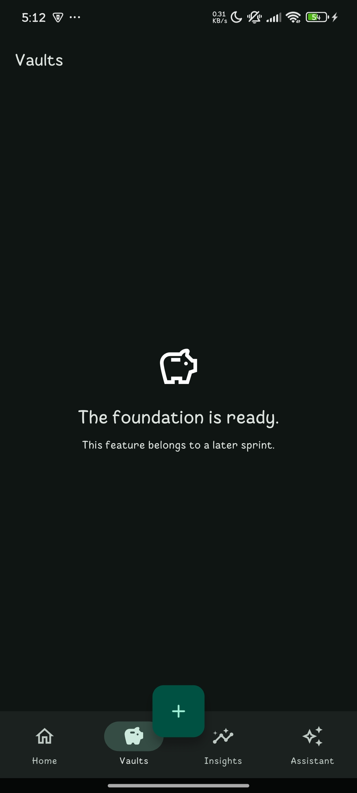

# Lys Finance

Lys Finance is a calm, offline-first personal finance companion for Android and
iOS. Sprint 02 added offline expense and income capture, a searchable and
filterable ledger, transaction detail/edit/delete/restore flows, and derived
account balances. Sprint 03 adds the Vault Engine: purpose-driven savings
vaults with contributions, withdrawals, vault-to-vault transfers, goal
tracking (progress, pace, ETA, goal health), and a merged vault history
timeline. Money remains exact integer minor units and local SQLite is the
only source of truth.

## App preview

<p align="center">
  
</p>

## Prerequisites

- Git
- FVM 4.1.2 (`dart pub global activate fvm 4.1.2`)
- Android Studio with an Android SDK and Java 17
- Xcode and CocoaPods for iOS development (macOS only)

Flutter 3.44.6 and Dart 3.12.2 are pinned in `.fvmrc`. The application identifier
is `com.lysfinance.app` and the display name is **Lys Finance**.

On Windows accounts whose home path contains spaces, native-asset tooling may
require an FVM cache path without spaces (for example, set `FVM_CACHE_PATH=C:\fvm`
before `fvm install`). This is a Flutter toolchain path-quoting constraint.

## Setup and run

```sh
fvm install
fvm flutter pub get
fvm dart run build_runner build --delete-conflicting-outputs
fvm flutter run
```

English and Vietnamese are generated from ARB files during Flutter tooling runs.
Use `fvm flutter gen-l10n` after changing localization resources if an editor has
not regenerated them automatically.

## Quality commands

```sh
fvm dart format --output=none --set-exit-if-changed .
fvm flutter analyze
fvm flutter test
fvm flutter build apk --debug
```

Generated `*.g.dart` and `*.freezed.dart` files are committed. CI regenerates and
fails if they differ, making builds reproducible without hiding generated changes.
Do not edit generated sources by hand.

Schema version 4 widens the transaction table (nullable `category_id`, a new
nullable `vault_id`) and adds `vaults`, `vault_transfers`, and `vault_history`,
seeding eight starter vaults. Existing accounts, categories, settings,
transactions, and metadata are preserved. Vault contributions and withdrawals
reuse the `Transaction` type Sprint 02 already reserved, so they appear in the
unified ledger's data model without affecting an account's derived balance;
only vault-to-vault transfers live in a dedicated, append-only table. Vault
balances, like account balances, are always derived and never stored.

## Project guide

- [Architecture](docs/architecture.md)
- [Code style](docs/code-style.md)
- [Git workflow](docs/git-workflow.md)
- [Testing](docs/testing.md)
- [Domain model](docs/domain-model.md)
- [Database migrations](docs/database-migrations.md)
- [Repository contracts](docs/repositories.md)
- [Validation](docs/validation.md)
- [Roadmap](docs/roadmap.md)
- [Contributing](CONTRIBUTING.md)
- [Architecture decisions](docs/decisions/)

Never commit secrets, signing keys, local environment files, or user/financial
data. Configuration that may become sensitive must enter through platform-secure
mechanisms or CI secrets, never source control.
