# Lys Finance — Product Design & Software Requirements Specification

> **Document type:** Product Design Document + SRS
> **Status:** Ready for implementation hand-off (to Codex)
> **Version:** 1.0
> **Author role:** Product Lead / UX / FinTech Design / Architecture
> **Implementation target:** Flutter (iOS + Android), offline-first
> **Primary currency:** VND (₫) · **Secondary/subscription currency:** USD ($)

---

## 0. Reading Guide & Baseline Assumptions

This document is the single source of truth. It contains **no implementation code** — it defines *what* to build and *why*, so that engineering only has to decide *how*.

A few assumptions are locked here so the rest of the document is unambiguous. Change them only with intent:

| # | Assumption | Rationale |
|---|-----------|-----------|
| A1 | **Single-user, single-device in v1**, but every entity carries a `user_id` and sync-ready fields. | You are the only user now, but the schema must not need a rewrite when cloud sync arrives. |
| A2 | **Primary currency VND**, but the app is **multi-currency aware from day one**. | Your income is VND; your investments (Claude, VPS, domains, GPUs abroad) are USD. Pretending everything is one currency would corrupt the single most important metric — investment cost. |
| A3 | **Offline-first.** The app is fully usable with no network. Cloud is an optional mirror, never a dependency. | Logging must be instant and always available. Finance anxiety often comes from friction; friction here is fatal. |
| A4 | The **Investment / Necessity / Consumption (INC) classification is the spine of the product**, not a tag. | This is the one idea that makes Lys Finance *not another expense tracker*. |
| A5 | **Calm over complete.** When a feature and simplicity conflict, simplicity wins in v1 and the feature moves to the roadmap. | Design principle: *financial awareness, not financial anxiety.* |

---

# 1. Product Vision

### Vision
A personal finance companion that treats money as **fuel for a career and a future**, not as a number to feel guilty about. Lys Finance answers one question continuously: *"Am I spending in a way that compounds?"*

### Mission
Make it effortless to log money, and impossible to lose sight of whether each expense is **building the future, keeping the lights on, or being consumed** — while quietly funding long-term goals in the background.

### The Central Idea — The INC Lens
Every expense is exactly one of three things:

- **Investment (I)** — increases future earning capacity or capability. *AI subscriptions, VPS, domains, hardware, certifications, courses, books.*
- **Necessity (N)** — required to live and function. *Food, transport, health, minimal living costs.*
- **Consumption (C)** — pure present enjoyment, no compounding return. *Entertainment, impulse buys, treats.*

Consumption is **not framed as bad**. The app never scolds. It simply keeps the *ratio* visible so the story of your money is always legible in one glance.

### Target User
- One AI engineer (you), currently a student/intern, living with parents.
- Very low living expenses → high discretionary and high investment capacity.
- Income from **multiple, irregular streams**: internship, salary, freelance, family business — trending toward more streams over time.
- Financially literate, technically sophisticated, allergic to clutter and to condescending "you spent too much on coffee" UX.

### Design Philosophy
- **Minimal taps, fast logging.** Adding an expense should feel like sending a message.
- **Calm > dense.** No wall of charts. One meaningful number beats ten vanity metrics.
- **Goal-oriented.** Money is always shown moving *toward* something (a vault, a target, a ratio).
- **Reframe, don't warn.** "You invested ₫X in your career this month" instead of "You spent ₫X."
- **Premium restraint.** Apple / Notion / Linear / Arc — space, typography, and motion do the work; color is used surgically.

### Long-Term Roadmap (Vision Horizon)
1. **Now:** Beautiful single-user logger + vaults + INC insight.
2. **Next:** Intelligent budgeting, subscription intelligence, financial health score.
3. **Later:** AI assistant that reasons over your real ledger ("Can I buy this?").
4. **Eventually:** Cloud sync, multi-device, desktop/web, and **Elysia integration** (your own agent stack acting on financial signals).

---

# 2. Information Architecture

### Design constraint
The brief lists 8 destinations. Eight bottom-nav items would violate every principle here. The best architecture keeps **the bottom bar to 4 destinations + 1 central action**, and reaches everything else in ≤2 taps.

### Primary Navigation (Bottom Bar)

```
   Home        Vaults      [ + ]      Insights     Assistant
    🏠           🫙        (FAB)         📈            ✦
```

- **Home** — the calm dashboard: safe-to-spend, INC ring, recent activity, vault & subscription previews.
- **Vaults** — savings vaults *and* goals unified (a goal is a vault with a target). Emergency, Japan, GPU, Elysia funds live here.
- **`+` (Center FAB)** — Quick Add: expense / income / vault contribution in one sheet.
- **Insights** — meaningful analytics (ratios, not clutter).
- **Assistant** — the AI conversation surface.

### Full Navigation Tree

```
Lys Finance
├── Home (tab)
│   ├── Safe-to-Spend hero
│   ├── INC Ring (Investment / Necessity / Consumption)
│   ├── Recent Activity ──► Ledger (pushed)
│   │                        ├── Transaction Detail (pushed)
│   │                        └── Filter / Search
│   ├── Upcoming Subscriptions strip ──► Subscriptions (pushed)
│   ├── Active Vaults preview ──► Vaults (tab)
│   └── Monthly Budget capsule ──► Budgets (pushed)
│
├── Vaults (tab)
│   ├── Vault Detail (pushed) ── contribute / withdraw / edit
│   └── New Vault (sheet)
│
├── [ + ] Quick Add (modal sheet)
│   ├── Expense
│   ├── Income
│   └── Contribution to Vault
│
├── Insights (tab)
│   ├── Financial Health Score (pushed detail)
│   ├── Consumption vs Investment
│   ├── Cash Flow
│   ├── Subscription Cost breakdown
│   └── Net Worth
│
├── Assistant (tab)
│   └── Conversation + suggested prompts
│
└── Profile / Settings (top-app-bar avatar, pushed)
    ├── Accounts & Wallets
    ├── Categories (INC defaults)
    ├── Currencies & Exchange Rate
    ├── Notifications
    ├── Monthly Review archive
    ├── Backup & Export
    └── Appearance (theme, motion)
```

### Why this shape
- **Expenses and Income are not separate destinations.** They are two entry types in one Quick Add sheet and one unified **Ledger**. Splitting them doubles navigation for no benefit.
- **Goals = Vaults.** Merging them removes an entire redundant concept.
- **Subscriptions, Budgets, Ledger, Settings** are *pushed screens*, not tabs — important but not constantly visited.
- Everything reachable in **≤2 taps**, satisfying "minimal taps."

---

# 3. Feature Breakdown

Priority key: **P0** = MVP must-have · **P1** = fast-follow · **P2** = later.

Each feature: *Purpose · Inputs · Outputs · Interaction · Edge cases · Validation · Priority.*

### 3.1 Dashboard (Home)
- **Purpose:** One-glance financial state; reduce anxiety by showing "safe-to-spend" and the INC story, not raw totals.
- **Inputs:** Ledger, budgets, vaults, subscriptions, exchange rate.
- **Outputs:** Safe-to-spend today, INC ring %, month-to-date summary, previews.
- **Interaction:** Scroll; tap any card to drill in; pull-to-refresh recalculates.
- **Edge cases:** No data yet (empty state); mid-month with overspend; negative safe-to-spend.
- **Validation:** All derived values recomputed from source of truth, never stored stale.
- **Priority:** **P0**

### 3.2 Quick Expense
- **Purpose:** Log an expense in ≤3 taps.
- **Inputs:** Amount, category (auto-suggested), account, INC class (auto from category, editable), optional note, date (defaults now), optional currency.
- **Outputs:** New transaction; dashboard + budget + INC ring update instantly with animation.
- **Interaction:** FAB → sheet opens with numeric keypad focused → type amount → category pre-selected (last used / smart) → **Save**. Advanced fields collapsed behind "More."
- **Edge cases:** Zero/negative amount; future-dated; foreign currency; category deleted mid-entry; offline.
- **Validation:** amount > 0; category required (default assigned if skipped); currency ∈ enabled set; date not absurd (>1yr future blocked with confirm).
- **Priority:** **P0**

### 3.3 Quick Income
- **Purpose:** Log income fast; attribute to a stream.
- **Inputs:** Amount, income source (internship/salary/freelance/family/other), account, date, note.
- **Outputs:** Transaction; cash-flow & diversification metrics update; optional auto-allocation to vaults (see 3.8).
- **Interaction:** Same sheet as expense, toggled to "Income."
- **Edge cases:** Same as expense; large lump sums trigger optional "distribute to vaults?" prompt.
- **Validation:** amount > 0; source required.
- **Priority:** **P0**

### 3.4 Expense Categories
- **Purpose:** Organize spend; carry a **default INC class** so classification is automatic.
- **Inputs:** Name, icon, color, default INC class, optional monthly budget.
- **Outputs:** Category list; auto-classification on logging.
- **Interaction:** Managed in Settings; inline-creatable during Quick Add.
- **Edge cases:** Deleting a category with transactions → soft-delete + reassign to "Uncategorized."
- **Validation:** Unique name per type; INC class required.
- **Priority:** **P0**

### 3.5 Income Categories (Streams)
- **Purpose:** Track income diversification (a health-score input).
- **Inputs:** Stream name, type, expected cadence (one-off / monthly / irregular).
- **Outputs:** Per-stream totals; diversification score.
- **Priority:** **P1**

### 3.6 Savings Vaults *(see §8 for full system)*
- **Purpose:** Virtual envelopes toward named goals.
- **Priority:** **P0** (basic) / **P1** (auto-contribution, celebrations).

### 3.7 Emergency Fund
- **Purpose:** A special vault whose target is **N months of living expenses**, feeding the health score.
- **Inputs:** Target months (default 6), computed monthly necessity baseline.
- **Outputs:** Coverage in months; health-score contribution; completion celebration.
- **Edge cases:** Necessity baseline changes month to month → recompute target dynamically, show as a band not a hard number.
- **Priority:** **P0**

### 3.8 AI Budget / Auto-Allocation
- **Purpose:** On income, propose a split (necessities buffer, investment budget, vault contributions, discretionary).
- **Inputs:** Income event, rules, historical patterns.
- **Outputs:** Suggested allocation the user accepts/edits in one tap.
- **Edge cases:** Irregular income months; rule sum > income.
- **Priority:** **P2** (rules-based P1, AI-driven P2)

### 3.9 Subscriptions *(critical for this user)*
- **Purpose:** Track recurring digital spend (Claude, VPS, domains) and answer *"How much did Claude cost me this year?"*
- **Inputs:** Vendor, plan, amount, currency, billing cycle, next-due, INC class (usually Investment), account.
- **Outputs:** Monthly/annual recurring total (in VND-equivalent), upcoming-renewal list, per-vendor lifetime cost, calendar markers, renewal notifications.
- **Interaction:** Subscriptions hub; add via dedicated form; auto-generates a transaction on the billing date (confirmable).
- **Edge cases:** Price change; paused/cancelled; currency swing; trial → paid conversion; annual vs monthly amortization.
- **Validation:** amount > 0; next-due ≥ today; cycle ∈ {weekly, monthly, quarterly, yearly, custom-days}.
- **Priority:** **P0** (this user's dominant expense pattern)

### 3.10 Goal Tracker
- **Purpose:** Progress, pace, and ETA for each vault/goal.
- **Outputs:** % complete, ₫ remaining, projected completion date at current pace, "on track / behind" state.
- **Priority:** **P1**

### 3.11 Monthly Budget & Category Budgets *(see §9)*
- **Priority:** **P1**

### 3.12 Notifications *(see §7)*
- **Priority:** **P1**

### 3.13 Reports & Monthly Review
- **Purpose:** A calm end-of-month narrative: INC ratio, savings rate, top investments, vault progress, one gentle nudge.
- **Inputs:** Month's data.
- **Outputs:** A scrollable review screen + optional archive entry.
- **Interaction:** Prompted on the 1st; also on-demand.
- **Priority:** **P1**

### 3.14 Calendar
- **Purpose:** See upcoming financial events (subscription renewals, recurring income, goal deadlines).
- **Priority:** **P2**

### 3.15 Recurring Expenses (non-subscription)
- **Purpose:** Rent-share, transport passes, etc. — same engine as subscriptions but non-vendor.
- **Priority:** **P1**

### 3.16 Analytics / Insights *(see §10)*
- **Priority:** **P1**

### 3.17 AI Assistant *(see §11)*
- **Priority:** **P2** (surface as read-only insights first, then conversational)

---

# 4. Screen-by-Screen UI Specification

Written for a professional Flutter developer. Tokens (`space.4`, `radius.card`, `color.investment`) are defined in §5. Every screen defines empty / loading / error / success states and key micro-interactions.

> **Global chrome**
> - **Top App Bar:** large, transparent-until-scroll. Left = screen title (or greeting on Home). Right = profile avatar (→ Settings) and a currency-toggle chip when relevant. No shadow; a hairline border appears on scroll.
> - **Bottom Nav:** 4 items + center FAB. Frosted/translucent background, active item tinted `color.primary`, inactive `text.secondary`. Icon-only with tiny label; selection uses a soft spring scale (1.0→1.08) + fade.
> - **FAB:** center-docked, `color.primary`, `+` icon that rotates 45°→ close on sheet open. Spring on press.

---

### 4.1 Home / Dashboard

**Purpose:** Calm, single-glance state.

**Layout (top → bottom):**
1. **Greeting header** — "Good evening, Lys" + today's date, small. `text.secondary`.
2. **Safe-to-Spend hero card** — the largest element. Big tabular number: *"₫420,000 safe to spend today."* Subtext explains it ("after subscriptions, goals & necessities"). Tapping expands the formula (transparency = trust). If negative → number turns `color.warning` (never red), copy shifts to *"You're ₫X over your discretionary pace — ease off or borrow from next week."* Calm, not alarming.
3. **INC Ring** — a three-segment ring (Investment / Necessity / Consumption) for the current month with center label showing the **Investment ratio** ("38% invested"). Legend chips below with amounts. Animated fill on load (staggered, 240ms each). This is the emotional centerpiece.
4. **Month capsule** — a slim horizontal bar: income in, spend out, saved. Tap → Budgets.
5. **Upcoming subscriptions strip** — horizontal scroller of the next 3 renewals with vendor logo/initial, amount, days-until. Tap → Subscriptions.
6. **Active vaults preview** — 2–3 vault mini-cards with radial progress. Tap → Vaults.
7. **Recent activity** — last 5 transactions, each row: INC color dot · category icon · title · amount (expense `−`, income `+` green). Tap row → detail; "See all" → Ledger.

**Widgets:** hero card, ring chart, capsule bar, horizontal scrollers, list rows.
**Cards:** rounded `radius.card` (12), `surface` bg, hairline border (no heavy shadow — Linear/Arc restraint).
**Charts:** the INC ring; a sparkline optional in the capsule.
**FAB:** present.
**Colors:** neutral surfaces; color only on INC segments, income green, and progress rings.
**Spacing:** `space.5` (20) outer padding, `space.4` between cards.
**Animations:** ring staggered fill; hero number counts up (150ms) on change; cards fade+slide-up 12px on first paint (60ms stagger).
**Transitions:** shared-element from a vault preview → vault detail.
**Empty state:** friendly illustration + "Log your first expense" CTA that opens Quick Add. Ring shows a dashed placeholder.
**Loading:** skeleton shimmer for hero, ring, and rows (never a spinner — feels calmer).
**Error state:** if a recompute fails, show last-known values with a subtle "Couldn't refresh" pill + retry.
**Success:** after a log, the relevant card pulses once and the ring re-fills.
**Micro-interactions:** hero number count-up; ring segment tap → highlights + shows that category's total; long-press a recent row → quick edit/delete.

---

### 4.2 Quick Add (Modal Sheet)

**Purpose:** Fastest possible logging.

**Layout:** bottom sheet, ~70% height, drag handle on top.
- **Segmented control:** Expense · Income · Contribution.
- **Amount display** — huge, centered, tabular, with currency symbol. Cursor blinks. This is the focus.
- **Custom numeric keypad** — big, thumb-reachable, with a decimal and a currency-switch key (₫/$). Using a custom pad (not OS keyboard) keeps it fast and on-brand.
- **Category row** — horizontally scrollable chips, most-likely pre-selected (last used / time-of-day heuristic). Selected chip shows its INC color.
- **INC indicator** — a small pill auto-derived from category ("Investment"), tappable to override. Overriding is a 1-tap 3-way toggle.
- **"More" expander** — account, date, note, currency, link-to-vault.
- **Primary button:** **Save** (full-width, `color.primary`). Haptic + success animation on save.

**Interaction / minimal-tap path:** open → type amount → Save (3 taps incl. FAB). Category & INC pre-filled.
**Edge cases:** amount 0 → Save disabled; foreign currency → shows live VND equivalent under the amount; offline → saves locally, shows a tiny "saved offline" note.
**Validation:** inline, non-blocking; the Save button simply stays disabled until valid.
**Empty/loading:** none (instant sheet).
**Error:** save failure → keep sheet open, toast + retry, never lose input.
**Success:** sheet closes with a downward spring; a checkmark morph on the FAB; the affected Home card pulses.
**Micro-interactions:** amount digits animate in; keypad keys depress with haptic; INC pill color-shifts when class changes.

---

### 4.3 Ledger (Activity)

**Purpose:** Full, searchable transaction history — expenses + income unified.

**Layout:** sticky search/filter bar; sections grouped by day with a per-day subtotal and a tiny INC ratio for that day. Rows as on Home.
**Filters:** by INC class, category, account, stream, date range, currency, amount range. Filter chips row.
**Widgets:** search field, filter chips, grouped list, per-day headers.
**Empty state:** "No transactions match" with a clear-filters button.
**Loading:** skeleton rows.
**Micro-interactions:** swipe-left on a row → delete (soft, undoable via snackbar); swipe-right → edit; sticky day headers.

---

### 4.4 Transaction Detail

**Purpose:** View/edit one transaction.
**Widgets:** amount hero, INC pill, category, account, date, note, linked vault/subscription (if any), attachment placeholder (future OCR).
**Buttons:** Edit, Delete (with undo), Duplicate.
**States:** edit mode reuses Quick Add fields inline.

---

### 4.5 Vaults (Tab)

**Purpose:** All savings vaults & goals.
**Layout:** grid or list of **vault cards**, each: name, emoji/icon, radial or linear progress, current/target, ETA or deadline, "on track" state dot. A total "saved across vaults" header.
**New Vault:** a `+` in the app bar → creation sheet.
**Empty state:** suggested starter vaults (Emergency, Japan, GPU, Elysia) as one-tap templates.
**Micro-interactions:** progress ring animates on entry; completed vault shows a subtle shimmer/confetti badge.

---

### 4.6 Vault Detail

**Purpose:** Manage one vault.
**Layout:** big progress hero (radial), target & deadline, pace ("you're adding ~₫X/mo, ETA Mar 2027"), contribution history list, auto-contribution rule card.
**Buttons:** **Contribute** (opens Quick Add pre-linked), **Withdraw** (guarded — see §8 rules), Edit, Archive.
**Success (completion):** full-screen celebration — confetti, haptic, "GPU Fund complete 🎉", option to roll funds into a new vault.
**Edge cases:** over-funding (allow, show surplus); withdrawal below rules → confirmation with reason note.

---

### 4.7 Subscriptions Hub

**Purpose:** The recurring-spend command center.
**Layout:** header with **total monthly recurring (VND-equiv)** + annualized figure; toggle Monthly/Annual view. List grouped by INC class (Investments first). Each row: vendor, plan, amount+currency, cycle, next-due countdown, mini VND-equivalent. A "This year so far" per-vendor drill-down.
**Buttons:** Add subscription; per-row edit/pause/cancel.
**Charts:** a small stacked bar of subscription cost by INC class.
**Empty state:** "Track your first subscription — Claude? VPS?" quick templates.
**Edge cases:** paused subs excluded from totals but shown greyed; price-change history shown as a timeline in detail.
**Micro-interactions:** next-due countdown pulses when ≤2 days.

---

### 4.8 Budgets

**Purpose:** Monthly + category budgets with calm progress.
**Layout:** overall month budget bar at top; category budget rows each with a progress bar (fills `color.primary`, turns `color.warning` past threshold, never red). Rollover indicator where enabled.
**Charts:** forecast line ("projected to end at 92% of budget").
**Empty/first-run:** offer to auto-suggest budgets from last month's spend.
**Micro-interactions:** bars animate to fill; crossing 80% triggers a gentle color shift + optional notification.

---

### 4.9 Insights

**Purpose:** Meaningful analytics (§10), not vanity graphs.
**Layout:** vertically stacked insight cards, each a single idea: Financial Health Score (hero), Consumption vs Investment trend, Savings Rate, Subscription Cost, Net Worth, Cash Flow, Career Investment. Each card is tappable → a focused detail screen.
**Charts:** modern, minimal — area/line with soft gradients, no gridline clutter, tabular tooltips.
**Empty state:** "Insights unlock after ~2 weeks of data."
**Micro-interactions:** charts draw-in on scroll into view.

---

### 4.10 Financial Health Score (Detail)

**Purpose:** Explain the composite score (§10.1).
**Layout:** big score dial (0–100) with a qualitative label ("Strong"), then a breakdown of the 6 pillars as horizontal bars with plain-language tips ("Emergency fund covers 4.2/6 months").
**Micro-interactions:** dial sweeps to value; each pillar bar staggers in.

---

### 4.11 Assistant

**Purpose:** Conversational finance reasoning.
**Layout:** chat transcript; suggested-prompt chips at the bottom above the input ("Can I buy this?", "How much did Claude cost me this year?"); mono font for the assistant's numeric answers to reinforce the engineer identity.
**States:** empty → prompt chips + a one-liner on what it can do; thinking → a subtle animated dots row; error → graceful fallback with retry.
**Micro-interactions:** streamed text; when the assistant cites a number, it renders as a small inline "chip" linking to the source (a transaction/vault).

---

### 4.12 Monthly Review

**Purpose:** Calm narrative recap.
**Layout:** a story-style vertical scroll: "In June you invested ₫X (41%) · saved ₫Y · your GPU fund grew to 60% · one nudge: subscriptions rose 12%." Ends with a "Set July intention" prompt.
**Micro-interactions:** section-by-section reveal, like a slow, pleasant scrollytelling piece.

---

### 4.13 Settings / Profile

Standard grouped list: Accounts, Categories, Currencies & rate, Notifications, Backup/Export, Appearance, About. Each opens a focused sub-screen.

---

# 5. Design System

### 5.1 Color

**Brand / Primary** — refined violet-indigo (premium, "engineer," distinct from banking blue).

| Token | Light | Dark |
|-------|-------|------|
| `color.primary` | `#6E56CF` | `#8A7BE0` |
| `color.primary.subtle` | `#EEEBFA` | `#241E3A` |

**INC semantic colors** — the heart of the palette. Consumption is warm/gold, **never red**.

| Class | Token | Hex | Meaning |
|-------|-------|-----|---------|
| Investment | `color.investment` | `#1FAD66` (emerald) | growth / compounding |
| Necessity | `color.necessity` | `#6B7A99` (slate) | stable / expected |
| Consumption | `color.consumption` | `#E0A32E` (amber) | present enjoyment, noticed not judged |

**Surfaces**

| Token | Light | Dark |
|-------|-------|------|
| `bg` | `#FBFBFA` (warm off-white) | `#0E0E10` (near-black) |
| `surface` | `#FFFFFF` | `#17171A` |
| `surface.elevated` | `#FFFFFF` | `#1E1E22` |
| `border` | `#ECECEA` | `#26262B` |
| `text.primary` | `#1A1A18` | `#F4F4F5` |
| `text.secondary` | `#6B6B66` | `#A1A1AA` |

**Status** — `success` reuses investment green; `warning` = `#E0A32E`; `danger` = `#E5484D` (reserved for destructive confirms only, never for spending); `info` = primary.

**Usage rule:** surfaces are neutral; color appears only on INC segments, progress, income (+), and status. This restraint is what makes it read premium.

### 5.2 Typography

- **UI / display:** **Inter** (or *Geist*), tight tracking on large numbers, `tabular-nums` everywhere money appears so digits align.
- **Numeric / engineer accent:** **JetBrains Mono** for the assistant's answers and the safe-to-spend detail formula.
- **Scale:** Display 34/40 · H1 28/34 · H2 22/28 · Title 18/24 · Body 16/22 · Caption 13/18 · Micro 11/14. Weights 400/500/600; 700 only for the safe-to-spend hero.

### 5.3 Spacing (4-pt base)
`space.1`=4 · `2`=8 · `3`=12 · `4`=16 · `5`=20 · `6`=24 · `8`=32 · `10`=40 · `12`=48 · `16`=64. Screen gutters = `space.5`.

### 5.4 Radius
`radius.chip`=999 (pill) · `radius.card`=12 · `radius.sheet`=16 (top corners) · `radius.modal`=20 · `radius.field`=10.

### 5.5 Elevation
**Borders over shadows.** Default cards use a hairline border + `bg` contrast. One soft shadow token for sheets/FAB only: `shadow.sheet` = y6 blur24 rgba(0,0,0,.10) light / rgba(0,0,0,.40) dark. Flat by default = Linear/Arc feel.

### 5.6 Icons
Rounded, 1.75px stroke, 24px grid (Lucide/Phosphor style). INC uses three consistent glyphs: Investment = seedling/up-trend, Necessity = home, Consumption = sparkle.

### 5.7 Motion
- **Durations:** micro 120ms · standard 180ms · emphasized 240ms · large 320ms.
- **Easing:** standard `cubic-bezier(0.2,0,0,1)`; springs for FAB, ring fills, vault progress.
- **Signatures:** hero number count-up; ring staggered fill; card fade+rise 12px; sheet spring; completion confetti.
- **Reduce-motion:** all replaced with simple cross-fades; respect OS setting.

### 5.8 Dark / Light
Both first-class, not an afterthought. Dark is the *default* (matches the aesthetic and the audience). Semantic tokens swap; INC hues brighten slightly in dark for contrast (see table).

### 5.9 Accessibility
- WCAG AA contrast on all text (INC colors validated against both surfaces; slate/amber pass on their backgrounds).
- Color never the *only* signal — INC always pairs color + icon + label (critical for color-blind users, since green/amber can be confusable).
- Dynamic type / text scaling supported; layouts reflow, no truncation of money values.
- Full VoiceOver/TalkBack labels; the numeric keypad has proper semantics; targets ≥44×44.
- Haptics are supplementary, never the only feedback.

---

# 6. User Flows

Detailed journeys for the flows that matter. (Diagram versions in §13.)

### 6.1 Log an Expense (the core loop)
```
Open app (Home) → tap FAB → sheet opens (Expense preset, keypad focused)
→ type amount → category pre-selected (confirm or change) → INC auto-set
→ tap Save → sheet springs closed → INC ring re-fills + safe-to-spend updates
→ (if budget threshold crossed) gentle notification queued
```
*Optimized to 3 taps. This flow's speed defines the product.*

### 6.2 Receive Income + Allocate
```
FAB → Income → amount → select stream → Save
→ if lump sum ≥ threshold: "Distribute to vaults?" prompt
→ accept suggested split (Emergency / Japan / GPU / discretionary) or edit
→ contributions recorded → vault rings animate → diversification metric updates
```

### 6.3 Create & Fund a Vault
```
Vaults tab → + → choose template or custom → name, target, deadline, icon
→ optional auto-contribution rule (e.g., 10% of every income) → Create
→ Vault appears → Contribute now? → Quick Add pre-linked → funds move → progress animates
```

### 6.4 Subscription Lifecycle
```
Add subscription (vendor, amount, currency, cycle, next-due, INC=Investment)
→ appears in hub, counts toward recurring total
→ 2 days before due: renewal notification
→ on due date: auto-generated transaction (confirm) → next-due advances
→ price change: edit → history logged → totals recompute
→ cancel: status=cancelled → excluded from totals, kept for "cost this year"
```

### 6.5 Monthly Review
```
1st of month: notification "Your June review is ready"
→ open review → scroll narrative (INC ratio, savings rate, top investments, vault progress, one nudge)
→ set next-month intention (optional budget tweak) → archived
```

### 6.6 Ask the Assistant ("Can I buy this?")
```
Assistant tab → type "Can I buy a ₫3,000,000 monitor?"
→ assistant reads: safe-to-spend, upcoming commitments, INC (this is Investment),
  vault pace, emergency coverage
→ answers with a clear verdict + reasoning + impact ("Yes — it's an investment,
  leaves ₫X buffer, delays GPU fund by ~1 week")
→ offers one-tap "Log it" or "Add to a vault instead"
```

---

# 7. Notification System

**Governing rule: never spam.** Notifications are *earned by relevance*. Hard cap: **≤2 push/day**, batched into a single "daily digest" where possible. Each has a **priority**, **timing window**, **frequency cap**, and **calm wording**.

| Event | Priority | Timing | Frequency | Wording (calm, reframed) |
|------|----------|--------|-----------|--------------------------|
| 80% monthly budget reached | Medium | when crossed, daytime | once/category/month | "You're at 80% of your food budget — ₫X left for 9 days." |
| AI subscription due tomorrow | High | 6pm day before | per subscription | "Claude renews tomorrow — $20 (~₫490k)." |
| Savings milestone (25/50/75%) | Low | evening digest | once/threshold/vault | "Japan Fund just crossed 50% 🎌" |
| Emergency fund completed | High | immediate | once | "Emergency fund is fully funded. That's real peace of mind." |
| Monthly review ready | Medium | 1st, 9am | monthly | "Your June story is ready." |
| No expense logged today | Low | 9pm, only if streak-tracking on | opt-in, max 1/day | "Quiet day? Log anything before midnight to keep your record clean." |
| Income received (external detect / manual) | Low | on log | — | "Nice — ₫X in from freelance." |
| Goal achieved | High | immediate | once/vault | "GPU Fund complete 🎉 Time to build." |
| Weekend summary | Low | Sat 10am | weekly | "This week: 44% invested, ₫X saved." |
| Monthly financial report | Medium | 1st | monthly | merged with review |
| Subscription price changed (detected on edit) | Medium | on change | per change | "Heads up — VPS went from $6 to $8/mo." |
| Negative safe-to-spend | Medium | on crossing, once | max 1/day | "You've used this week's discretionary — want to borrow from next week?" |

**Design principles:**
- **Batching:** low-priority items roll into an evening digest, not individual pings.
- **Quiet hours:** nothing 10pm–8am except user-set reminders.
- **Reframing:** investments are *celebrated*, overspend is *offered options*, never scolded.
- **Actionable:** each notification deep-links to the relevant screen.
- **User control:** every category toggleable; a global "essential only" mode.

---

# 8. Savings Vault System

A **Vault** is a named container of money with a purpose, target, and rules. Goals *are* vaults.

**Starter templates:** Emergency Fund · Japan Master's Fund · GPU Fund · Elysia Fund · Vacation Fund · Investment Fund.

### Each vault includes
- **Progress:** current balance vs target (radial + %).
- **Target:** fixed amount, or *dynamic* (Emergency = N × monthly necessities).
- **Deadline:** optional; drives pace/ETA and "on track / behind."
- **Automatic contribution:** rule-based — fixed ₫/month, or % of each income, or round-ups. Executes on income events or on a schedule.
- **Manual contribution:** via Quick Add (Contribution mode) or Vault detail.
- **Withdrawal rules:** configurable guardrails —
  - *Locked* (Emergency): withdrawal requires a confirmation + reason; logs an event.
  - *Soft* (most): free withdrawal, but a gentle "this delays your ETA by ~X" note.
  - *Deadline-linked*: warn if withdrawal makes the deadline unreachable.
- **Visual indicators:** progress ring color = vault's accent; "on track" dot (green/amber); surplus badge if over-funded.
- **Completion celebration:** confetti + haptic + a "roll into a new goal / keep as buffer" choice.

### Vault mechanics
- Vault balances are **virtual** — money still lives in real Accounts; a vault is an *earmark*, not a separate wallet. (This avoids double-counting net worth.) A "committed to vaults" figure is subtracted from safe-to-spend.
- **Contribution = a Transaction** of type `contribution` linking `account` → `vault`, keeping one unified ledger.
- Over-contribution allowed; under a deadline, app shows required monthly pace to still make it.

*(State machine in §13.4.)*

---

# 9. Budget System

Budgets should *inform*, not *police*.

- **Monthly budget:** overall discretionary ceiling; excludes vault contributions and Investment-class spend by default (so investing never looks like "going over budget" — a deliberate philosophical choice).
- **Category budgets:** per-category caps with their own progress bars.
- **Flexible budgets:** "envelope" style — unused amount visibly available; no hard block, ever.
- **Recurring budgets:** auto-reset monthly; subscriptions counted as committed, not discretionary.
- **Budget rollover:** optional per category — leftover carries to next month (great for irregular income).
- **Progress bars:** fill `color.primary`; ≥80% shifts to `color.warning`; **no red, no blocking.**
- **Warnings:** gentle, threshold-based, batched into notifications.
- **Forecasts:** "projected to end at 92%" using current daily burn rate × remaining days.
- **INC-aware default:** the app can auto-suggest budgets *only for Necessity + Consumption*, deliberately leaving Investment uncapped (you want to invest more, not less).

---

# 10. Analytics

No vanity graphs. Every insight answers a real question for *this* user.

### 10.1 Financial Health Score (0–100) — the hero metric
A transparent composite of 6 pillars (weights sum to 100):

| Pillar | Weight | Definition | Full score when… |
|--------|--------|-----------|------------------|
| Emergency coverage | 25 | months of necessities covered by Emergency vault | ≥ target (default 6 mo) |
| Savings rate | 20 | (income − expenses)/income, trailing 3 mo | ≥ 40% |
| Investment ratio | 20 | Investment spend / total spend | ≥ 30% (capped; guarded so it can't score high while emergency < 1 mo) |
| Subscription load | 15 | recurring cost / monthly income (inverse) | ≤ 10% |
| Income diversification | 10 | 1 − Herfindahl index of stream shares | ≥ 3 balanced streams |
| Budget adherence | 10 | share of months within discretionary budget | consistently within |

**Guardrail:** if Emergency coverage < 1 month, Investment-ratio points are damped — you can't be "healthy" by over-investing with no safety net. This encodes judgment, not just math.

### 10.2 Other insights
- **Investment Ratio** (trend line, month over month) — *the* signature chart.
- **Consumption vs Investment** — stacked area over time; the story of your money.
- **Savings Rate** — % saved per month.
- **Career Investment / Career Spending** — cumulative spend tagged as career (subset of Investment: subs, hardware, certs). Answers "how much am I putting into becoming employable?"
- **Subscription Cost** — monthly & annualized recurring, by vendor & INC class; per-vendor lifetime ("Claude: ₫X this year").
- **Average Monthly Spend** — rolling.
- **Goal Progress** — aggregate vault completion.
- **Net Worth** — sum of account balances (vaults are earmarks within this, not additive).
- **Cash Flow** — in vs out, monthly, with a running balance line.

**Chart style:** soft-gradient area/line, minimal axes, tabular tooltips, draw-in animation, dark-first.

---

# 11. AI Assistant

Designed now, implemented later. The assistant **reasons over the real ledger** — it is grounded, not generic.

### Experience principles
- **Grounded answers:** every number cites a source (transaction/vault) as an inline chip.
- **Verdict-first:** answer the question, *then* explain. ("Yes, you can — here's why.")
- **Impact-aware:** always states the consequence ("delays GPU fund ~1 week").
- **Calm & concise:** short answers, mono for figures.

### Flagship prompts (v1 target set)
| Prompt | The assistant reasons over… |
|--------|------------------------------|
| "Can I buy this ₫X thing?" | safe-to-spend, INC class, upcoming commitments, vault pace, emergency coverage → verdict + impact |
| "When will I reach my GPU goal?" | current balance, contribution pace, income cadence → ETA + how to accelerate |
| "What did I spend the most on?" | category/vendor totals for a period |
| "How much did Claude cost me this year?" | subscription lifetime ledger, currency-normalized |
| "How much can I safely spend today?" | the safe-to-spend formula, explained |
| "Is my subscription spend too high?" | subscription-load pillar vs income |

### Interaction
Chat surface + suggested-prompt chips. Read-only in early versions (answers, insights). Later: **actions** ("log it," "move ₫X to Japan fund") with confirmation.

### Future assistant features (suggested)
- Proactive nudges ("your investment ratio dropped 3 months running").
- "What if" simulations ("if I add ₫2M/mo to Japan fund, ETA?").
- Natural-language logging ("spent 45k on lunch") → parsed to a transaction.
- Monthly-review narration authored by the assistant.
- **Elysia hook:** expose financial signals to your agent stack (see §16).

---

# 12. Database Design

Local store: **SQLite** (via Drift in Flutter). Design is sync-ready (every row carries `user_id`, `created_at`, `updated_at`, `deleted_at`, `version`, and a client-generated `uuid` primary key for conflict-free cloud merge).

### Conventions
- **PK:** `id` = UUID v4 (string), client-generated → offline-safe & sync-safe.
- **Soft delete:** `deleted_at` nullable timestamp; queries filter `deleted_at IS NULL`. Nothing is hard-deleted in v1 (undo + audit).
- **Versioning:** `version` int, incremented on every update; plus `updated_at`. Enables last-write-wins sync and optimistic concurrency.
- **Money:** stored as **integer minor units** in the transaction's original currency + an `amount_base` in VND minor units (computed at write time using the day's rate) to keep aggregates fast and currency-correct. Never store money as float.
- **Indexes:** on every FK, on `date`/`next_due`, and on `(user_id, deleted_at)`.

### Entities

**user**
`id` (PK) · `name` · `base_currency` (default VND) · `emergency_target_months` (default 6) · `created_at` · `updated_at` · `version`

**account** (real wallets: cash, bank, Momo…)
`id` (PK) · `user_id` (FK→user) · `name` · `type` (cash/bank/ewallet/other) · `currency` · `opening_balance` (int minor) · `icon` · `is_archived` · timestamps/version/deleted_at
*Balance is derived from opening_balance + transactions (not stored).*

**category**
`id` (PK) · `user_id` (FK) · `name` · `kind` (expense/income) · `default_inc_class` (investment/necessity/consumption/null-for-income) · `icon` · `color` · `is_archived` · timestamps/version/deleted_at
*Index:* `(user_id, kind, deleted_at)`.

**income_stream**
`id` (PK) · `user_id` (FK) · `name` · `type` (internship/salary/freelance/family/other) · `cadence` (oneoff/monthly/irregular) · timestamps…

**transaction**
`id` (PK) · `user_id` (FK) · `type` (expense/income/contribution/withdrawal/transfer) · `amount` (int minor, original) · `currency` · `amount_base` (int minor VND) · `exchange_rate` · `date` · `account_id` (FK→account) · `category_id` (FK→category, nullable) · `income_stream_id` (FK, nullable) · `vault_id` (FK→vault, nullable — for contribution/withdrawal) · `subscription_id` (FK, nullable — if generated by a sub) · `inc_class` (investment/necessity/consumption/null) · `note` · `is_auto_generated` (bool) · timestamps/version/deleted_at
*Indexes:* `(user_id, date, deleted_at)`, `(category_id)`, `(vault_id)`, `(subscription_id)`, `(inc_class)`.
*Validation:* `amount>0`; `inc_class` required for expenses; exactly one of category/stream depending on type.

**vault**
`id` (PK) · `user_id` (FK) · `name` · `icon` · `color` · `target_amount` (int minor, nullable if dynamic) · `is_dynamic_target` (bool, e.g. Emergency) · `dynamic_months` (nullable) · `deadline` (nullable) · `withdrawal_policy` (locked/soft/deadline) · `is_completed` · `completed_at` · timestamps/version/deleted_at
*Derived:* `balance` = Σ contributions − Σ withdrawals.

**auto_contribution_rule**
`id` (PK) · `vault_id` (FK→vault) · `type` (fixed/percent_of_income/roundup) · `value` (int/percent) · `is_active` · timestamps…

**subscription**
`id` (PK) · `user_id` (FK) · `vendor` · `plan` · `amount` (int minor) · `currency` · `billing_cycle` (weekly/monthly/quarterly/yearly/custom) · `custom_interval_days` (nullable) · `next_due` (date) · `account_id` (FK) · `category_id` (FK, nullable) · `inc_class` (default investment) · `status` (active/paused/cancelled) · `auto_generate_txn` (bool) · timestamps/version/deleted_at
*Index:* `(user_id, status, next_due)`.

**subscription_price_history**
`id` (PK) · `subscription_id` (FK) · `amount` · `currency` · `effective_from` · `created_at`

**budget**
`id` (PK) · `user_id` (FK) · `period` (month) · `scope` (overall/category) · `category_id` (FK, nullable) · `amount` (int minor) · `rollover_enabled` (bool) · `rollover_carried` (int minor) · timestamps/version/deleted_at
*Unique:* `(user_id, period, scope, category_id)`.

**recurring_rule** (non-subscription recurring txns)
`id` (PK) · `user_id` (FK) · `template_txn` (json/FK-like fields) · `cycle` · `next_run` · `is_active` · timestamps…

**exchange_rate**
`id` (PK) · `base` (VND) · `quote` (USD) · `rate` · `as_of_date` · `source` (manual/api) · `created_at`
*Index:* `(quote, as_of_date)`.

**notification**
`id` (PK) · `user_id` (FK) · `type` · `priority` · `title` · `body` · `deeplink` · `scheduled_for` · `sent_at` · `read_at` · `created_at` · deleted_at

**ai_conversation**
`id` (PK) · `user_id` (FK) · `title` · `created_at` · `updated_at`

**ai_message**
`id` (PK) · `conversation_id` (FK) · `role` (user/assistant) · `content` · `cited_entity_refs` (json) · `created_at`

**attachment** *(future OCR)*
`id` (PK) · `transaction_id` (FK) · `file_path` · `type` · `created_at`

**audit_log**
`id` (PK) · `user_id` (FK) · `entity` · `entity_id` · `action` (create/update/delete/restore) · `snapshot` (json) · `created_at`

### Relationships (summary)
- user 1─* account, category, income_stream, vault, subscription, budget, transaction, notification, ai_conversation
- account 1─* transaction · category 1─* transaction / subscription / budget
- vault 1─* transaction (contribution/withdrawal) · vault 1─* auto_contribution_rule
- subscription 1─* transaction · subscription 1─* price_history
- income_stream 1─* transaction · conversation 1─* ai_message · transaction 1─* attachment

*(Full ERD in §13.9.)*

### Data-integrity rules
- FKs enforced; deletes are soft + cascade-soft to children.
- All aggregates (balances, ratios, net worth) are **derived**, never denormalized-stored, to prevent drift.
- Currency conversion frozen at write time (`amount_base`, `exchange_rate`) so history is stable even as rates change.

---

# 13. UML Diagrams (Mermaid)

### 13.1 Use Case Diagram
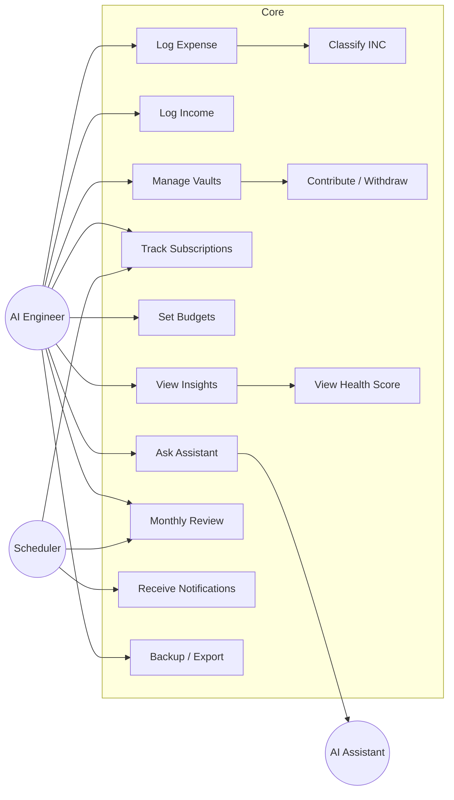

### 13.2 Class Diagram (domain)
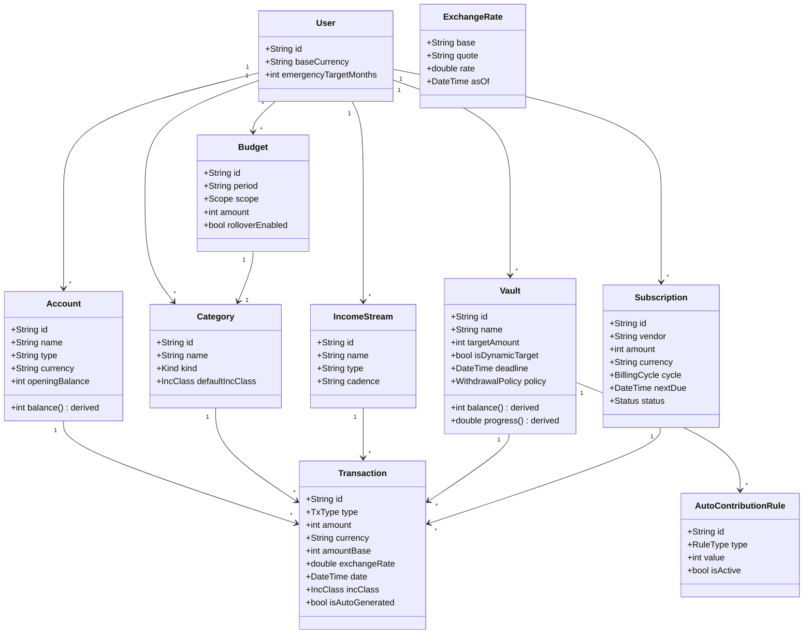

### 13.3 Sequence — Log Expense
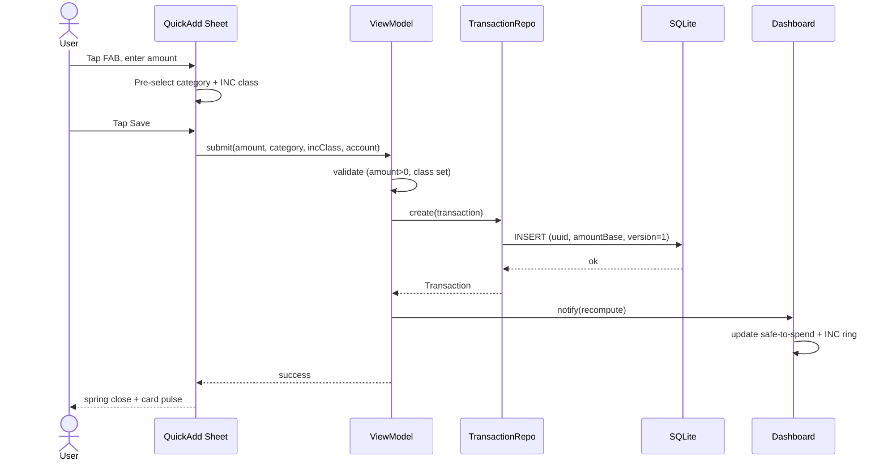

### 13.4 Sequence — "Can I buy this?"
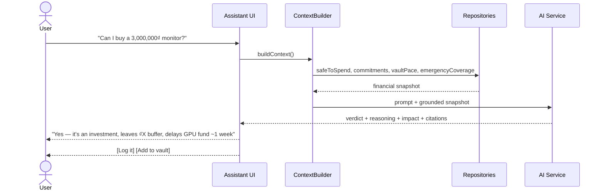

### 13.5 Activity — Monthly Review
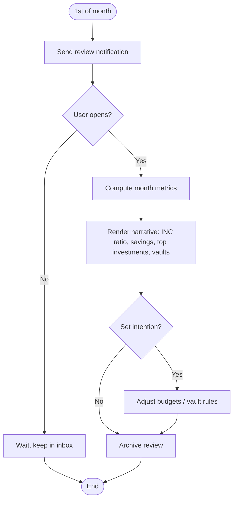

### 13.6 State — Vault Lifecycle
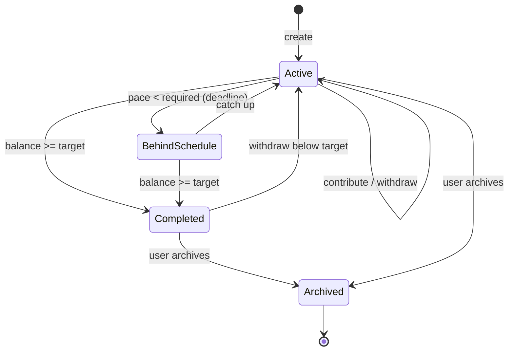

### 13.7 State — Subscription Lifecycle
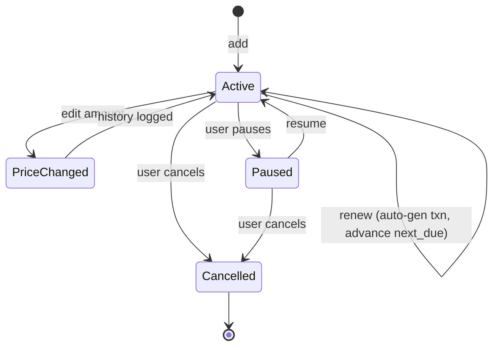

### 13.8 Component Diagram
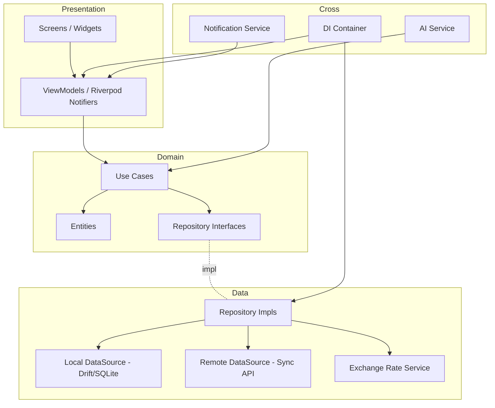

### 13.9 Entity Relationship Diagram
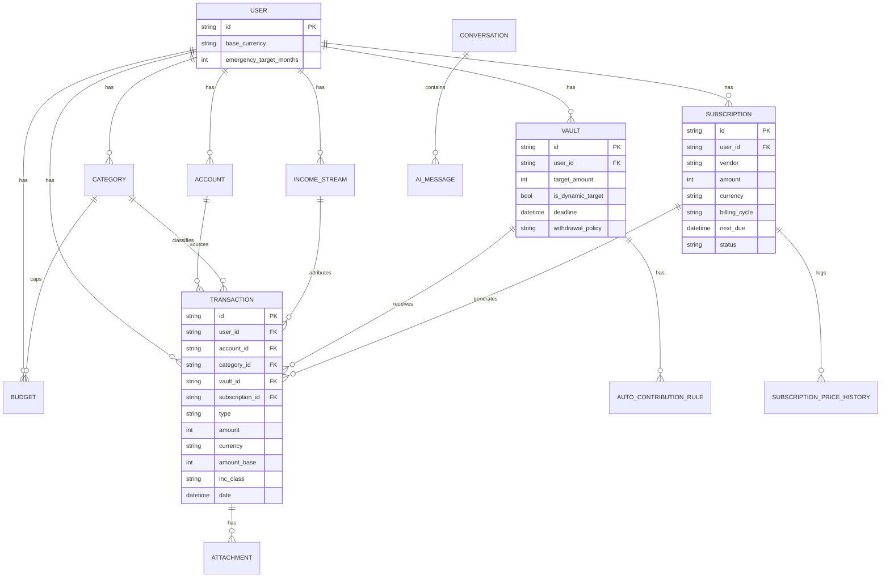

### 13.10 Package Diagram (feature-first)
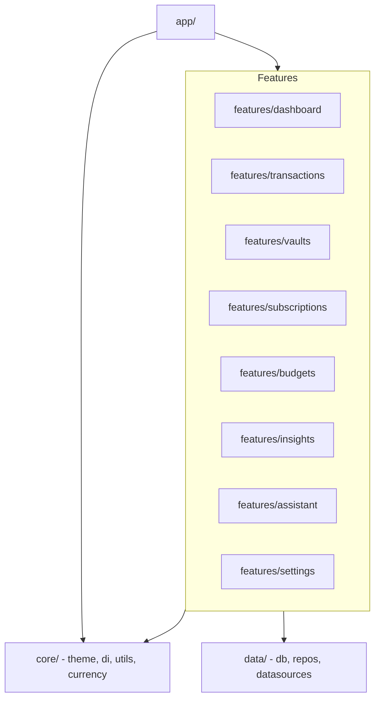

### 13.11 Deployment Diagram
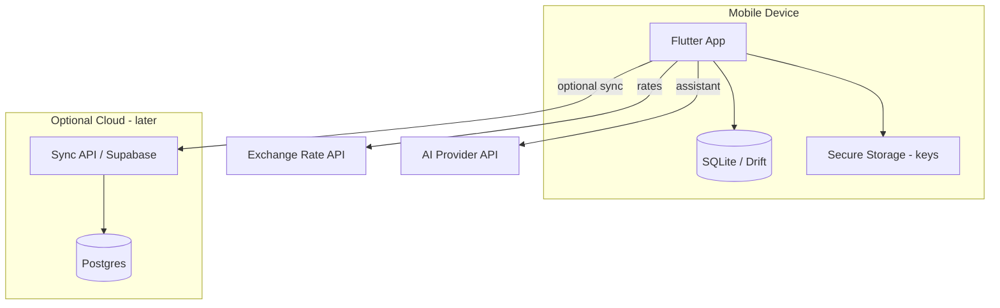

### 13.12 Navigation Flow Diagram
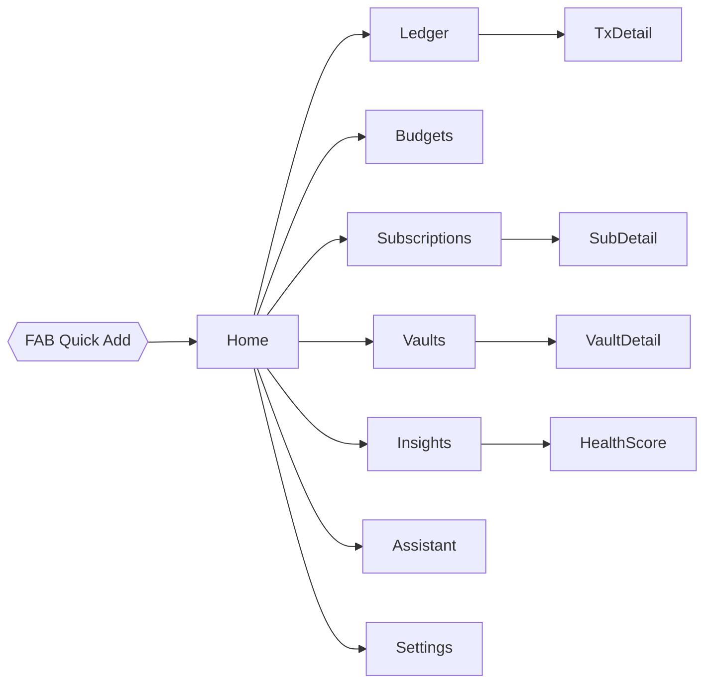

---

# 14. Architecture

### Recommended stack & patterns
- **Framework:** Flutter (single codebase, premium motion, the target implied by the brief).
- **Architecture:** **Clean Architecture, feature-first** — `presentation → domain → data`, features as vertical slices (`features/vaults/...`). Justification: solo maintainability, testable domain, and the ability to add features (assistant, sync) without cross-contamination.
- **Presentation pattern:** **MVVM** via **Riverpod** notifiers as ViewModels.
- **State management:** **Riverpod** over BLoC. Justification: less boilerplate for a solo dev, excellent for derived/computed state (safe-to-spend, ratios, health score are all *derived*), compile-safe DI built in. BLoC's event ceremony fights the "minimal" ethos.
- **Repository pattern:** domain depends on interfaces; data provides implementations → swap local-only for local+cloud later with zero domain change.
- **Dependency injection:** Riverpod providers (no separate get_it needed).
- **Local database:** **Drift (SQLite)** — typed queries, migrations, reactive streams (UI auto-updates when data changes).
- **Offline-first strategy:** all writes go to SQLite first and succeed offline; UI is driven by DB streams. Network is never on the critical path.
- **Synchronization strategy (later):** each row has `uuid`, `updated_at`, `version`, `deleted_at`. Sync = push local changes, pull remote, resolve with **last-write-wins on `updated_at`** (sufficient for single-user multi-device). Soft deletes propagate. Consider a simple change-log table for efficient deltas.
- **Cloud (later):** Supabase (Postgres + auth + row-level security) — matches the offline-first schema with minimal friction.
- **Backup strategy:** (1) on-device automatic snapshot of the SQLite file; (2) **JSON export/import** for portability & manual backup; (3) later, encrypted cloud backup. Export is P0-friendly and de-risks data loss before cloud exists.
- **Currency handling:** an `ExchangeRateService` (manual entry + optional API) freezes the rate into each transaction; base-currency aggregates stay correct forever.
- **Money type:** integer minor units end-to-end; a `Money` value object wraps arithmetic to prevent float bugs.
- **Notifications:** `flutter_local_notifications` + a scheduling service reading upcoming subscription due-dates, budget thresholds, review dates; batching layer enforces the ≤2/day cap.
- **AI service:** an interface (`AiAssistant`) with a `ContextBuilder` that assembles a grounded financial snapshot; provider-agnostic behind the interface.
- **Testing:** domain use-cases unit-tested (health score, safe-to-spend, vault pace are pure functions — high ROI); repository fakes; golden tests for key screens.

### Why not the alternatives (brief justifications)
- *Firebase-first?* No — couples you to the cloud and fights offline-first; also money-as-documents invites float/consistency bugs.
- *BLoC?* Overhead not justified for a solo, derived-state-heavy app.
- *Hive/Isar?* Great, but relational integrity (FKs, joins for ledger + ratios) is cleaner in SQLite/Drift.

---

# 15. Development Roadmap

Each phase: Objectives · Deliverables · Risks · Dependencies · Complexity.

### Phase 1 — Core Foundation (P0)
- **Objectives:** Instant logging + calm dashboard + INC lens working end to end.
- **Deliverables:** Design system & theming (dark/light); accounts & categories with INC defaults; Quick Add (expense/income); unified Ledger; Home with safe-to-spend + INC ring; SQLite/Drift schema; JSON export/import.
- **Risks:** over-scoping the dashboard; safe-to-spend formula tuning.
- **Dependencies:** none (greenfield).
- **Complexity:** **M–L** (foundation heavy).

### Phase 2 — Vaults & Subscriptions (P0/P1)
- **Objectives:** Fund goals; master recurring spend.
- **Deliverables:** Vault system (create/contribute/withdraw, dynamic Emergency target, completion celebration); Subscriptions hub with multi-currency + auto-generated transactions + "cost this year."
- **Risks:** virtual-balance vs net-worth double-counting; currency conversion edge cases.
- **Dependencies:** Phase 1 ledger + exchange-rate service.
- **Complexity:** **M**.

### Phase 3 — Budgets & Notifications (P1)
- **Objectives:** Inform without policing; timely, non-spammy nudges.
- **Deliverables:** Monthly + category budgets (rollover, forecasts, INC-aware defaults); notification engine with priority/batching/quiet-hours; Monthly Review.
- **Risks:** notification spam perception; forecast accuracy.
- **Dependencies:** Phase 1–2 data.
- **Complexity:** **M**.

### Phase 4 — Analytics (P1)
- **Objectives:** Meaningful, calm insight.
- **Deliverables:** Financial Health Score + 6 pillars; Consumption-vs-Investment, Savings Rate, Subscription Cost, Net Worth, Cash Flow, Career Investment charts.
- **Risks:** metric overload (resist!); chart performance on large ledgers.
- **Dependencies:** enough historical data (≥2–4 weeks).
- **Complexity:** **M**.

### Phase 5 — AI Assistant (P2)
- **Objectives:** Grounded reasoning over the real ledger.
- **Deliverables:** ContextBuilder; assistant chat; flagship prompts; citations; later, actions.
- **Risks:** hallucinated numbers (mitigate with strict grounding + citation); privacy of financial data to provider.
- **Dependencies:** Phases 1–4 (needs the metrics to reason over).
- **Complexity:** **L**.

### Phase 6 — Cloud & Multi-Device (P2)
- **Objectives:** Optional sync + encrypted backup.
- **Deliverables:** Supabase sync (LWW), auth, encrypted cloud backup, conflict handling.
- **Risks:** sync conflicts; security of financial data.
- **Dependencies:** stable schema from all prior phases.
- **Complexity:** **L**.

---

# 16. Future Expansion

**Premium / later features (brainstorm):**
- **AI financial coach** — proactive, longitudinal guidance (trend alerts, "what-if" simulations, negotiation-style budget coaching).
- **Investment tracking** — brokerage/stock portfolio, cost basis, returns (turns "Investment Fund" from a vault into a live portfolio).
- **Crypto** — wallet balances & valuation.
- **Shared family vault** — given the family business, a multi-contributor vault with roles.
- **Multi-device sync** — the Phase-6 groundwork productized.
- **OCR receipt scanning** — attachment → parsed transaction (schema already has `attachment`).
- **Voice assistant** — natural-language logging ("spent 45k on lunch") and queries.
- **Elysia integration** — expose financial signals (safe-to-spend, health score, vault pace) to your own agent stack so agents can *act* on them (e.g., pause a VPS when subscription-load pillar drops, or auto-draft a monthly review). This is the standout differentiator: your finance app as a data source for your broader "AI assists, humans decide" system.
- **Desktop version** (Flutter desktop) — a richer analytics/review surface.
- **Web dashboard** — read-mostly insights + review sharing.
- **Wear OS / Apple Watch** — glanceable safe-to-spend + one-tap quick log.
- **Income prediction** — model irregular streams (freelance/family) to forecast a realistic monthly floor.
- **Tax/receipt bundle export** — for freelance income reporting.

---

## Appendix A — Key Derived Formulas (for implementation reference)

**Safe-to-spend (today):**
```
monthly_discretionary = income_allocation
                      − committed_recurring (subscriptions + recurring)
                      − planned_vault_contributions
                      − necessity_budget
                      − buffer
remaining_discretionary = monthly_discretionary − discretionary_spent_this_month
safe_today = max(0, remaining_discretionary) / remaining_days_in_month
```
*(Investment-class spend is intentionally excluded from the discretionary ceiling.)*

**Vault ETA:** `months_left = (target − balance) / avg_monthly_contribution` → project date; compare to deadline for on-track/behind.

**Financial Health Score:** weighted sum of the 6 pillars in §10.1, with the Emergency-coverage guardrail damping the Investment-ratio pillar when coverage < 1 month.

---

*End of specification. This document is complete and self-contained for hand-off to implementation. Every feature carries a priority; the INC lens, calm-over-complete principle, and offline-first architecture are the three non-negotiable constraints that should govern all downstream decisions.*
