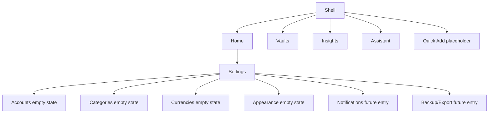
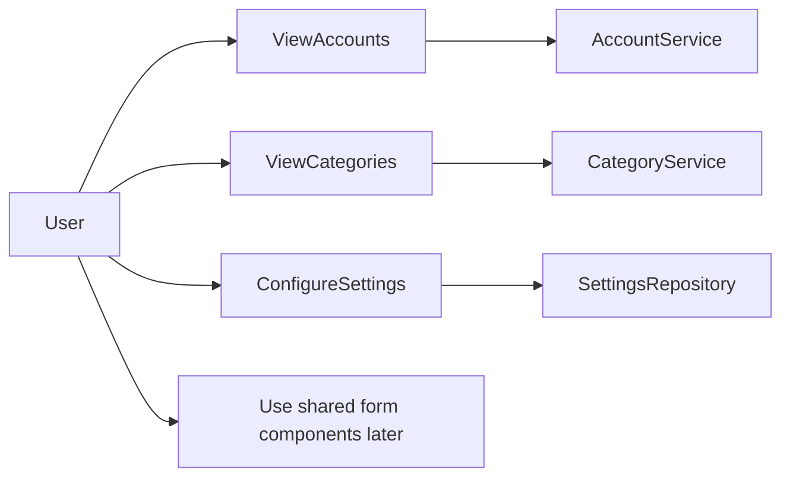
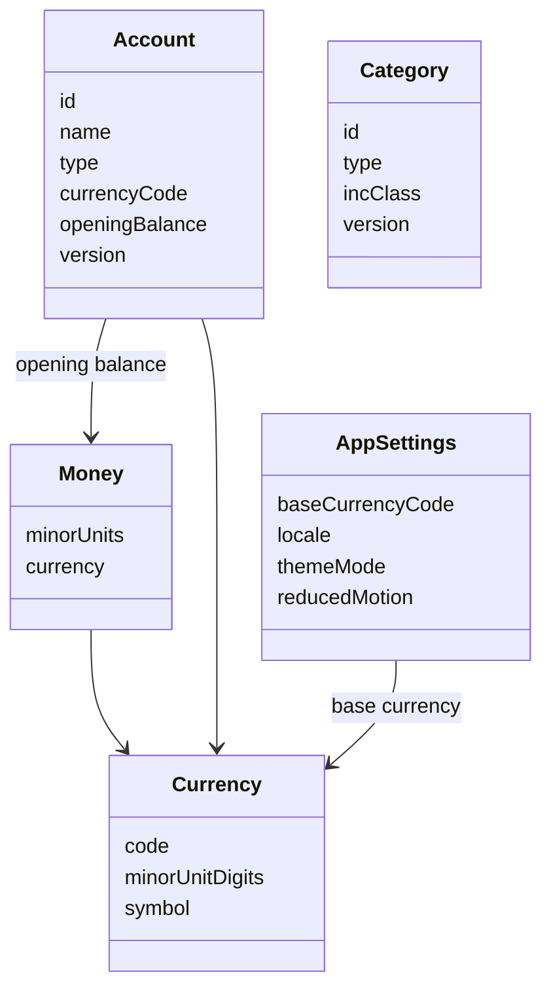
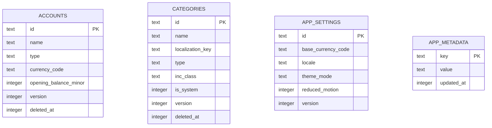
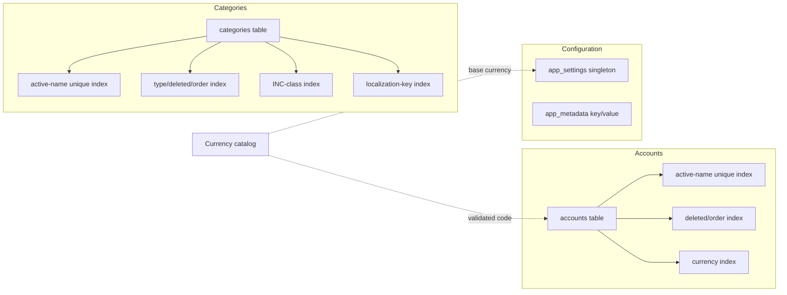
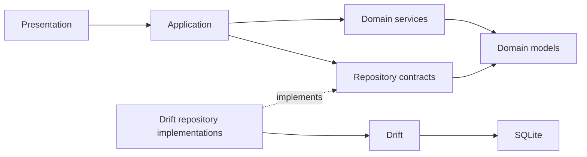
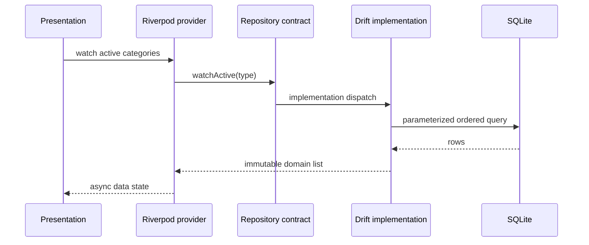
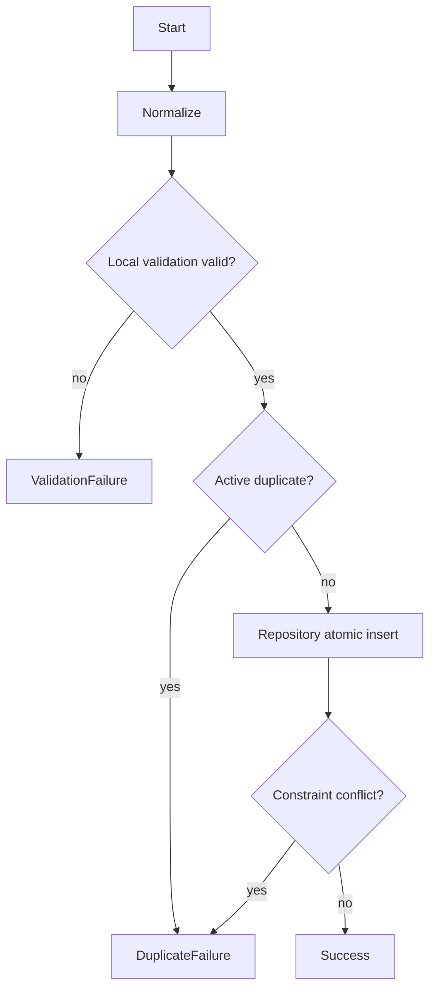

# Sprint 01 — Core Domain Foundation

**Status:** Ready for implementation

**Version:** 1.0

**Related:** [Product design](01-product-design.md),
[engineering architecture](02-engineering-architecture.md), and
[Sprint 00](03-sprint-00-bootstrap.md)

## Sprint vision

Sprint 01 establishes the business language and persistence contracts that every
later feature uses. Finance behavior is unusually expensive to correct after
data exists: changing currency precision, identity, deletion, or category
semantics later would require risky migrations and could silently alter a user's
history. Domain modeling therefore precedes screens and workflows.

The sprint delivers immutable value and entity definitions, database schema
version 2, repository and service contracts, validation rules, reusable form and
UI component specifications, migration behavior, and an implementation test
plan. It does not deliver a usable finance workflow.

### Outcome

After implementation, Sprint 02 can add transactions without revisiting money,
currency, account, category, settings, repository, validation, or shared-form
decisions.

### Explicitly out of scope

- Expense and income entry screens
- Transaction persistence or transaction calculations
- Dashboard or safe-to-spend calculations
- Budgets, vault behavior, subscriptions, analytics, notifications, or AI
- Authentication, cloud synchronization, exchange-rate APIs, OCR, or market data

Placeholder types may be documented to define boundaries, but only Money,
Currency, Account, Category, and App Settings are implemented in Sprint 01.

## Engineering principles

| Principle | Sprint 01 application | Rationale |
|---|---|---|
| Offline first | Accounts, categories, settings, and seeds are entirely local. | Core setup must never require a network. |
| Integer money | Store and calculate signed 64-bit minor units only. | Binary floating point cannot represent decimal money exactly. |
| Immutable domain | Domain objects change through validated copies/services. | Predictable equality and state transitions simplify Riverpod and tests. |
| Repository boundary | Application code sees domain contracts, never Drift rows. | Persistence changes must not leak into use cases. |
| Soft deletion | User-created records receive `deleted_at`; history remains referentially valid. | Later transactions must continue resolving archived records. |
| YAGNI | No transaction, budget, vault, sync, or exchange-rate engine is built. | Foundation should enable later work without pre-implementing it. |

## Business domain language

| Concept | Definition and boundary |
|---|---|
| Money | An amount in one currency, represented by integer minor units plus a currency code. It is a value, never an account balance by itself. |
| Currency | ISO 4217 identity and display/precision metadata. VND is the base currency. Currency definitions are a catalog, not exchange rates. |
| Account | A real-world location of money, such as cash, bank, or e-wallet. Sprint 01 stores opening balance metadata but does not derive a live balance. |
| Category | A classification applied to a future transaction. Expense categories require exactly one INC class; income categories do not. |
| Transaction type | Future ledger intent: expense, income, transfer, or vault contribution. It is defined here only to reserve language for Sprint 02. |
| Income | Money entering an account. Persistence and workflows begin in Sprint 02. |
| Expense | Money leaving an account and classified as Investment, Necessity, or Consumption. Persistence begins in Sprint 02. |
| Transfer | Movement between two accounts that does not change net worth. Deferred to Sprint 02 or later. |
| Investment | Expense that increases future earning capacity or capability. This is an INC class, not an asset portfolio. |
| Necessity | Expense required to live and function. This is an INC class. |
| Consumption | Expense for present enjoyment. It is neutral language, never a warning state. |
| Budget period | A future calendar interval used to evaluate a budget. No period calculations are implemented here. |
| Budget | A future advisory limit. Budgets never block spending and are deferred. |
| Vault | A future virtual earmark within real accounts; it never adds to net worth. Deferred. |
| Goal | A vault with a target and optional deadline. Deferred. |
| Subscription | A future recurring vendor commitment with an amount, currency, cadence, and next due date. Deferred. |
| Recurring payment | A future recurrence rule that may create or propose transactions. Deferred. |
| Financial health | A future derived score over ledger and goal data. No inputs or calculation are implemented here. |
| App settings | Singleton local preferences such as base currency, locale override, theme, and reduced motion. No secrets belong here. |

## Domain models

All implemented models are immutable, compare by value, and validate at creation
boundaries. Persistence DTOs map explicitly to domain models; domain packages do
not import Flutter, Drift, or platform packages.

### Money

| Field | Type semantics | Validation |
|---|---|---|
| `minorUnits` | Signed 64-bit integer | Must remain within signed 64-bit range after every operation. |
| `currency` | Currency code/value | Must exist in the supported currency catalog. |

Money supports same-currency addition, subtraction, negation, absolute value,
comparison, and allocation by integer ratios. Cross-currency arithmetic fails
with a typed currency-mismatch failure. Multiplication or division by a decimal
factor requires an explicit rounding mode; silent rounding is prohibited.

Examples: VND 125,000 is stored as `125000`; USD 12.34 is stored as `1234`.
Money does not format itself and does not know exchange rates.

### Currency

| Field | Purpose | Validation |
|---|---|---|
| `code` | Uppercase ISO 4217 code | Exactly three ASCII letters and present in the catalog. |
| `numericCode` | ISO numeric identity | Positive three-digit catalog value. |
| `minorUnitDigits` | Decimal precision | Catalog-controlled integer from 0 through 3. |
| `symbol` | Preferred compact symbol | Non-empty display metadata. |
| `englishName` | Stable fallback name | Non-empty; localized names live in ARB resources. |

Sprint 01 ships VND and USD because the product explicitly requires both. The
catalog is extensible without a schema migration. Currency does not contain a
mutable exchange rate.

### Account

| Field | Purpose and rules |
|---|---|
| `id` | UUID string created locally. Seed IDs are reserved stable UUID constants. |
| `name` | Trimmed, 1–80 Unicode characters; unique case-insensitively among active accounts. |
| `type` | Closed Sprint 01 set: cash, bank, or e-wallet. Unknown persisted values map to a typed data failure. |
| `currencyCode` | Supported catalog currency; VND by default. |
| `openingBalance` | Money whose currency matches `currencyCode`; no derived current balance exists yet. |
| `iconKey` | Allow-listed semantic icon key, not an arbitrary asset path. |
| `colorToken` | Allow-listed theme token key, not a raw platform color integer. |
| `sortOrder` | Non-negative ordering value. |
| `createdAt`, `updatedAt` | UTC instants; update cannot precede creation. |
| `deletedAt` | Nullable UTC instant implementing soft deletion. |
| `version` | Positive optimistic-concurrency counter, incremented on update. |

Accounts may be archived/soft-deleted but never hard-deleted through the public
repository. Future transactions reference accounts by ID.

### Category

| Field | Purpose and rules |
|---|---|
| `id` | Local UUID; stable reserved UUID for each seed. |
| `name` | Custom display name, or null when a seed localization key supplies the label. |
| `localizationKey` | Stable ARB lookup key for seeds; null for user-created categories. Exactly one of name/key is present. |
| `type` | Income or expense. |
| `incClass` | Required for expense; absent for income. Values: investment, necessity, consumption. |
| `iconKey`, `colorToken` | Allow-listed semantic keys. |
| `sortOrder` | Non-negative ordering within category type. |
| `isSystem` | True for protected defaults; system records can be hidden but not renamed or hard-deleted. |
| audit fields | Same UTC, soft-delete, and version rules as Account. |

Resolved category names must be unique after Unicode trim/case normalization
within each category type among active rows. Future transactions retain the
category ID when a category is soft-deleted.

### App Settings

The singleton has the stable ID `app`. It contains base currency code (default
VND), optional locale override (`en`, `vi`, or system), theme mode (system,
light, dark), reduced-motion preference, UTC created/updated instants, and a
positive version. It contains no credentials, personal profile, exchange rate,
or financial aggregate. Missing settings are repaired by inserting defaults in
one atomic initialization transaction.

### Deferred model contracts

The following definitions guide compatibility but produce no Sprint 01 tables or
runtime types:

| Model | Reserved shape and future extension |
|---|---|
| Transaction Draft | Positive Money, transaction type, account ID, optional category ID, occurred-at instant, and optional note; validation belongs to Sprint 02. |
| Transaction | Draft plus UUID, frozen base amount/rate, audit/version fields, and soft deletion. |
| Budget | Period, optional category, Money limit, rollover policy, and audit fields. |
| Vault | Name, account-independent target Money, virtual balance derived from contributions, optional deadline. |
| Subscription | Vendor, plan, Money, cadence, next due date, INC class, account ID, and lifecycle state. |

These shapes are documentation only so Sprint 01 cannot accidentally become a
partial transaction or budgeting feature.

### Model design summary

| Model | Purpose | Relationships | Future extension | Example |
|---|---|---|---|---|
| Money | Exact monetary value and safe arithmetic. | Contains one Currency identity; embedded by financial entities. | Explicit conversion result with frozen rate metadata. | VND 125,000 → 125000 minor units. |
| Currency | Precision and display metadata for an ISO currency. | Referenced by Money, Account, and App Settings by code. | Add catalog entries without schema changes. | VND with 0 digits; USD with 2. |
| Account | Real-world location where money is held. | Embeds opening-balance Money; future transactions reference its ID. | Additional account types and institution metadata via migrations. | Cash Wallet in VND with zero opening balance. |
| Category | Stable classification for future ledger entries. | Future transactions reference its ID; expense categories own one INC class. | User ordering, hiding, and later budget association. | Food / expense / Necessity. |
| Transaction Draft | Future validated intent before persistence. | Refers to Account and optionally Category. | Transfer endpoints, attachments, recurrence source. | Expense draft for food; not implemented in Sprint 01. |
| Transaction | Future immutable ledger event with audit state. | Refers to accounts/category and embeds original/base Money metadata. | Sync fields, attachments, subscription/vault links. | Persisted expense; deferred to Sprint 02. |
| Budget | Future advisory limit over a period. | Optionally scoped to Category and denominated in Money. | Rollover and forecast policy. | Monthly food limit; deferred. |
| Vault | Future virtual earmark toward a goal. | Contributions reference an Account through transactions; target is Money. | Pace, deadline, and auto-contribution rules. | GPU fund; deferred. |
| Subscription | Future recurring vendor commitment. | Refers to Account and Category; amount is Money. | Price history and recurrence-generated transactions. | AI plan billed monthly; deferred. |
| App Settings | Singleton non-secret local preferences. | References base Currency by code and controls presentation defaults. | Additional backward-compatible preferences or versioned columns. | VND, system locale/theme, normal motion. |

## Money rules

1. Money is stored end-to-end as signed 64-bit integer minor units. `double` and
   SQLite `REAL` are prohibited for amounts, balances, rates, and arithmetic.
2. VND has zero minor-unit digits; USD has two. Parsing rejects excess precision
   instead of truncating it.
3. Same-currency arithmetic checks overflow before returning. Overflow produces
   a typed domain failure; it never wraps.
4. Money values with different currency codes are neither arithmetically
   compatible nor order-comparable.
5. Equality includes both minor units and currency.
6. Allocation uses quotient/remainder distribution so allocated parts sum
   exactly to the original value.
7. Formatting is locale-aware and delegated to FormattingService. Parsing is
   delegated to MoneyService and accepts localized grouping/decimal symbols.
8. Exchange conversion is deferred. A future CurrencyService must require an
   explicit rate, target currency, effective instant, and rounding mode.

Floating point is forbidden because values such as 0.1 have no exact binary
representation. Repeated operations would introduce invisible rounding drift,
breaking ledger equality and user trust.

## Database schema version 2

Schema version 1 is intentionally empty. Version 2 introduces only accounts,
categories, app settings, and migration metadata. Drift tables use text UUID
primary keys, UTC epoch-microsecond timestamps, integer booleans, and integer
money.

### Accounts table

| Column | Constraints |
|---|---|
| id | Text primary key; valid UUID |
| name | Text, trimmed length 1–80 |
| type | Text check: cash, bank, e_wallet |
| currency_code | Text, three uppercase characters |
| opening_balance_minor | 64-bit integer |
| icon_key, color_token | Non-empty text keys |
| sort_order | Integer ≥ 0 |
| created_at, updated_at | Non-null UTC integer timestamps |
| deleted_at | Nullable UTC integer timestamp |
| version | Integer ≥ 1 |

Indexes: active normalized name, `(deleted_at, sort_order)`, and currency code.
Uniqueness is enforced for normalized active names by repository preflight and a
database partial unique index so concurrent writes cannot create duplicates.

### Categories table

| Column | Constraints |
|---|---|
| id | Text primary key; valid UUID |
| name | Nullable custom text, length 1–80 when present |
| localization_key | Nullable seed key; exclusive with name |
| type | Text check: income, expense |
| inc_class | Nullable; required/check-limited for expense, null for income |
| icon_key, color_token | Non-empty text keys |
| sort_order | Integer ≥ 0 |
| is_system | Integer boolean |
| created_at, updated_at, deleted_at, version | Same audit semantics as accounts |

Indexes: `(type, deleted_at, sort_order)`, INC class, localization key, and active
normalized custom name. Table checks enforce name/key exclusivity and INC rules.

### App settings table

One row with ID `app`: base currency code, nullable locale override, theme mode,
reduced-motion boolean, created/updated UTC timestamps, and version. A primary-key
check prevents additional singleton IDs.

### App metadata table

Key/value text records hold schema-support information only. Version 2 writes
`seed_version=1` and an updated UTC timestamp. No user preference or financial
value belongs here.

### Migration 1 → 2

The migration runs in one SQLite transaction:

1. Create all four tables, checks, and indexes.
2. Insert app settings defaults if absent.
3. Insert seed accounts/categories using stable reserved UUIDs and conflict-safe
   insert semantics.
4. Record seed version 1.
5. Validate foreign-key checks and required row counts before commit.

If any operation fails, SQLite rolls the transaction back and the app surfaces a
recoverable database-initialization failure. Database downgrades remain
unsupported. App binaries must never decrement schema version. Rollback means
restoring a pre-migration backup or shipping a forward corrective migration—not
executing destructive down migrations on user data.

Migration tests must build an actual version-1 database, open it with version-2
code, inspect tables/indexes/check behavior, verify seeds/settings exactly once,
close/reopen, and prove idempotent results.

## Default seed data

Seed identities and localization keys are stable across installs. Labels are
resolved from English/Vietnamese ARB resources at presentation time; translated
strings are never stored in the database.

### Accounts

| Localization key | Type | Currency | Opening balance |
|---|---|---|---|
| account.cashWallet | Cash | VND | 0 |
| account.bankAccount | Bank | VND | 0 |

### Categories

| Localization key | Type | INC class |
|---|---|---|
| category.salary | Income | — |
| category.food | Expense | Necessity |
| category.transport | Expense | Necessity |
| category.shopping | Expense | Consumption |
| category.aiSubscription | Expense | Investment |
| category.health | Expense | Necessity |
| category.education | Expense | Investment |
| category.investment | Expense | Investment |
| category.other | Expense | Consumption |

Seed reruns update only seed-owned presentation metadata such as localization,
icon, color, and sort order when the seed version advances. They never overwrite
user-editable state, resurrect a hidden record, or duplicate a record.

## Repository contracts

Repository interfaces live in the domain layer; Drift implementations live in
data. All write methods validate, translate uniqueness/constraint errors into
typed failures, and use optimistic versions. Streams emit immutable domain lists.

### AccountRepository

- Watch active accounts ordered by sort order/name.
- Fetch by ID with an explicit include-deleted option for historical resolution.
- Create a validated account.
- Update when the expected version matches; return conflict failure otherwise.
- Soft-delete/archive an account; never hard-delete publicly.
- Determine whether an active normalized name already exists, excluding an ID.

### CategoryRepository

- Watch active categories, optionally filtered by income/expense and INC class.
- Resolve localized seed/custom display data through a mapper, not SQL.
- Fetch by ID including deleted records when requested.
- Create/update custom categories with duplicate and INC validation.
- Hide/soft-delete system categories and soft-delete custom categories.
- Determine duplicate normalized names within category type.

### SettingsRepository

- Watch and read the singleton settings value.
- Atomically update base currency, locale, theme, or reduced-motion preference
  with expected-version conflict protection.
- Repair a missing singleton with defaults during initialization.

### CurrencyRepository

- Return the immutable supported-currency catalog.
- Fetch by normalized code and report unsupported-currency failure.
- Expose base currency from SettingsRepository composition.
- It does not fetch exchange rates or persist catalog entries in Sprint 01.

## Service layer

Services are pure or repository-orchestrating application dependencies, exposed
through generated Riverpod providers and replaceable in tests.

| Service | Responsibility | Explicit non-responsibility |
|---|---|---|
| MoneyService | Parse localized input into Money; checked arithmetic/allocation; precision validation. | Formatting widgets, exchange rates, or persistence. |
| FormattingService | Format Money and dates for an explicit locale, preserving currency precision. | Parsing, conversion, or business decisions. |
| CurrencyService | Catalog lookup, support checks, and minor-unit metadata. | Live/manual exchange-rate conversion in this sprint. |
| ValidationService | Compose synchronous reusable validators and normalized values. | Database duplicate queries. |
| AccountService | Validate account commands, query duplicate names, and invoke AccountRepository. | Balances derived from transactions. |
| CategoryService | Enforce type/INC/system constraints, duplicate checks, and invoke CategoryRepository. | Transaction classification heuristics. |

Services return typed success/failure results rather than throwing expected
validation or duplicate errors. Unexpected infrastructure exceptions are logged
using event names only and mapped to safe failures.

## Validation framework

Validation is deterministic, synchronous unless uniqueness requires a repository,
and independent of Flutter widgets. A validation result contains either a
normalized value or one or more stable error codes; UI localizes codes through
ARB resources.

| Validator | Rules |
|---|---|
| Money input | Required, locale-parseable, ≤ currency precision, within 64-bit range; positivity is command-specific. |
| Name | Unicode trim; 1–80 characters; reject control characters and isolated line separators. Emoji and Vietnamese text are valid. |
| Currency | Normalize uppercase; exactly three ASCII letters; must exist in catalog. |
| Length | Counts Unicode grapheme clusters for user-facing limits. |
| Duplicate | Case-folded, Unicode-normalized, whitespace-collapsed comparison within entity scope; repository confirms atomically. |
| Icon/color key | Required and included in the respective allow-list. |

Error codes include required, invalid format, unsupported currency, excessive
precision, out of range, invalid character, too long, duplicate, invalid INC
class, version conflict, and unavailable storage. Validators never return English
messages. Future validators extend the error-code set without changing existing
semantics.

## Reusable form system

The form system standardizes behavior but owns no finance workflow:

- Field state distinguishes pristine, focused, valid, invalid, and submitting.
- Validation runs on submit and after first blur; it does not show errors on the
  first keystroke.
- Focus order follows visual order and supports next/done keyboard actions.
- Submission disables duplicate actions and restores focus to the first invalid
  field with an accessibility announcement.
- Money input uses a numeric keyboard, locale-aware separators, selection-safe
  grouping, currency precision limits, and preserves the raw edit buffer.
- State restoration stores non-sensitive draft field text only; it never stores
  secure values or submits automatically.
- Every field provides a semantic label, hint, error association, 48×48 minimum
  target, and works at 200% text scale without clipping.

## Shared component library

Components live under `shared/widgets` only when feature-neutral. They accept
domain/display values and callbacks; they do not read repositories directly.

| Component | Required behavior |
|---|---|
| MoneyInput | Amount controller, currency, locale, error code, enabled state, semantic label, precision-aware input formatting. |
| CurrencyInput | Catalog-backed selection with code, localized name, symbol, keyboard/search support. |
| CategoryChip | Resolved label, semantic icon/color, selected/disabled states, INC semantics beyond color. |
| SectionHeader | Title, optional description/action; correct heading semantics and scaling. |
| ConfirmationDialog | Explicit title/body, destructive flag, cancel/confirm actions; safe default focus on cancel. |
| AppBottomSheet | Safe areas, draggable/scrollable content, keyboard insets, reduced-motion transition. |
| LoadingCard | Stable layout skeleton excluded from accessibility focus with a live loading label. |
| ErrorState | Safe localized message, optional retry, no raw exception. |
| EmptyState | Icon, title, explanation, optional primary action; no feature calculations. |
| PrimaryButton | Loading/disabled state, single invocation, full semantic label. |
| SecondaryButton | Non-primary action with matching height and focus behavior. |
| AppIconButton | Tooltip required, 48×48 target, semantic selected state. |
| AppSearchBar | Query controller, clear action, debounce supplied by caller, restoration ID. |
| AppFilterChip | Label, selected state, optional count, keyboard toggle, non-color selection cue. |
| AppCard | Flat semantic surface using tokenized border, radius, padding, and optional tap action. |

Widget tests cover state combinations, keyboard traversal, 200% text scale,
English/Vietnamese labels, light/dark themes, and reduced motion. Goldens cover a
small representative matrix rather than every permutation.

## Navigation updates

The four primary destinations remain Home, Vaults, Insights, and Assistant with
central Quick Add and Settings. Sprint 01 replaces generic placeholders with
structured empty states that state the future purpose and sprint ownership.
Settings exposes non-functional navigation entries for Accounts, Categories,
Currencies, Appearance, Notifications, and Backup/Export; only architecture and
empty-state routing are present. No create/edit forms or finance workflow routes
are enabled until their owning sprint.

## Theme extensions

The finance theme extension adds semantic roles for income, expense, investment,
necessity, consumption, warning, success, progress track/fill, eight category
palette slots, and six chart series. Every light token must meet WCAG contrast
against light surfaces and every dark token against dark surfaces. INC classes
must always pair color with label/icon. Chart/category palettes are ordinal
tokens, not business meaning.

Motion uses the existing duration tokens and `MediaQuery.disableAnimations` plus
the app reduced-motion setting. Reduced mode returns zero duration for decorative
motion and a short cross-fade only where continuity is necessary.

## Error and recovery model

| Layer | Failure examples | Recovery |
|---|---|---|
| Domain | Currency mismatch, overflow, invalid INC relationship | Correct command/input; never retry automatically. |
| Validation | Required, format, precision, duplicate | Inline localized field error and focus. |
| Repository | Not found, version conflict, constraint, unavailable storage | Refresh/reload; retry only transient availability failures. |
| Database | Migration, corruption, disk full | Roll back migration, safe error screen, preserve database, offer future restore path. |
| UI | Unexpected rendering/provider failure | Existing safe fallback and retry/restart guidance. |

Expected failures are not logged as errors. Unexpected failures log only stable
event name, layer, failure type, and stack trace; names, amounts, account data,
notes, and raw SQL parameters are prohibited.

## Testing strategy

| Area | Minimum evidence |
|---|---|
| Money | VND/USD precision, equality, mismatch, checked overflow boundaries, arithmetic, comparison, allocation remainder invariants. |
| Currency | Catalog lookup, normalization, unsupported code, correct minor digits. |
| Validation | Unicode/Vietnamese names, whitespace/case duplicates, control characters, length, money parsing, overflow, error codes. |
| Repositories | CRUD, ordering, filtering, soft deletion, seed protection, duplicate race mapping, optimistic conflicts, stream updates. |
| Migration | Real v1→v2 file migration, schema/index/check inspection, defaults/seeds, second-open idempotence, transactional rollback. |
| Services | Success and every typed failure branch with repository fakes. |
| Formatting | en/vi VND and USD snapshots, negative/zero/large values, dates. |
| Widgets | All shared states, focus/keyboard, semantics, 200% scaling, themes, reduced motion. |
| Integration | Cold initialization creates schema/seeds/settings and shell reaches structured empty states. |

Coverage targets are ≥95% for Money and validators, ≥90% for services and
repositories, and meaningful state coverage for shared widgets. Generated code
is excluded. Coverage never replaces boundary/invariant assertions.

## Performance and accessibility budgets

| Metric | Budget and measurement |
|---|---|
| First v1→v2 migration and seed | ≤250 ms p95 on a representative mid-tier Android device, excluding process startup. |
| Warm database initialization | ≤100 ms p95. |
| Synchronous validation | ≤2 ms p95 per field; duplicate repository lookup ≤50 ms p95 locally. |
| Money formatting | ≤1 ms average over 10,000 warmed iterations. |
| Account/category list | Smooth 60 fps for 1,000 rows; repository queries return first page ≤50 ms p95. |
| Memory | Foundation/domain additions ≤15 MB incremental resident memory during list/form tests. |

All components support screen readers, keyboard traversal, high contrast, dark
mode, reduced motion, and 200% text scaling. Performance benchmarks record device,
build mode, warm-up, and sample count; debug-mode timings do not prove budgets.

## Architecture diagrams

### Use cases

### Domain class relationships

### Entity relationship

Sprint 01 tables have no foreign-key relationship because transactions are
deferred. Currency codes reference an application catalog by validated value,
not a mutable database table.

### Database schema diagram

### Repository dependency graph

### Read sequence

### Validated create activity

## Documentation deliverables for implementation

The implementation PR must update:

- `README.md` with Sprint 01 scope, migration/codegen commands, and supported
  currency statement.
- `docs/architecture.md` with actual folder paths and dependency mappings.
- `docs/domain-model.md` with the model rules and class diagram.
- `docs/database-migrations.md` with the v1→v2 procedure and rollback policy.
- `docs/repositories.md` with contract responsibilities and failure mapping.
- `docs/validation.md` with normalization, codes, localization, and form timing.

Documentation must describe implemented behavior only. If implementation differs
from this specification, update the specification or add an ADR before merging.

## Risks and mitigations

| Risk | Consequence | Mitigation |
|---|---|---|
| Float or incorrect minor precision | Silent money corruption | Money value object, integer columns, precision tests, analyzer/code-review prohibition. |
| Migration partially applies | App cannot open or data is inconsistent | One transaction, real-file migration tests, validation before commit, forward-only repair. |
| Seed localization stored as text | Locale changes leave stale labels | Persist stable localization keys and resolve in presentation. |
| Seed duplication | Repeated startup clutters setup data | Stable IDs, seed version metadata, conflict-safe idempotent seed transaction. |
| Category INC ambiguity | Later analytics become unreliable | Database checks and domain validation require INC for expense only. |
| Future currencies need schema rewrite | Delays multi-currency work | Store ISO code and catalog precision; no VND-specific amount columns. |
| Repository leaks Drift types | UI becomes persistence-coupled | Domain contracts and explicit row/domain mappers with import-boundary tests/lints. |
| Unicode duplicate mismatch | Visually duplicate names | One documented normalization algorithm plus database normalized unique key/index. |
| Optimistic conflict ignored | Updates silently overwrite | Expected version on every update and typed conflict result. |
| Component library over-generalizes | Complex APIs before consumers exist | Implement only listed states with near-term Sprint 02 consumers; extend on evidence. |

## Implementation backlog

| Order | Work item | Dependency | Complexity |
|---:|---|---|---|
| 1 | Money, Currency, validation results/codes, and unit tests | Sprint 00 core | M |
| 2 | Drift v2 tables, constraints, indexes, migration, and seed transaction | 1 | L |
| 3 | Account/Category/Settings models, mappers, and repository contracts | 1–2 | L |
| 4 | Drift repository implementations and repository/migration tests | 2–3 | L |
| 5 | Services and Riverpod composition with test overrides | 3–4 | M |
| 6 | Formatting/localization seeds and validator error messages | 1, 3 | M |
| 7 | Shared form/component library and accessibility tests | 1, 5–6 | L |
| 8 | Structured empty-state navigation and integration tests | 5–7 | M |
| 9 | Documentation, performance evidence, full quality gates | all | M |

## Definition of Done for the implementation sprint

- [ ] Money uses checked integer minor units and all invariants are tested.
- [ ] VND and USD currency definitions and formatting are tested in English and
      Vietnamese.
- [ ] Immutable Account, Category, and App Settings models match this document.
- [ ] Drift schema version is exactly 2 and contains only accounts, categories,
      app settings, and metadata.
- [ ] A transactional v1→v2 migration passes real-file, rollback, reopen, and
      idempotent seed tests.
- [ ] Account, Category, Settings, and Currency repositories are implemented
      behind domain contracts with optimistic conflict and soft-delete behavior.
- [ ] Money, Formatting, Currency, Validation, Account, and Category services are
      implemented and provider-overridable.
- [ ] Seed accounts/categories are stable, idempotent, and localized by key.
- [ ] Every listed shared component and form behavior has meaningful widget and
      accessibility coverage.
- [ ] Structured empty states replace generic placeholders without enabling a
      finance workflow.
- [ ] Theme roles cover finance, INC, category, chart, progress, and reduced
      motion semantics in light/dark modes.
- [ ] Failure mapping and privacy-safe logging follow the error model.
- [ ] Performance budgets are measured in an appropriate build mode/device.
- [ ] Required implementation documentation and diagrams match the code.
- [ ] Code generation, formatting, analysis, tests, and Android debug build pass
      locally and in GitHub Actions.
- [ ] No transaction table/logic, dashboard calculation, budget logic, vault
      behavior, notification scheduling, AI, authentication, or cloud sync exists.
- [ ] No unresolved implementation markers or committed secret/user financial
      data exists.

## Specification acceptance checklist

- [x] Sprint vision and domain-first rationale are explicit.
- [x] Every requested business concept is defined with sprint boundaries.
- [x] Implemented and deferred immutable model contracts are unambiguous.
- [x] Money precision, arithmetic, comparison, overflow, and formatting rules are
      specified without floating point.
- [x] Version-2 tables, indexes, constraints, seeds, migration, and rollback
      policy are defined while transactions remain deferred.
- [x] Four repository and six service responsibilities are defined.
- [x] Reusable validation, forms, and every requested shared component are
      specified with accessibility behavior.
- [x] Navigation, theme, error, testing, performance, documentation, and risk
      requirements include measurable acceptance evidence.
- [x] Use case, class, ER/schema, sequence, activity, repository dependency, and
      navigation diagrams are included.
- [x] The implementation backlog and Definition of Done preserve the original
      scope and prohibitions.

This document is the complete Sprint 01 engineering hand-off. It intentionally
contains no Flutter, Dart, or SQL implementation.
