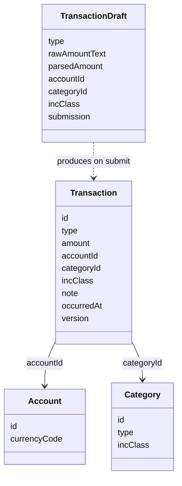
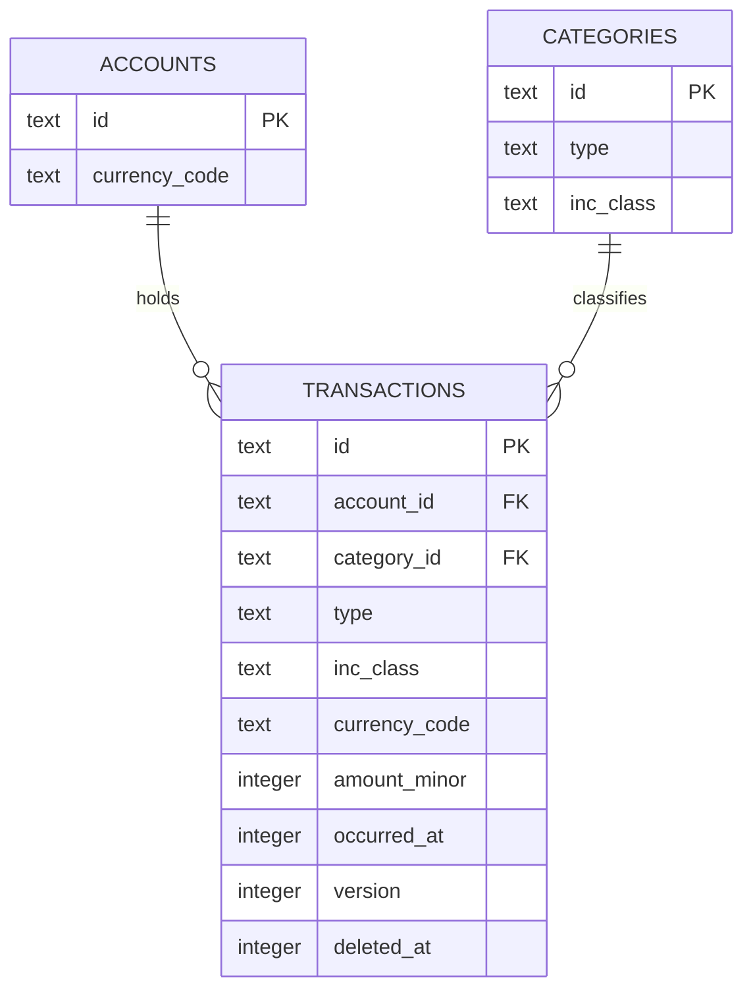
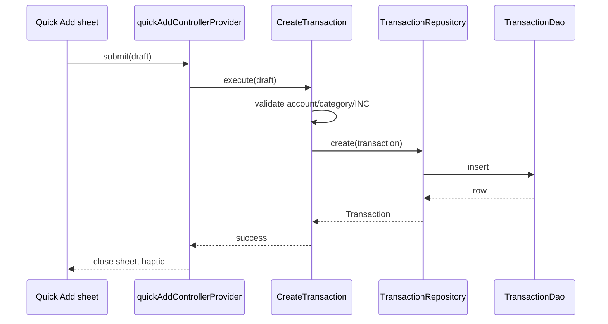
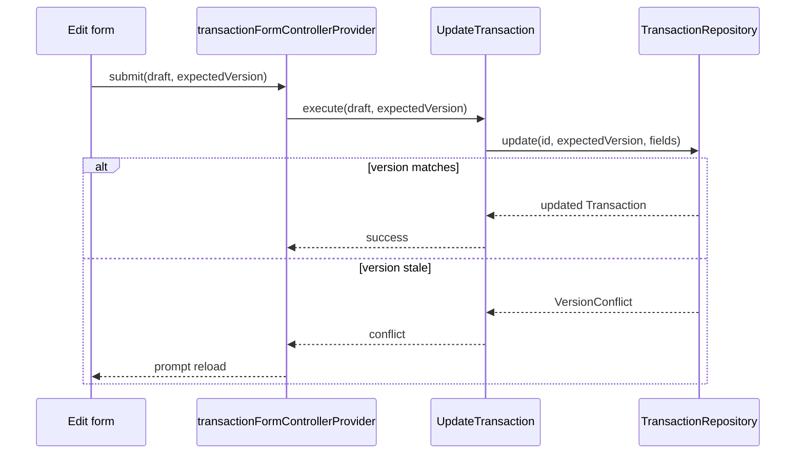
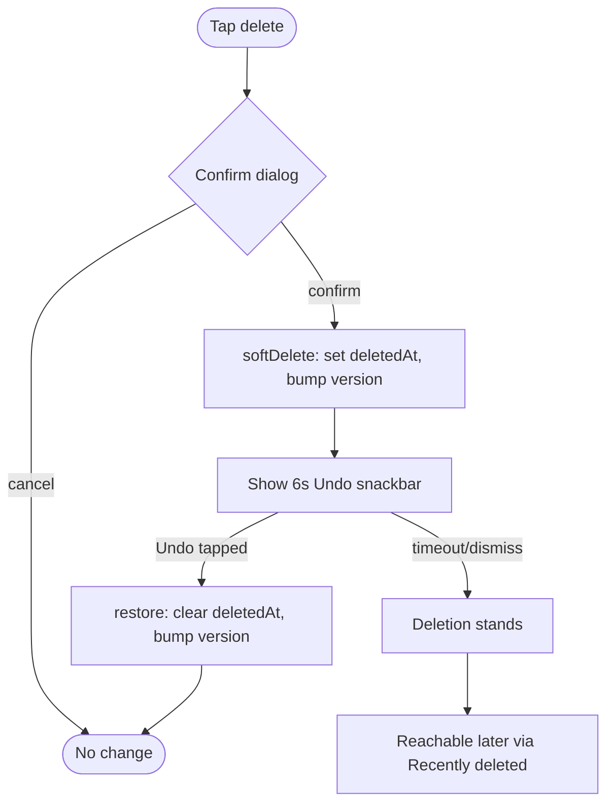
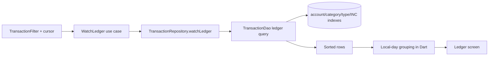
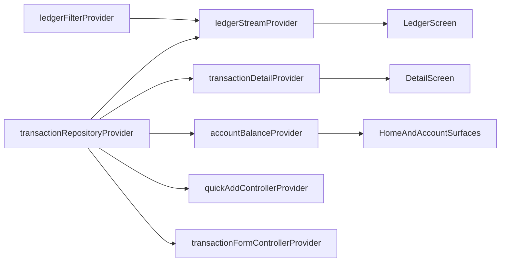
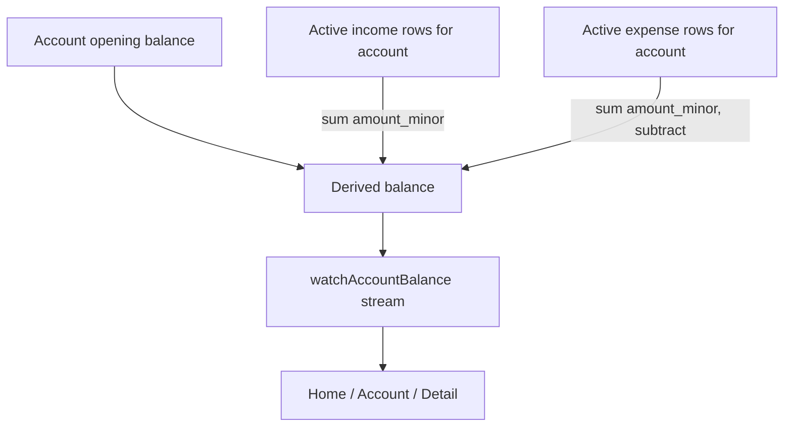
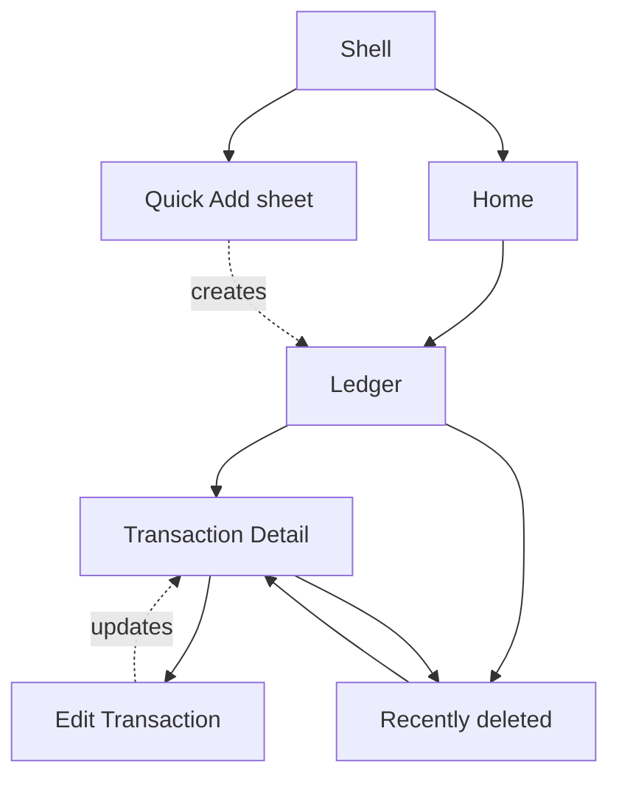

# Sprint 02 — Transaction Engine

**Status:** Ready for implementation

**Version:** 1.0

**Related:** [Product design](01-product-design.md),
[engineering architecture](02-engineering-architecture.md),
[Sprint 00](03-sprint-00-bootstrap.md), and [Sprint 01](04-sprint-01-foundation.md)

## Sprint vision

Sprint 01 gave Lys Finance a business vocabulary and a place to store it. Sprint 02
gives it a reason to be opened every day: the transaction ledger. A finance app
that cannot record what happened to your money is not a finance app yet — it is
a settings screen. Transactions are the central ledger because every other
future surface (balances, budgets, vaults, insights, the assistant) is a
question asked *of* the ledger; none of them may hold their own opinion about
what happened. The ledger is the source of truth specifically because money
mistakes compound silently: a mis-derived balance that quietly diverges from
the transaction history is worse than a missing feature, because the user
stops trusting every number in the app at once, not just one screen.

Account balances must therefore be derived, never stored as a mutable total.
A stored balance is a cache, and caches go stale exactly when they matter
most — after an edit, a delete, a moved transaction, or a version conflict.
Deriving the balance from an indexed query costs milliseconds and never lies.

Offline-first behavior matters because logging is the app's only truly
frequent action. If saving a transaction ever depends on a network round
trip, the fastest and most common interaction in the product becomes its
least reliable one. Every write in this sprint lands in SQLite first and
only SQLite; there is nothing else to wait for.

Income and expense share one transaction engine — one table, one repository,
one form scaffold — because they are the same event with an opposite sign
and a different classification surface. Splitting them into parallel systems
would double the maintenance and testing burden for no product benefit, and
would make a unified chronological ledger (a P0 requirement) awkward to
build from two sources of truth.

Finally, transaction correctness matters more than visual complexity. Sprint
02 intentionally ships a plain, calm ledger and a fast entry sheet rather
than dashboards, charts, or AI reasoning. Those features are cheap to add
once the ledger is trustworthy, and dangerous to add before it is.

### Outcome

After implementation, a user can record real income and expenses, see their
account balances update correctly, and browse, edit, delete, and restore
their history — entirely offline. Sprint 03 (budgets) can then read from a
ledger it does not need to re-validate.

### Explicitly out of scope

- Budgets, safe-to-spend calculations, monthly spending limits
- Savings vaults, goals, subscriptions, recurring payments
- Analytics dashboards, full dashboard, investment/portfolio tracking
- Cloud sync, authentication, OCR, receipt scanning, bank integrations
- AI assistant behavior, financial advice
- Exchange-rate API fetching, automatic multi-currency conversion
- Notifications beyond the infrastructure placeholders already in Sprint 01

## Domain scope

Sprint 02 implements only the **expense** and **income** transaction
workflows. Transfer, contribution, and withdrawal are reserved as enum
values so that a future sprint can add them without a schema migration, but
no screen, use case, or validation rule in Sprint 02 creates them.

| Concept | Sprint 02 status | Notes |
|---|---|---|
| Transaction | Implemented | Immutable persisted record described below. |
| Transaction ID | Implemented | Client-generated UUID, same convention as Account/Category. |
| Transaction Type | Implemented (expense, income); reserved (transfer, contribution, withdrawal) | Reserved values exist only in the database check and the Dart enum; no workflow. |
| Expense | Implemented | Requires a matching expense category and an INC classification. |
| Income | Implemented | Requires a matching income category; never carries an INC classification. |
| Transfer | Reserved enum value only | No account-to-account movement logic exists yet. |
| Contribution | Reserved enum value only | No vault exists yet to contribute to. |
| Withdrawal | Reserved enum value only | Symmetric reservation with Contribution. |
| Transaction Draft | Implemented, ephemeral | In-memory form state; never persisted across app restarts (see below). |
| Transaction Status | Not a stored field | Active/deleted is derived from `deletedAt`; a separate status column would duplicate that fact and could drift from it. |
| Transaction Date (`occurredAt`) | Implemented | User-editable; distinct from `createdAt`. |
| Created/Updated/Deleted Time | Implemented | Same UTC audit convention as Sprint 01 entities. |
| Account | Implemented (Sprint 01) | Referenced by ID; not modified by this sprint except through balance derivation. |
| Category | Implemented (Sprint 01); extended in role | Now the sole classification surface for both expense and income (see §Category and Income Source Behavior). |
| Income Source | Not a separate entity | Represented as `Category` with `type = income`. |
| INC Classification | Implemented | Stored per-transaction, defaulted from the chosen category, user-overridable. |
| Note | Implemented | Optional, bounded length. |
| Original Currency | Implemented, constrained | Must equal the selected account's currency (see decision below). |
| Base Currency / Base Amount | Deferred | No `base_amount` or `exchange_rate` column ships in Sprint 02 (see decision below). |
| Exchange Rate Snapshot | Deferred | Same reasoning as Base Amount. |
| Original Amount | Implemented | Positive signed 64-bit minor units. |
| Soft Deletion | Implemented | Same `deletedAt` convention as Sprint 01. |
| Restore | Implemented | Clears `deletedAt`, bumps `version`. |
| Optimistic Version | Implemented | Same convention as Account/Category. |
| Account Balance | Implemented, derived | Never stored; computed from active transactions plus opening balance. |
| Ledger | Implemented | Chronological, day-grouped, filterable, searchable. |
| Daily Group | Implemented | Computed at the application layer from already-fetched rows, not in SQL. |
| Transaction Filter | Implemented | Value object described in §Ledger Query Model. |
| Transaction Search | Implemented | Normalized `LIKE` match on note and resolved category label; no full-text search engine. |

### Two decisions made explicit up front

These two simplifications shape almost every section below, so they are
stated once here rather than re-argued repeatedly.

**Decision 1 — a transaction's currency must equal its account's currency.**
The product design document imagines free multi-currency entry with a
manual exchange rate, but Sprint 02's own instructions prohibit exchange-rate
APIs and ask for the simplest workable behavior. Requiring the transaction
currency to match the selected account's currency removes an entire class of
problems at once: there is no currency picker in Quick Add, no manual rate
entry UI, no rounding policy to design, and — critically — account balances
can be summed directly from `amount_minor` without any conversion step ever
being wrong. A user who genuinely holds a USD account enters USD amounts
into it; a VND account only ever receives VND transactions. Multi-currency
*roll-up* (e.g., "total net worth in VND") is an Insights-sprint problem, not
a transaction-engine problem.

**Decision 2 — `baseAmount` and `exchangeRate` are not implemented as columns
in Sprint 02.** The product design document's schema sketch includes them,
and the sprint prompt lists them as proposed fields, but with Decision 1 in
place there is no live rate source and nothing that would ever populate them
correctly. Adding placeholder columns that are always "amount, rate 1.0"
would be a form of unnecessary database complexity — exactly what the
database schema section warns against — and it is not free: it becomes a
column every future migration and query must explain the meaning of. The
column can be added by an `ALTER TABLE` in whichever future sprint
introduces true multi-currency aggregation, without disturbing Sprint 02
data. This is flagged again in the Risks table below as a deliberate,
revisitable trade-off.

## Transaction domain model

The `Transaction` domain model is immutable, validates at construction, and
never imports Drift or Flutter types — same rule as every Sprint 01 model.

| Field | Type semantics | Nullability | Validation | User-editable |
|---|---|---|---|---|
| `id` | UUID string, client-generated | Never null | Valid UUID | No |
| `type` | Enum: expense, income (transfer/contribution/withdrawal reserved) | Never null | Must be expense or income to be created through public APIs | No, fixed at creation |
| `amount` | Money, positive minor units | Never null | > 0; currency must equal the account's currency | Yes |
| `accountId` | Account ID reference | Never null | Account must exist and not be archived | Yes (via move-between-accounts, see Account Balance Rules) |
| `categoryId` | Category ID reference | Never null | Category must exist, not be archived, and match transaction type | Yes |
| `incClass` | Enum: investment, necessity, consumption | Required for expense; null for income | Must be present iff type is expense | Yes, defaults from category |
| `note` | Trimmed text | Nullable | 0–2,000 Unicode characters | Yes |
| `occurredAt` | UTC instant | Never null | May be past-dated freely; future-dated beyond a configurable horizon requires explicit confirmation in the UI | Yes |
| `createdAt` | UTC instant | Never null | Immutable after creation | No |
| `updatedAt` | UTC instant | Never null | Cannot precede `createdAt` | No |
| `deletedAt` | UTC instant | Nullable | Set by soft delete, cleared by restore | No (only through delete/restore operations) |
| `version` | Positive integer | Never null | Incremented on every update; drives optimistic concurrency | No |

Fields intentionally **not** present in Sprint 02: `baseAmount`,
`exchangeRate`, `incomeSourceId`, `isAutoGenerated`, and a stored
`status`/`state` field — each is covered by a decision recorded above or in
the Domain Scope table.

### Invariants

1. Amount must be strictly greater than zero.
2. A transaction's currency must equal its account's currency (Decision 1).
3. Expense transactions require an expense-type category and a non-null INC
   classification.
4. Income transactions require an income-type category and must not carry an
   INC classification.
5. The referenced account must exist and must not be archived at the moment
   of create or update.
6. The referenced category must exist, must not be archived, and its `type`
   must match the transaction's `type`.
7. Currency must exist in the Sprint 01 currency catalog (enforced
   transitively through the account's currency).
8. Deleted records are excluded from every default query and are reachable
   only through the explicit include-deleted repository option.
9. Editing a transaction requires the caller's expected `version` to match
   the stored `version`; a mismatch is a typed conflict, never a silent
   overwrite.

## Transaction Draft

`TransactionDraft` is a separate, mutable, non-persisted model used only by
the Quick Add and Edit forms. It exists apart from `Transaction` because a
draft is allowed to be incomplete and invalid mid-edit — a persisted
`Transaction` is never allowed to exist in an invalid state, even
momentarily. Merging the two would force the domain model to support a
"partially valid" mode that every other consumer (repository, balance
query, ledger row) would then have to defensively check for.

| Field | Purpose |
|---|---|
| `type` | Selected segmented-control value (expense/income). |
| `rawAmountText` | The exact text the user has typed, preserved verbatim for re-editing. |
| `parsedAmount` | `Money?`, the result of parsing `rawAmountText`; null while invalid/empty. |
| `accountId` | Selected account, preselected per the rules in Quick Add Experience. |
| `categoryId` | Selected category. |
| `incClass` | Selected/overridden classification (expense only). |
| `note` | Free text. |
| `occurredAt` | Defaults to now; editable. |
| `isDirty` | True once any field differs from its initial value. |
| `submission` | Enum: idle, validating, submitting, success, failure(reason). |

**Validation timing.** Field-level format checks (e.g., amount parses under
the account's currency precision) run as the user types, but *presence*
errors (missing category, missing account) are not shown until the field has
been blurred once or the user taps Save — mirroring the Sprint 01 form
system's "not on the first keystroke" rule. Cross-field checks (category
type must match transaction type) run on submit.

**Survival.** The draft lives in a Riverpod `Notifier` scoped to the Quick
Add/Edit provider, not in widget `State`, so it survives keyboard
appearance, sheet resizing, and device rotation automatically — those are
all widget-tree events, and the provider is not part of the widget tree.
Navigation interruption (e.g., the user backgrounds the app mid-entry)
preserves the draft only as long as the provider is not disposed; the sheet
uses `autoDispose` with `keepAlive` pinned while `submission` is not `idle`,
so an in-flight save cannot be cancelled by a stray rebuild. A save error
returns the draft to `failure` with all fields intact so nothing is lost.
Sprint 02 does **not** persist an unfinished draft across a full app
restart: Quick Add is fast enough that an abandoned draft is cheap to
re-enter, and persisting partial money input to disk raises questions about
retention and clearing that are not worth solving for this sprint.

## Database schema version 3

Schema moves from version 2 to version 3. Only one new table is added.

### Transactions table

| Column | Constraints |
|---|---|
| `id` | Text primary key; valid UUID |
| `type` | Text check: expense, income, transfer, contribution, withdrawal (only expense/income are reachable through public write APIs) |
| `account_id` | Text, foreign key to accounts, restrict on delete |
| `category_id` | Text, not null, foreign key to categories, restrict on delete |
| `inc_class` | Text, nullable; check requires non-null when `type = expense` and null when `type = income` |
| `currency_code` | Text, three uppercase characters; must equal the referenced account's currency |
| `amount_minor` | 64-bit integer, > 0 |
| `note` | Nullable text, 0–2,000 characters |
| `occurred_at` | Non-null UTC integer timestamp (epoch microseconds, matching Sprint 01 convention) |
| `created_at`, `updated_at` | Non-null UTC integer timestamps |
| `deleted_at` | Nullable UTC integer timestamp |
| `version` | Integer ≥ 1 |

No uniqueness constraint applies to transactions — two rows may legitimately
share identical amount, account, category, and timestamp (e.g., two coffees
bought seconds apart), so uniqueness would be actively wrong here, unlike
Account and Category names.

**Indexes**, chosen to match the required query shapes:

- `(account_id, deleted_at, occurred_at)` — account ledger and balance queries.
- `(category_id, deleted_at, occurred_at)` — category filtering.
- `(type, deleted_at, occurred_at)` — expense/income filtering.
- `(inc_class, deleted_at, occurred_at)`, partial where `inc_class` is not
  null — INC filtering without scanning income rows.
- `(deleted_at)` — cheap existence checks for the deleted-record surface.

**Search.** Notes use a normalized (trimmed, case-folded) `LIKE` scan rather
than SQLite FTS5. At the single-user, local-only scale this sprint targets
(the performance budget is proven at 10,000 rows), a `LIKE` search against
an indexed, bounded result set stays comfortably inside the 400 ms budget,
and FTS5 would add a shadow table, a sync-on-write trigger, and a tokenizer
decision for no measurable benefit yet. If note volume or search quality
ever demands it, FTS5 is a additive migration, not a rewrite.

**No `income_sources` table** and **no transaction metadata table** are
added — both were evaluated and rejected; see Category and Income Source
Behavior and the deferred-fields decision above.

### App metadata

The existing `app_metadata` key/value table gains no new keys except the
seed-version bump described in the migration below.

## Migration v2 → v3

Runs inside one transaction, in this order:

1. Create the `transactions` table with its checks, foreign keys, and
   indexes.
2. Insert the new default income categories described below using stable
   reserved UUIDs and conflict-safe insert semantics, identical in spirit to
   the Sprint 01 seed step.
3. Advance `seed_version` from 1 to 2 in `app_metadata`.
4. Validate row counts and foreign-key checks before commit.

All Sprint 01 tables and data are untouched — the migration only adds. It is
idempotent: running it against an already-migrated database is a no-op
because seed inserts are conflict-safe on their stable IDs and the schema
version guard prevents Drift from re-running a completed migration.
Downgrade is rejected; there is no v3 → v2 path, consistent with Sprint 01's
policy that app binaries never decrement schema version and that recovery
means a forward corrective migration, not a destructive down-migration.
Foreign-key enforcement (`PRAGMA foreign_keys = ON`) carries forward
unchanged from Sprint 01. The migration test suite must build a real
version-2 database file, open it with version-3 code, inspect the new
table/indexes/checks, confirm the new seed categories exist exactly once,
close and reopen to prove idempotence, and confirm existing Sprint 01 rows
are byte-for-byte unchanged.

After schema v3 ships, v2 history must never be rewritten and the new
transaction tables must never be treated as if they existed before v3 —
same discipline Sprint 01 established for its own schema.

## Transaction repository

`TransactionRepository` is a domain-layer interface; the Drift
implementation lives in the data layer, same boundary as Sprint 01's
repositories.

| Method | Parameters | Returns | Failure cases | Notes |
|---|---|---|---|---|
| `create` | Validated transaction fields (no id/version) | New `Transaction` | InvalidAmount, MissingAccount, ArchivedAccount, MissingCategory, CategoryKindMismatch, CurrencyAccountMismatch, DatabaseWriteFailure | Assigns id, version 1, timestamps. |
| `getById` | id, `includeDeleted` | `Transaction?` | DatabaseReadFailure | Returns null (not a failure) when not found and not deleted. |
| `watchById` | id | `Stream<Transaction?>` | Stream emits a failure state, does not throw | Used by Transaction Detail. |
| `update` | id, expected version, changed fields | Updated `Transaction` | StaleVersion, ArchivedAccount, MissingCategory, CategoryKindMismatch, CurrencyAccountMismatch, DatabaseWriteFailure | Bumps version, `updatedAt`. |
| `softDelete` | id, expected version | Unit | StaleVersion, DatabaseWriteFailure | Sets `deletedAt`, bumps version. |
| `restore` | id, expected version | Unit | StaleVersion, DatabaseWriteFailure | Clears `deletedAt`, bumps version. |
| `watchLedger` | `TransactionFilter`, page cursor | `Stream<LedgerPage>` | Stream error state on DatabaseReadFailure | Reactive; re-emits on any matching row change. |
| `queryLedger` | `TransactionFilter`, page cursor | `LedgerPage` | DatabaseReadFailure | One-shot variant for non-reactive callers (e.g., export, later sprints). |
| `search` | query text, `TransactionFilter`, page cursor | `LedgerPage` | DatabaseReadFailure | Normalized `LIKE` over note and resolved category label. |
| `count` | `TransactionFilter` | `int` | DatabaseReadFailure | Used for pagination affordances, not a running total. |
| `getAccountBalance` | accountId | `Money` | MissingAccount, DatabaseReadFailure | One-shot derived balance. |
| `watchAccountBalance` | accountId | `Stream<Money>` | Stream error state | Reactive; used by Account list/detail once wired. |

`getTotalsForPeriod` is **not implemented** in Sprint 02. Daily subtotals in
the ledger are computed client-side by summing rows already fetched for that
day's group; nothing else in this sprint's scope needs a period aggregate,
and the sprint's own Non-Goals exclude dashboards and analytics that would.

**Ordering** is fixed: `occurredAt` descending, then `createdAt` descending,
then `id` descending as a final tiebreaker so ordering is total even when
two transactions share the same instant. **Pagination** uses a keyset
cursor built from that same triple (see Ledger Query Model). **Deleted-record
behavior**: every read method defaults to excluding deleted rows;
`includeDeleted` must be explicitly passed to see them, and the
deleted-record surface (§Delete and Restore) is the only caller that does.
**Concurrency**: `update`, `softDelete`, and `restore` all require the
caller's last-known `version`; a mismatch returns a typed
`VersionConflict` failure rather than applying the write, and the affected
row is left untouched.

## Ledger query model

`TransactionFilter` is an immutable value object with every field optional
(unset = no constraint on that dimension):

| Filter | Shape |
|---|---|
| `dateRange` | Inclusive start/end, expressed in the device's local calendar day and converted to UTC bounds at query time. |
| `type` | expense, income, or unset for both. |
| `accountIds` | Set of account IDs, OR-combined. |
| `categoryIds` | Set of category IDs, OR-combined. |
| `incClasses` | Set of INC classes, OR-combined. |
| `currencyCode` | Single code (rarely needed given Decision 1, but kept for completeness — e.g., "show only my USD account's activity"). |
| `minAmount`, `maxAmount` | Inclusive bounds in minor units, compared within the filtered currency. |
| `searchText` | Passed to `search`, not `queryLedger`. |
| `includeDeleted` | Defaults false. |

Multiple filter dimensions AND together; values within one multi-select
dimension OR together. An empty filter returns the full active ledger.

**Pagination** uses cursor (keyset) pagination over `(occurredAt,
createdAt, id)`, not offset pagination. Offset pagination re-scans and
discards rows on every page as the offset grows, which is exactly the
access pattern the 300 ms-at-10,000-rows budget forbids; keyset pagination
uses the same covering index for every page regardless of depth and stays
correct even if new transactions are inserted while the user is mid-scroll,
because the cursor is a value, not a position.

## Account balance rules

Balance = account opening balance + sum of active income `amount_minor` −
sum of active expense `amount_minor`, filtered to that account, with
`deletedAt IS NULL`. Because of Decision 1, every transaction against an
account is already in that account's currency, so this is plain integer
addition/subtraction with no conversion step to get wrong. The balance is
never stored; every read recomputes it from the indexed
`(account_id, deleted_at, occurred_at)` query.

| Scenario | Behavior |
|---|---|
| Transaction moved between accounts | Both accounts' balance streams update, since both are derived from the same `account_id` column change. |
| Expense changed to income (or reverse) | Not directly supported as a field edit — Sprint 02's edit flow does not allow changing `type` after creation, because doing so would also require re-selecting a category of the other kind and re-deriving INC class; the user deletes and re-creates instead. This is a deliberate scope cut, recorded in Risks. |
| Deleted transaction | Excluded from balance immediately; balance stream re-emits. |
| Restored transaction | Included again immediately. |
| Future-dated transaction | Included in balance the moment it is saved — balance reflects the ledger's active rows, not "as of today." |
| Historical (past-dated) transaction | Included normally; no special handling. |
| Archived account | Balance remains queryable (for historical display) but the account cannot receive new or edited transactions. |
| Negative account balance | Allowed; Sprint 02 does not block or warn on it. Negative-balance policy is a future product decision, not an engineering constraint. |

## INC classification rules

Investment, Necessity, and Consumption remain the three expense
classifications; income never carries one. Selecting a category sets the
transaction's `incClass` to that category's default. The user may override
it with a one-tap three-way toggle immediately after; the override is
stored on the transaction itself (not derived at read time), since the
prompt's own model explicitly separates a transaction's `incClass` from its
category's default. If the user changes the category again afterward, the
classification resets to the new category's default rather than preserving
a stale override — this avoids a confusing "why does this still say
Investment" state and keeps the rule simple: *category choice always
proposes; the very next explicit tap always wins*.

Accessibility labels always pair color with an icon and a text label — no
INC state is communicated by color alone, continuing the Sprint 01 theme
rule. If a transaction's category is later archived, the transaction keeps
its `categoryId` and its own `incClass`; the ledger and detail screen
resolve the category's display name through the same deleted-record-tolerant
lookup Sprint 01 established for categories. Consumption is never rendered
in a warning color; this is a hard product rule inherited unchanged from
the product design document.

## Category and income source behavior

**Decision: Option A — Category records where `type = income`.** Sprint 01
already implemented `Category.type` as an income/expense enum and already
seeded `category.salary` as an income-type category. Introducing a
separate `IncomeSource` entity in Sprint 02 would duplicate that
infrastructure (its own table, its own repository, its own seed/localization
machinery, its own selector widget) for a concept Category already models
correctly, and would require an ADR to justify diverging from Sprint 01's
established shape without a compelling reason. No such reason exists: income
categorization has the same needs as expense categorization — a localized
label, an icon, a color, a system/user distinction, soft delete. Option A is
therefore the only choice consistent with "do not rewrite Sprint 00 or
Sprint 01 architecture without an explicit ADR."

New default income categories are added by the v3 migration's seed step,
localizable and user-editable like all Sprint 01 seeds:

| Localization key | Type |
|---|---|
| `category.salary` | Income (already seeded in Sprint 01; unchanged) |
| `category.freelance` | Income |
| `category.businessIncome` | Income |
| `category.gift` | Income |
| `category.otherIncome` | Income |

The prompt's example list ("VinUni program," "Family company") names the
current user's specific employers and is intentionally **not** seeded as a
system constant — hard-coding a real institution into the generic product
would misrepresent the product for every other user and would need manual
cleanup the moment the user's circumstances change. `category.businessIncome`
covers that need generically; the user can rename or duplicate it into a
personal, editable category from Settings without any engineering change.

## Quick Add experience

The Quick Add sheet supports Expense and Income only; Contribution and
Transfer are omitted entirely rather than shown as disabled placeholders —
the simplest compliant reading of "unless represented as disabled future
options," and it avoids building and testing a disabled-state UI for
features that do not exist yet.

Because of Decision 1, **there is no currency selector in Quick Add**: the
transaction's currency is whatever the selected account's currency is, so
removing that field is not a cut corner, it is a consequence of the amount
being unambiguous once an account is chosen.

Required UI: transaction-type segmented control (Expense/Income); large
amount input; account selector; category selector; INC indicator
(expense only); optional note; occurred date/time; Save; cancel/dismiss;
loading, validation, error, and success states.

**Minimal expense flow:** FAB → amount → category → Save (three actions
after the sheet opens, matching the sprint's performance target). Account
and INC classification are preselected using safe defaults so the user does
not have to touch them for the common case:

- **Account**: last account used for this transaction type (expense or
  income tracked independently), falling back to the user's first active
  account.
- **Category**: last category used for this transaction type.
- **INC classification**: the selected category's default.
- **Date/time**: now.

These are simple recency heuristics, not a recommendation engine — there is
no scoring, ranking, or opaque logic behind them, consistent with the
prohibition on opaque AI recommendations.

## Money input behavior

Money input reuses the Sprint 01 `MoneyInput` component and
`MoneyService.parse`, extended with the same precision and range rules
already specified in Sprint 01 (checked 64-bit range, currency-specific
minor-unit precision, no floating point anywhere in the pipeline). A custom
numeric keypad is used rather than the OS keyboard, matching the product
design document's explicit decision — it keeps the interaction fast,
consistent across devices, and free of OS autocorrect/suggestion bars
stealing space from a modal sheet.

- Thousand separators and decimal behavior follow the active locale and the
  target currency's precision (VND: 0 decimal digits; USD: 2).
- Paste is sanitized to digits and the locale's decimal separator only;
  anything else is stripped before parsing.
- Leading zeros collapse as the user types (`0` → `05` becomes `5`, not
  `05`).
- The hard ceiling is the signed 64-bit minor-unit range from Sprint 01's
  Money rules; a separate, lower **soft** ceiling (a configurable "this looks
  unusually large" threshold) asks for one-tap confirmation before saving,
  to catch fat-finger extra zeros without ever blocking a legitimate large
  transaction.
- Backspace removes the last raw digit from the edit buffer, never a
  formatted character, so the cursor never jumps.
- The draft keeps `rawAmountText` separate from `parsedAmount` (see
  Transaction Draft) so re-entering the field never reformats text the user
  is still editing.
- Accessibility: the field's semantic value announces the fully formatted
  amount and currency, not the raw digit buffer.
- A light haptic accompanies each digit press and the Save confirmation,
  gated by the same reduced-motion/haptics-off preference path Sprint 01
  established.

As stated in the two decisions above, **Sprint 02 does not support
multi-currency transaction creation.** A transaction's currency is fixed by
its account, so there is nothing to convert and no manual exchange rate to
collect. This is the simpler of the two options the sprint prompt offered,
and it is the one consistent with the prohibition on exchange-rate fetching.

## Ledger screen

A single chronological list, grouped by local calendar day, each day header
showing that day's income and expense subtotal (summed from the already-
fetched rows for that day, per Decision in §Transaction repository). Each
row shows a category icon, the resolved category/income-source label, the
account name, the signed amount, and — for expenses only — an INC marker
that pairs an icon and short label (never color alone). A search field and a
filter entry point sit above the list; search is debounced client-side
before it reaches `TransactionRepository.search`.

States: empty (reuses `EmptyState`, with a call to action that opens Quick
Add), loading (`LoadingCard` skeleton rows), database error (`ErrorState`
with retry). A deleted-record surface exists, but as a lightweight entry
point (an overflow menu item, "Recently deleted") rather than a new
navigation destination — the restore requirement is satisfied without
adding a fifth thing to the information architecture the product design
document deliberately kept minimal.

Row behavior: tapping a row opens Transaction Detail. Edit and delete are
reached from Detail, not directly on the row — Sprint 02 does not implement
swipe actions, because swipe-only actions are difficult for screen-reader
and switch-control users to discover and trigger, and duplicating the same
actions as both a swipe and an accessible alternative doubles the testing
surface for a P0 sprint. Each row is exposed to assistive technology as one
semantic node summarizing type, category, amount, INC class (if any), and
date, so a screen-reader user gets the full row in one announcement. At
200% text scale, rows wrap to a second line rather than truncating any
monetary value.

## Transaction detail screen

Shows amount (hero), type, account, category (or income category), INC
class (expense only), currency, date/time, note, and secondary
created/updated metadata. Because of Decision 1, there is no separate
original/base amount display — the amount shown *is* the account's
currency amount, with no conversion to explain. Actions: Edit; Delete
(soft, with confirmation); Restore, shown only when viewing a deleted
record reached through the "Recently deleted" surface. Duplicate is
deferred — no Sprint 02 workflow needs it, and adding it would mean
designing prefill rules that have no other consumer yet.

Delete requires a `ConfirmationDialog` with the destructive flag set,
defaulting focus to Cancel. On confirmation, the transaction is soft-deleted
immediately (the delete is not provisional) and a 6-second Undo snackbar
appears; tapping Undo calls `restore`. If the snackbar times out or is
dismissed, the deletion stands — it remains reversible afterward only
through the "Recently deleted" surface, so Undo is a convenience, not the
only path back.

## Edit transaction flow

Editing loads the existing `Transaction` into a `TransactionDraft`,
including its current `version`. Validation is identical to creation.
Saving passes the loaded `version` as the expected version; a mismatch
returns a typed conflict rather than overwriting newer data, and the UI
shows a non-destructive "this transaction changed elsewhere — reload the
latest version?" prompt. Sprint 02 does not attempt a merge UI; reloading
simply discards the local edit and re-fetches. If the draft is compared to
the original on Save and nothing actually changed, the screen navigates
back without issuing an update call at all — avoiding a needless version
bump and `updatedAt` change for a no-op edit. Balance recomputation needs no
explicit step, since balances are derived queries that react to the
underlying row change automatically. A soft-deleted transaction cannot be
edited: its Edit action is hidden and Restore is shown instead. Sprint 02's
edit flow does not allow changing `type` (expense ↔ income) after creation
(see Account Balance Rules); the user deletes and re-creates instead.

## Delete and restore

Soft delete only — no permanent deletion is reachable from any user-facing
surface in this sprint. `deletedAt` records when; restore clears it and
bumps `version`. Confirmation is required before every delete; the Undo
snackbar lasts 6 seconds, long enough to react without holding up the UI
indefinitely. A hard-delete method may exist for test fixtures/dev tooling,
but it lives outside `TransactionRepository`'s public interface and is
never called from a widget.

## State management

| Provider | Type | Lifecycle | Notes |
|---|---|---|---|
| `transactionRepositoryProvider` | `Provider` | App-scoped, not auto-disposed | Overridable in tests with a fake repository. |
| `ledgerFilterProvider` | `NotifierProvider` | Kept alive while the Ledger screen is mounted | Holds the current `TransactionFilter`; edited by search/filter UI. |
| `ledgerStreamProvider` | `StreamProvider.family` (keyed by filter + cursor) | `autoDispose` | Wraps `watchLedger`; cached per filter key so switching filters back and forth doesn't re-query needlessly within the cache window. |
| `transactionDetailProvider` | `StreamProvider.family` (keyed by id) | `autoDispose` | Wraps `watchById`. |
| `accountBalanceProvider` | `StreamProvider.family` (keyed by accountId) | `autoDispose` | Wraps `watchAccountBalance`; consumed by Home/Account surfaces outside this sprint's screens too. |
| `quickAddControllerProvider` | `NotifierProvider` | `autoDispose`, kept alive while `submission != idle` | Owns the create-mode `TransactionDraft` and dispatches `CreateTransaction`. |
| `transactionFormControllerProvider` | `NotifierProvider.family` (keyed by optional existing id) | `autoDispose`, kept alive while `submission != idle` | Same controller shape reused for both create and edit; family parameter is null for create. |

Error propagation follows the Sprint 01 convention: expected failures
surface as typed values on the relevant `AsyncValue`/controller state, not
as thrown exceptions the UI has to catch. Every provider above is
overridable via `ProviderScope` overrides in widget and controller tests,
matching the Sprint 01 test-override strategy. No new state-management
library is introduced.

## Application services and use cases

| Use case | Responsibility |
|---|---|
| `CreateTransaction` | Validates the draft, confirms account/category existence and archived state, resolves the INC classification, calls `TransactionRepository.create`, maps failures. |
| `UpdateTransaction` | Same validation as create, plus the expected-version check and unchanged-save short-circuit described in Edit Transaction Flow. |
| `DeleteTransaction` | Confirms the record is not already deleted, calls `softDelete` with the expected version. |
| `RestoreTransaction` | Confirms the record is deleted, calls `restore` with the expected version. |
| `GetTransaction` | Thin read, mostly a pass-through — justified only because it is the single place that decides whether to include deleted records for the "Recently deleted" surface. |
| `WatchLedger` | Translates a `TransactionFilter` plus UI-level cursor state into a repository call and exposes a stream the controller can consume directly. |
| `SearchTransactions` | Debounce-aware wrapper around `TransactionRepository.search`. |
| `WatchAccountBalance` | Pass-through to the repository; kept as a named use case only for symmetry with the other balance-adjacent use cases and because a future sprint (budgets) will likely add policy here. |

Domain objects own field-level invariants (amount positivity, INC/type
pairing). Use cases own cross-entity policy (does the account exist and is
it archived, does the category type match, does the INC default resolve
correctly). Repositories own persistence-error translation and optimistic
concurrency. Drift DAOs own the actual queries and index usage. UI
controllers own draft state and dispatch only — no validation rule is
duplicated in a controller that already lives in the domain or a use case.

## DAO design

`TransactionDao` responsibilities: insert with server-assigned defaults
(id if absent, version 1, timestamps); update with an explicit version
check where zero affected rows signals a conflict; soft delete and restore,
each a single audited column update; the ledger query, built from a
whitelisted set of filter fields so no caller can construct an unbounded or
unindexed scan; the account balance aggregate; the search query; and
returning rows in the fixed sort order described in Ledger Query Model so
that day-grouping in the repository layer can rely on already-sorted input.
Day-grouping itself happens in Dart, not SQL — bucketing by the device's
local calendar day from a UTC-stored `occurred_at` is simpler and less
error-prone to get right in application code than in SQLite's UTC-only date
functions, and the required scale (a single page of rows at a time) makes
the cost irrelevant. Every create/update/delete/restore operation runs
inside a single Drift transaction block even though each currently touches
one row, so that a future sprint that needs to update a linked record (a
vault contribution, for instance) in the same atomic unit does not have to
introduce a new transaction boundary at that point. Derived balances are
never cached in application memory as a source of truth — every read goes
back to the aggregate query.

## Error handling

| Failure | Typical trigger | User-facing message tone |
|---|---|---|
| InvalidAmount | Zero, negative, or unparseable amount | "Enter an amount greater than zero." |
| MissingAccount | No account selected, or account no longer exists | "Choose an account to continue." |
| ArchivedAccount | Selected account has been archived | "This account is archived — choose another." |
| MissingCategory | No category selected, or category no longer exists | "Choose a category to continue." |
| CategoryKindMismatch | Category type does not match transaction type | "That category doesn't match this transaction type." |
| CurrencyAccountMismatch | Attempted amount currency differs from the account's currency (should not be reachable through the UI given Decision 1; guarded defensively at the repository) | "This account only accepts <currency>." |
| StaleVersion | Concurrent edit/delete on the same record | "This transaction changed elsewhere. Reload the latest version?" |
| DatabaseWriteFailure | Unexpected local write failure | "Couldn't save. Please try again." |
| DatabaseReadFailure | Unexpected local read failure | "Couldn't load your transactions. Please try again." |
| ConstraintViolation | Unexpected database-level constraint hit not covered above | "Something went wrong saving this. Please try again." |
| UnexpectedFailure | Anything not otherwise classified | Generic calm fallback, logged with a stable event name only. |

The prompt's "invalid transaction type" and "exchange-rate error" failure
kinds are intentionally absorbed here: transaction type is fixed by the
segmented control and never freely typed, so it cannot be independently
invalid, and there is no exchange rate to fail given Decision 1 —
`CurrencyAccountMismatch` is the one guard that plays that role, kept as a
defensive backstop rather than a reachable UI state. No failure message
includes a stack trace, an internal ID, raw SQL, or a specific amount/note
value.

## Localization

New English/Vietnamese strings are required for: Expense, Income, Amount,
Account, Category, Income source (used only as a section label, not an
entity name — see Decision), Investment, Necessity, Consumption, Note,
Date, Save, Edit, Delete, Restore, Undo, empty ledger copy, Search, Filters,
and every validation/database/conflict error message in the table above.
Money and date formatting reuse the Sprint 01 `FormattingService` unchanged;
the only new formatting concern is the transaction date/time display on
Detail, which uses the same locale-aware date formatting Sprint 01 already
defined, extended with a time component. No display string is hard-coded in
a widget.

## Accessibility

Every Sprint 01 accessibility baseline applies unchanged: TalkBack/VoiceOver
labels, 44×44 minimum touch targets, 200% text scale without truncation,
color-independent INC indicators, reduced motion, WCAG AA contrast, and form
error announcements on blur/submit. One addition specific to this sprint:
the amount hero's semantic label states its sign in words ("negative forty-
five thousand dong") rather than relying on a leading minus glyph, since a
screen reader reading digits alone can make a sign easy to miss on a value
that matters this much.

## Motion and feedback

The Quick Add sheet reuses the `AppBottomSheet` spring transition from
Sprint 01. Save triggers a light haptic only after the write has actually
succeeded — animations never gate persistence and never hide a failure, so
the success animation is a consequence of the save, never a stand-in for
confirming it. A newly saved or edited row fades and slides into place
within its day group rather than re-animating the whole list. The affected
account balance updates with the same short count-up motion signature the
product design document defines for the dashboard hero number. Delete fades
the row out before the Undo snackbar appears; restore reverses the fade.
Every motion above has a reduced-motion fallback that is a plain, instant
cross-fade.

## Testing strategy

| Area | Minimum evidence |
|---|---|
| Domain | Amount/currency invariants, expense/income INC-pairing rules, edit invariants (type immutability, version required), overflow boundaries reused from Money. |
| Database | v2→v3 real-file migration, insert/read, update, stale-update rejection, soft delete, restore, account balance aggregation across active/deleted/future-dated rows, moving a transaction between accounts, category/date filtering, stable sort with same-instant ties, search, foreign-key constraints against archived and missing accounts/categories. |
| Repository | Typed failure mapping for every case in the Error Handling table, watch-stream updates on write, filter combination behavior, soft-delete visibility, optimistic concurrency conflicts. |
| Controller | Quick Add submission success and every validation failure, retry after a transient failure, draft preservation after a failed save, edit conflict handling and reload. |
| Widget | Quick Add expense, Quick Add income, ledger empty/populated/error states, transaction detail, delete/undo, filter sheet, English and Vietnamese strings, light/dark themes, 200% text scale. |
| Integration | Create expense → appears in ledger → open detail → edit → delete → undo (and separately, restore from Recently Deleted). Create income → account balance increases by exactly the transaction amount. |

Coverage targets: ≥95% for the transaction domain model and validators
(matching Sprint 01's Money/validator bar), ≥90% for repository/DAO/use
cases, and meaningful state coverage — not percentage-chasing — for
controllers and widgets. All database and repository performance-adjacent
tests additionally run once against a generated 10,000-row dataset to
produce real evidence for the Performance Requirements below, not just
correctness.

## Performance requirements

| Metric | Budget |
|---|---|
| Quick Add sheet open | < 200 ms on a mid-range Android device |
| Transaction save acknowledgment | < 300 ms for local writes |
| Ledger first page | < 300 ms with 10,000 transactions present |
| Search response | < 400 ms with 10,000 transactions present |
| Account balance query | < 100 ms with the indexes defined above |
| Ledger scrolling | Smooth 60 fps |
| Database work | Never on the UI thread; no background polling |
| Page size | Bounded (50 rows per keyset page) |

These are engineering targets measured against a representative device and
build mode, not a guarantee for every device — same framing Sprint 01 used
for its own budgets.

## Security and privacy

No raw transaction amount or note appears in production logs. Unexpected
failures log a stable event name, layer, and failure type only — the same
Sprint 01 logging discipline, now explicitly extended to cover amounts and
notes. No clipboard copy happens unless the user explicitly initiates it. No
data leaves the device: no cloud backup, no LLM access, and no external
transmission of any kind in this sprint. The database remains entirely
local. Screenshot blocking is not enabled by default, consistent with
Sprint 01's stance that it would need separate justification.

## Documentation updates

The implementation PR must update `README.md` (Sprint 02 scope, migration
command), `docs/architecture.md`, `docs/domain-model.md` (Transaction and
Transaction Draft), `docs/database-migrations.md` (v2→v3 procedure),
`docs/repositories.md` (`TransactionRepository`), and `docs/testing.md`
(new coverage areas). `docs/roadmap.md` should mark Sprint 02 complete.
Documentation must describe implemented behavior only; if the implementation
ends up diverging from this specification, this document must be updated
or an ADR added before merging — the same discipline Sprint 01 required.

## Architecture diagrams

### Transaction class model

### Database ERD

### Create transaction sequence

### Edit transaction sequence

### Delete and restore activity

### Ledger query flow

### State-management flow

### Account balance derivation

### Navigation flow

## Implementation backlog

| Order | Work item | Dependency | Complexity |
|---:|---|---|---|
| 1 | Finalize transaction domain model and INC/type invariants in code | Sprint 01 domain | M |
| 2 | Drift schema v3: transactions table, indexes, checks, migration, seed categories | 1 | L |
| 3 | `TransactionDao` (insert, versioned update, soft delete, restore, ledger query, balance aggregate, search) | 2 | L |
| 4 | `TransactionRepository` implementation and failure mapping | 3 | L |
| 5 | Use cases (Create/Update/Delete/Restore/Get/WatchLedger/Search/WatchAccountBalance) and Riverpod composition | 4 | M |
| 6 | Quick Add form foundation (draft controller, validation timing) | 1, 5 | M |
| 7 | Expense creation flow | 6 | M |
| 8 | Income creation flow | 6, §Category and Income Source Behavior | S |
| 9 | Ledger screen (grouping, search, filters, empty/loading/error states) | 5 | L |
| 10 | Transaction Detail screen | 5 | M |
| 11 | Edit flow, including conflict handling | 5, 10 | M |
| 12 | Delete, restore, and the Recently Deleted surface | 5, 10 | M |
| 13 | Search and filter UI wiring | 9 | M |
| 14 | Localization (en/vi strings) and accessibility pass | 6–13 | M |
| 15 | Performance tests against a 10,000-row generated dataset | 9, 12 | M |
| 16 | Documentation updates listed above | all | S |
| 17 | Full quality gates (codegen, format, analyze, tests) and Android device verification | all | M |

## Definition of Done

- [x] Schema version is exactly 3 and contains only the new `transactions`
      table plus its seed additions.
- [x] A transactional v2→v3 migration passes real-file, idempotence, and
      reopen tests without touching existing Sprint 01 data.
- [x] Expense and income creation both work fully offline.
- [x] Account balances are derived queries and update correctly across
      create, edit, delete, restore, and account-move.
- [x] The ledger displays saved transactions, grouped by local day, with
      correct subtotals.
- [x] Transaction Detail, Edit, Delete, and Restore all work as specified.
- [x] Search and the required filters (date, type, account, category, INC
      class, amount range) work correctly and within budget.
- [x] Optimistic concurrency is enforced on every update/delete/restore.
- [x] All new strings are localized in English and Vietnamese.
- [x] Light/dark themes and 200% text scale work on every new screen.
- [x] No transaction amount or note appears in logs.
- [x] No analyzer warnings; formatting passes; all tests pass.
- [ ] Android debug APK builds and the flow is verified on a physical
      device or emulator.
- [ ] GitHub CI passes.
- [x] Architecture documentation matches the implementation.
- [x] No budgets, vaults, subscriptions, analytics, AI, cloud sync, or
      recurring-payment logic was introduced.

## Specification acceptance checklist

- [x] Sprint vision explains why the ledger is the source of truth and why
      income/expense share one engine.
- [x] Every listed domain concept is placed as implemented, reserved, or
      deferred, with rationale for each deviation from the prompt's literal
      field list.
- [x] The Transaction and Transaction Draft models are fully specified,
      including the two load-bearing simplification decisions.
- [x] Schema v3, its indexes, and the v2→v3 migration are defined without
      SQL, matching Sprint 01's documentation style.
- [x] The repository interface, ledger query model, and pagination strategy
      are specified with justification.
- [x] Account balance derivation and INC classification rules cover every
      required scenario.
- [x] The category-vs-income-source decision is made explicitly, with
      rationale grounded in Sprint 01's existing architecture.
- [x] Quick Add, money input, ledger, detail, edit, and delete/restore are
      each fully specified.
- [x] State management, use cases, DAO design, and error handling map rules
      to the correct architectural layer.
- [x] Localization, accessibility, motion, testing, performance, security,
      and documentation requirements are all measurable.
- [x] Nine required Mermaid diagrams are included.
- [x] The implementation backlog and Definition of Done preserve Sprint 02's
      scope and non-goals.

This document is the complete Sprint 02 engineering hand-off. It
intentionally contains no Flutter, Dart, or SQL implementation.

## Codex Implementation Contract

Codex must:

- Read `01-product-design.md`, `02-engineering-architecture.md`,
  `03-sprint-00-bootstrap.md`, `04-sprint-01-foundation.md`, and this
  document in full before writing any code.
- Implement Sprint 02 only — no budgets, vaults, subscriptions, analytics,
  AI, cloud sync, or recurring-payment logic.
- Create and work on branch `feat/sprint-02-transaction-engine`.
- Preserve the existing Clean Architecture / feature-first structure and
  Riverpod conventions established in Sprint 01; do not introduce a
  competing pattern or state-management library.
- Add Drift schema version 3 as an additive migration on top of version 2 —
  never rewrite or renumber version 2.
- Use `Money` for every amount; no `double` or SQLite `REAL` for money,
  balances, or aggregates.
- Keep the SQLite database as the sole source of truth; never cache a
  derived balance as a mutable stored value.
- Avoid speculative abstraction — do not add the deferred fields
  (`baseAmount`, `exchangeRate`, a separate `IncomeSource` entity, a stored
  transaction status column) that this document explicitly decided against.
- Add tests alongside each behavior as it is implemented, not as a final
  pass; do not skip migration testing.
- Run code generation, formatting, and static analysis, and ensure all
  tests pass before opening a pull request.
- Build an Android debug APK and verify the full expense/income create →
  ledger → detail → edit → delete → undo/restore flow on a physical device
  or emulator.
- Create a draft pull request including screenshots and verification
  evidence (test output, performance measurements against the 10,000-row
  dataset), and stop before merging.
