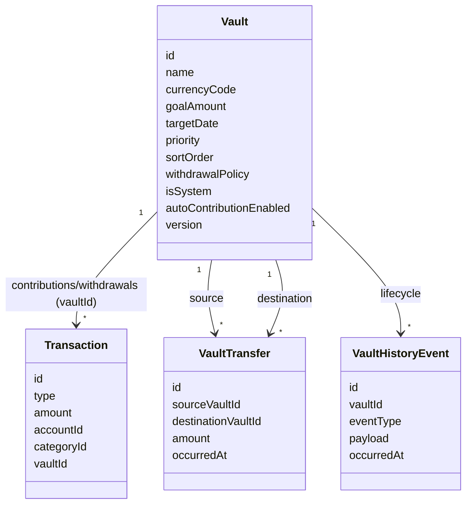
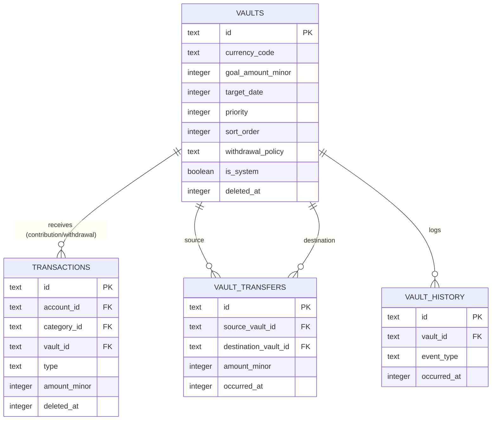
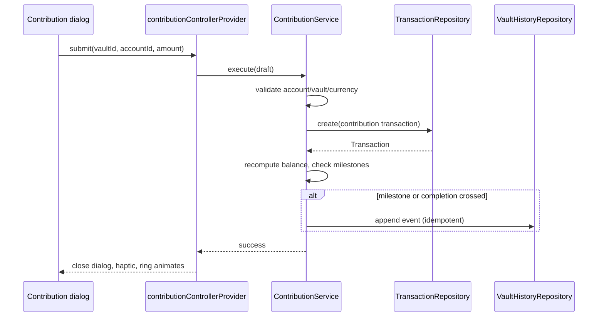
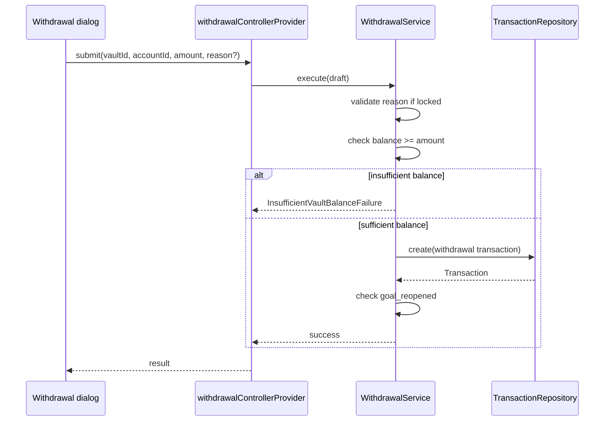
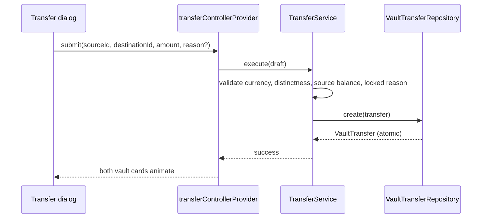
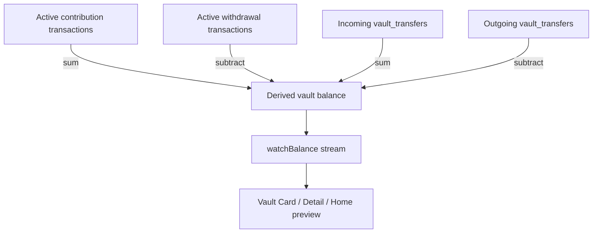
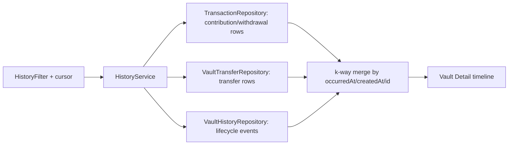
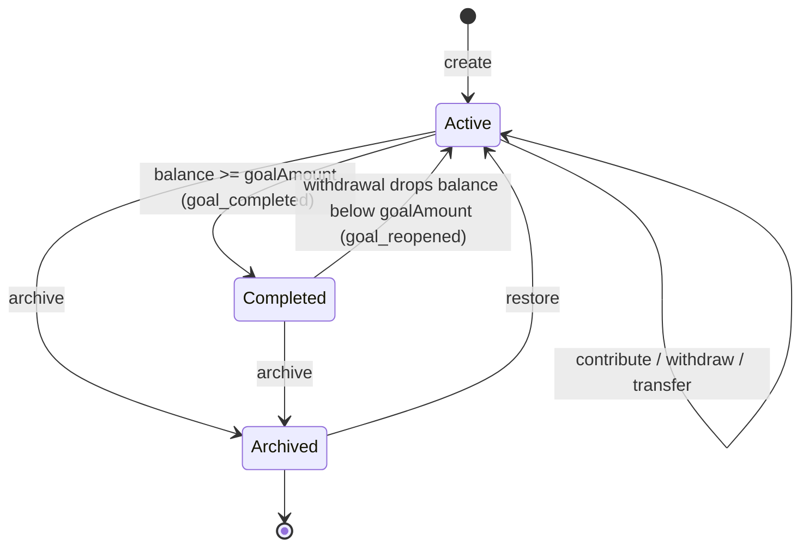
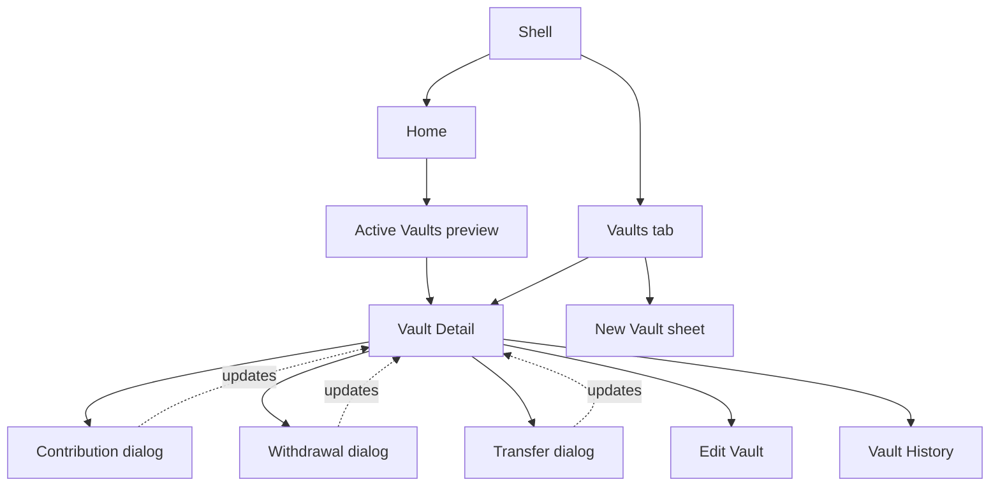

# Sprint 03 — Vault Engine

**Status:** Ready for implementation

**Version:** 1.0

**Related:** [Product design](01-product-design.md),
[engineering architecture](02-engineering-architecture.md),
[Sprint 00](03-sprint-00-bootstrap.md), [Sprint 01](04-sprint-01-foundation.md),
and [Sprint 02](05-sprint-02-transactions.md)

## Sprint vision

Sprint 02 gave Lys Finance a trustworthy ledger. Sprint 03 gives it a reason to
keep money in that ledger instead of spending it: the vault. People do not
save money in the abstract — nobody has ever felt motivated by a rising
account balance with no name attached to it. People save **for something**.
"₫38,400,000 in Bank" is a number; "Japan Master's — 64% there, on track for
March 2027" is a story, and stories are what change behavior. Vaults exist to
attach every saved unit of money to a mission, because an unlabeled surplus is
the single easiest thing to quietly spend, while a labeled one has to be
consciously un-earmarked first. That extra half-second of friction is the
entire product mechanism.

Vaults come before budgets for the same reason Sprint 02 came before Sprint
03 in the roadmap: budgets are a **constraint** ("don't cross this line") and
vaults are a **direction** ("move toward this point"). The product philosophy
in the design document is explicit that Lys Finance reframes rather than
polices — "you invested ₫X in your career" instead of "you spent ₫X." A
constraint-first product would teach the user to fear opening the app;
a direction-first product teaches the user to enjoy opening it. Shipping
vaults first means the very first strategic feature the user experiences is
encouraging, not restrictive, and every later budget screen can then sit on
top of an app the user already trusts.

Vaults are also architecturally superior to a simple savings account. A real
bank account fragments money across institutions and adds friction (transfer
delays, minimum balances, sometimes fees) for what is, conceptually, a single
decision: "this money has a job." A vault reuses money that is already sitting
in a real, spendable account and adds a *virtual* earmark on top of it — the
product design document is explicit that "a vault is an earmark, not a
separate wallet," specifically to avoid double-counting net worth. This is
strictly more flexible than a savings account: the user can create eight
purpose-built vaults today without opening eight bank accounts, re-prioritize
by moving virtual balance between vaults with the Transfer engine, and never
worry about minimum balances, transfer holidays, or reconciling multiple
external institutions. The cost of that flexibility is entirely engineering
discipline — the app must never let a vault's virtual balance diverge from
what its underlying transactions actually say — and this document exists to
remove every ambiguity that could let that discipline slip.

### Outcome

After implementation, a user can create purpose-built vaults (from the eight
starter templates or from scratch), contribute to and withdraw from them,
move balance between them, watch progress and a projected completion date
update in real time, and review a complete, filterable history of everything
that happened to each vault — entirely offline, and without touching a single
line of Sprint 01/02 architecture. Sprint 04 (budgets) can then read
"committed to vaults" as a settled fact rather than a feature it has to build
itself.

### Explicitly out of scope

- Monthly budgets, category budgets, budget alerts, rollover, forecasts
- Safe-to-spend, the Home dashboard hero, and the INC ring
- The full Insights/Analytics tab and the Financial Health Score
- The AI assistant, including "can I buy this?" reasoning
- Cloud sync, authentication, backend APIs
- Investment/brokerage portfolio tracking
- OCR and receipt scanning
- Bank/exchange-rate integrations
- Subscription manager (recurring vendor billing)
- Sending a single push/local notification — architecture only (§15)
- Dynamic goal targets (e.g., an Emergency Fund target computed from a
  necessity-spend baseline) — see Decision 5
- Executing automatic/scheduled contributions — see Decision 6

## Domain scope

| Concept | Sprint 03 status | Notes |
|---|---|---|
| Vault | Implemented | Immutable persisted record described in §Vault domain model. |
| Vault Goal | Implemented, as fields on Vault | `goalAmount` + `targetDate`; not a separate entity (see below). |
| Vault Contribution | Implemented, as a `Transaction` | Reuses the `contribution` enum value Sprint 02 reserved (Decision 1). |
| Vault Withdrawal | Implemented, as a `Transaction` | Reuses the reserved `withdrawal` enum value (Decision 1). |
| Vault Transfer | Implemented, dedicated entity | Vault-to-vault reallocation; no real account cash moves (Decision 2). |
| Goal Target | Implemented | Fixed amount only; nullable for open-ended vaults. |
| Goal Deadline | Implemented | Optional `targetDate`; drives pace/ETA and Goal Health. |
| Current Balance | Implemented, derived | Never stored; see §Vault balance rules. Same discipline as Account balance. |
| Completion Percentage | Implemented, derived | `currentBalance / goalAmount`; undefined for open-ended vaults. |
| Monthly Contribution | Implemented, derived | Trailing-window net contribution pace; see §Goal tracking formulas. |
| Contribution Schedule | Reserved fields only; not executed | See Decision 6 (Auto Contribution). |
| Goal ETA | Implemented, derived | Projected completion date from pace; see formulas. |
| Archived Vault | Implemented | Synonym for soft-deleted (`deletedAt != null`) — same convention as Account/Category, not a separate status column. |
| Locked Vault | Implemented, as `withdrawalPolicy` | One of three policy values, not a separate boolean (see below). |
| Priority | Implemented | User-set integer; drives sort and dashboard emphasis, not a scoring algorithm. |
| Milestone | Implemented, derived + logged | 25/50/75/100% thresholds, detected at contribution time, recorded to Vault History. |
| Contribution History | Implemented | Read from `Transaction` rows with `vaultId` set and `type = contribution`. |
| Withdrawal History | Implemented | Same, `type = withdrawal`. |
| Transfer History | Implemented | Read from the dedicated `vault_transfers` table. |
| Vault History (lifecycle timeline) | Implemented, dedicated entity | Create/edit/archive/restore/milestone/completion events not already captured above; see Decision 3. |
| Income Source auto-allocation ("distribute to vaults?" prompt) | Deferred | Product design §6.2 describes this; it depends on an income-entry-time prompt that is a Quick Add UX change, not a vault engine change. Sprint 03 ships manual "contribute directly after recording income," not an automatic prompt. |
| Emergency Fund dynamic target | Deferred | See Decision 5. |
| Auto-contribution execution | Deferred | See Decision 6. |
| Notifications (milestone, deadline, completion) | Architecture only, not sent | See §15. |

### Decisions made explicit up front

These decisions shape nearly every later section, so each is stated once here
with its rationale rather than re-argued repeatedly.

**Decision 1 — Contributions and withdrawals are `Transaction` rows, not a
separate table.** Sprint 02 already reserved `contribution` and `withdrawal`
as `TransactionType` enum values and as a database check constraint,
specifically so that "a future sprint that needs to update a linked record (a
vault contribution, for instance)" would not need a new transaction boundary.
The product design document is explicit: "Contribution = a Transaction of
type `contribution` linking `account` → `vault`, keeping one unified ledger."
Introducing a parallel `vault_contributions` table would fork the ledger the
product design explicitly protects, would duplicate soft-delete/restore/
optimistic-concurrency machinery `Transaction` already has for free, and
would force every future feature that reads "everything that happened to my
money on this day" to query two tables instead of one. This is also why
`getAccountBalance` intentionally sums only active `income`/`expense` rows
(§Account balance rules, Sprint 02): a contribution or withdrawal must be
visible in the ledger without changing the real account balance, because the
money never physically left the account — it only became earmarked. Undo,
restore, and soft delete for contributions/withdrawals therefore come free
from the existing `Transaction` repository; no new mechanism is designed for
them in this sprint.

**Decision 2 — Vault-to-vault Transfer is not a `Transaction`.** A transfer
moves virtual balance between two earmarks; no real account balance changes,
and unlike a contribution or withdrawal, no single real account is the
counterparty. Recording it as a `Transaction` would force an artificial
`accountId` onto a row that has none, and would need a synthetic
`type = transfer` meaning fundamentally different from the "move real cash
between two real accounts" meaning the enum value was reserved for in Sprint
02 (that account-to-account case remains unimplemented and out of scope here,
same as Sprint 02 left it). Transfer therefore gets its own append-only
`vault_transfers` table (§Database schema version 4).

**Decision 3 — Vault History is a lifecycle/audit log, not a duplicate
ledger.** The prompt's requested `vault_history` table would be redundant
with `Transaction` and `vault_transfers` if it tried to also record
contributions, withdrawals, and transfers. Instead it records only events
that have no other home: vault created, vault edited (with which fields
changed), vault archived, vault restored, a milestone crossed, a goal
completed, and a goal reopened (§Vault history). The Vault Detail timeline
the user sees is a **merged read** of three sources — contribution/withdrawal
transactions, transfers, and history events — assembled in the application
layer, exactly as the Sprint 02 ledger merges nothing but reads one table:
here it is three tables because the underlying facts genuinely live in three
places, not because the design forks the source of truth.

**Decision 4 — `transactions.category_id` becomes nullable in schema v4, and
gains a nullable `vault_id`.** A contribution or withdrawal has no category —
forcing one would mean inventing a meaningless "Vault" pseudo-category, which
would then show up in every category picker, filter, and count that Sprint 02
built for real expense/income categorization. The correct fix is a table-level
rule: `category_id` is required if and only if `type` is `expense` or
`income`; `vault_id` is required if and only if `type` is `contribution` or
`withdrawal`; both are forbidden for `type = transfer` (still unreachable).
SQLite cannot alter a column's nullability in place, so the v3→v4 migration
recreates the `transactions` table under the same name with the wider
constraint, copies every existing row unchanged, and re-creates its indexes —
the standard Drift technique for a nullability change, described procedurally
in §Migration v3 → v4 (no SQL is written here, per this document's own
constraint).

**Decision 5 — Goal targets are fixed amounts only; dynamic targets (e.g.,
Emergency Fund = *N* months of necessity spend) are deferred.** The product
design document proposes a dynamic Emergency Fund target computed from a
trailing necessity-spend baseline. Computing that baseline is an aggregate
over categorized ledger history — exactly the shape of computation the
Insights sprint owns, and this sprint's own instructions exclude an
"analytics dashboard." Building a one-off necessity-average formula just for
the Emergency Fund template would either duplicate that future Insights logic
ahead of schedule or freeze a fragile approximation into a system vault the
Insights sprint would then have to migrate away from. The Emergency Fund
ships as a system-protected vault template with a nullable, user-editable
fixed target like every other vault; nothing about the schema prevents a
later sprint from adding a `dynamicTargetMonths` column as an additive
migration.

**Decision 6 — Auto Contribution is a persisted, non-executing preference.**
The Vault Model section of this sprint's brief lists "Auto Contribution" as a
field. The product design document describes it as a rule engine that reacts
to income events or a schedule. Actually running that engine requires
background execution and, for the notification half of the feature, exactly
the push-notification infrastructure §15 explicitly defers. Sprint 03
therefore persists the rule (`enabled`, `kind` — fixed amount or percent of
income — and `value`) so the schema and UI never need to change when the
execution engine ships, but nothing in this sprint reads that rule and
creates a transaction from it automatically. This mirrors exactly how Sprint
02 reserved `contribution`/`withdrawal` as enum values a full sprint before
anything used them.

**Decision 7 — A vault has one fixed currency; contributions, withdrawals,
and transfers must match it exactly.** This is the same simplification as
Sprint 02's Decision 1 (a transaction's currency must equal its account's
currency), applied one layer up: a vault's currency is set at creation (from
its first contributing account, or chosen explicitly for an empty vault) and
never changes. A contribution must come from an account whose currency
matches the vault's currency; a transfer's source and destination vaults must
share a currency. This removes every conversion, rounding, and stale-rate
question from the vault engine, at the cost of not supporting a single vault
funded from both a VND and a USD account — a real but narrow limitation the
user can work around today with two vaults, and a later multi-currency
sprint can lift without a breaking schema change.

## Vault domain model

The `Vault` domain model is immutable, validates at construction, and never
imports Drift or Flutter — same rule as every Sprint 01/02 model.

| Field | Type semantics | Nullability | Validation | User-editable |
|---|---|---|---|---|
| `id` | UUID string, client-generated | Never null | Valid UUID | No |
| `name` / `localizationKey` | Exactly one of the two is set | XOR, enforced at construction | Name: Unicode-trimmed, 1–80 grapheme clusters, same rule as Account/Category names | Yes (name only; system vaults keep their `localizationKey` but the resolved label can still be renamed to a custom `name`, same convention as system categories) |
| `description` | Trimmed text | Nullable | 0–500 grapheme clusters | Yes |
| `iconKey` | Opaque icon token | Never null | Must exist in the icon catalog | Yes |
| `colorToken` | Opaque theme token | Never null | Must exist in the token catalog | Yes |
| `currencyCode` | ISO 4217 code | Never null | Must exist in the Sprint 01 currency catalog | No after first contribution (Decision 7); yes before |
| `goalAmount` | `Money?`, positive minor units | Nullable (open-ended vault) | > 0 when present; currency must equal `currencyCode` | Yes |
| `targetDate` | UTC date | Nullable | May be past-dated (shows as overdue, not blocked) | Yes |
| `priority` | Non-negative integer | Never null | ≥ 0 | Yes |
| `sortOrder` | Non-negative integer | Never null | ≥ 0; same convention as Account/Category | Yes (drag-to-reorder) |
| `withdrawalPolicy` | Enum: locked, soft, deadlineLinked | Never null | — | Yes |
| `isSystem` | Boolean | Never null | Set only at seed time | No |
| `autoContributionEnabled` | Boolean | Never null, default false | — | Yes |
| `autoContributionKind` | Enum: fixed, percentOfIncome | Required iff `autoContributionEnabled` | — | Yes |
| `autoContributionValue` | Positive integer | Required iff `autoContributionEnabled` | Minor units when `kind = fixed`; whole percent 1–100 when `kind = percentOfIncome` | Yes |
| `createdAt` | UTC instant | Never null | Immutable after creation | No |
| `updatedAt` | UTC instant | Never null | Cannot precede `createdAt` | No |
| `deletedAt` (= archived) | UTC instant | Nullable | Set by archive, cleared by restore | No (only through archive/restore) |
| `version` | Positive integer | Never null | Incremented on every update | No |

Fields intentionally **not** present: `currentAmount`, `completionPercentage`,
`estimatedCompletion`, and `monthlyAverageContribution` are never stored —
each is a derived read composed in §Goal tracking formulas, following the
same "never store a mutable derived total" rule Sprint 02 established for
Account balance. There is no separate `Goal` entity; goal fields live
directly on `Vault` because Sprint 03 has exactly one goal per vault and no
scenario (multiple goals racing toward one vault, a goal independent of any
vault) that would justify splitting them — the same reasoning Sprint 02 used
to reject a separate `IncomeSource` entity.

### Invariants

1. `goalAmount`, when present, must be strictly greater than zero and in the
   vault's currency.
2. `targetDate`, when present, may be any date; a past `targetDate` on an
   incomplete vault is a valid, visible "overdue" state, not a validation
   error.
3. `priority` and `sortOrder` are both non-negative; they are independent —
   `priority` drives visual emphasis (e.g., which vaults surface on Home),
   `sortOrder` drives literal list position, and a user may prioritize a
   vault without moving it in the list.
4. `autoContributionKind` and `autoContributionValue` must both be present
   when `autoContributionEnabled` is true, and both absent when it is false —
   there is no "configured but disabled" half-state to defend against
   elsewhere.
5. A system vault (`isSystem = true`) can be archived and restored like any
   vault, but never hard-deleted — no code path exposes permanent deletion
   for any vault, system or user-created, matching the Sprint 02 "no
   permanent deletion reachable from any user-facing surface" rule exactly.
6. Deleted (archived) vaults are excluded from every default query and
   reachable only through the explicit include-archived repository option,
   same convention as Transaction's `includeDeleted`.
7. Editing a vault requires the caller's expected `version` to match the
   stored `version`; a mismatch is a typed conflict, never a silent
   overwrite — identical to Transaction's optimistic concurrency rule.

## Vault Contribution and Withdrawal

Both are ordinary `Transaction` rows (Decision 1) with `type` set to
`contribution` or `withdrawal` and a required `vaultId`. Every invariant
`Transaction.create` already enforces (positive amount, active account,
audit-timestamp ordering, optimistic version) applies unchanged. Sprint 03
extends `Transaction.create`'s validation with two additional rules gated on
`type`:

- `category_id` must be null when `type` is `contribution` or `withdrawal`,
  and `vault_id` must be null when `type` is `expense` or `income` — the two
  fields are mutually exclusive by transaction type (Decision 4).
- `vault_id`, when present, must reference a vault that is not archived, and
  the transaction's currency must equal that vault's `currencyCode`
  (Decision 7).

A withdrawal additionally requires the vault to have sufficient current
balance (§Vault balance rules): unlike an Account, which Sprint 02
deliberately allows to go negative, a vault cannot be withdrawn below zero,
because a vault balance is not real money with an overdraft concept — it is
an earmark against money that must already exist. A `locked` vault requires a
non-empty `reason` on withdrawal (stored in the transaction's existing `note`
field — no new column, since "reason" and "note" are the same free-text
concept for this transaction type); `soft` and `deadlineLinked` vaults leave
the note optional.

## Vault Transfer

`VaultTransfer` is a new, dedicated, **immutable and append-only** domain
model — it is never edited or soft-deleted (see Decision 2's rationale); a
mistaken transfer is corrected by recording a new transfer in the opposite
direction, the same discipline already applied to Sprint 02's ledger
philosophy of never rewriting history.

| Field | Type semantics | Nullability | Validation |
|---|---|---|---|
| `id` | UUID string, client-generated | Never null | Valid UUID |
| `sourceVaultId` | Vault ID reference | Never null | Must exist, not be archived, and have sufficient balance |
| `destinationVaultId` | Vault ID reference | Never null | Must exist and not be archived; must differ from `sourceVaultId` |
| `amount` | Money, positive minor units | Never null | > 0; currency must equal both vaults' `currencyCode` (Decision 7) |
| `note` | Trimmed text | Nullable | 0–500 grapheme clusters |
| `occurredAt` | UTC instant | Never null | May be past-dated; same future-dating rule as Transaction |
| `createdAt` | UTC instant | Never null | Immutable |

## Database schema version 4

Schema moves from version 3 to version 4. Three tables are added and one
existing table is widened.

### Vaults table

| Column | Constraints |
|---|---|
| `id` | Text primary key; valid UUID |
| `name` | Nullable text, 1–80 characters |
| `localization_key` | Nullable text |
| `description` | Nullable text, 0–500 characters |
| `icon_key`, `color_token` | Non-null text |
| `currency_code` | Text, three uppercase characters; must exist in the currency catalog |
| `goal_amount_minor` | Nullable 64-bit integer; check: null or > 0 |
| `target_date` | Nullable UTC integer timestamp |
| `priority` | Integer, check ≥ 0 |
| `sort_order` | Integer, check ≥ 0 |
| `withdrawal_policy` | Text check: `locked`, `soft`, `deadlineLinked` |
| `is_system` | Boolean |
| `auto_contribution_enabled` | Boolean |
| `auto_contribution_kind` | Nullable text check: `fixed`, `percentOfIncome` |
| `auto_contribution_value` | Nullable integer, check: null or > 0 |
| `created_at`, `updated_at` | Non-null UTC integer timestamps |
| `deleted_at` | Nullable UTC integer timestamp (archived marker) |
| `version` | Integer ≥ 1 |

Table-level check: `auto_contribution_enabled = 0` OR
(`auto_contribution_kind IS NOT NULL AND auto_contribution_value IS NOT NULL`)
— enforces Invariant 4 at the storage layer, not just in Dart, matching the
same belt-and-suspenders approach Sprint 01/02 used for `inc_class` pairing.

**Indexes:**

- `(deleted_at, sort_order)` — the active-vault list query, mirroring
  Account's ordered-active-list index.
- `(deleted_at, priority)` — Home/dashboard "top vaults" query.

### Transactions table (widened)

Adds one column and replaces the existing type-pairing check:

| Column | Constraints |
|---|---|
| `vault_id` | Nullable text, foreign key to `vaults`, restrict on delete |
| `category_id` | **Now nullable** (was non-null in schema v3) |

Replacement check (supersedes Sprint 02's `inc_class` pairing check, which is
preserved unchanged as a second, independent check):

- `category_id IS NOT NULL` if and only if `type IN ('expense', 'income')`.
- `vault_id IS NOT NULL` if and only if `type IN ('contribution', 'withdrawal')`.
- Both `category_id` and `vault_id` are null when `type = 'transfer'` (still
  unreachable through any public API in Sprint 03).

**New index:** `(vault_id, deleted_at, occurred_at)` — vault
contribution/withdrawal history and balance-derivation queries, the same
shape as the existing `account_id` index.

### Vault transfers table

| Column | Constraints |
|---|---|
| `id` | Text primary key; valid UUID |
| `source_vault_id`, `destination_vault_id` | Text, foreign keys to `vaults`, restrict on delete; check: not equal to each other |
| `currency_code` | Text, three uppercase characters |
| `amount_minor` | 64-bit integer, > 0 |
| `note` | Nullable text, 0–500 characters |
| `occurred_at`, `created_at` | Non-null UTC integer timestamps |

No `updated_at`, `deleted_at`, or `version` — the table is append-only by
design (see the `VaultTransfer` model above).

**Indexes:** `(source_vault_id, occurred_at)`, `(destination_vault_id, occurred_at)`.

### Vault history table

| Column | Constraints |
|---|---|
| `id` | Text primary key; valid UUID |
| `vault_id` | Text, foreign key to `vaults`, restrict on delete |
| `event_type` | Text check: `created`, `edited`, `archived`, `restored`, `milestone_reached`, `goal_completed`, `goal_reopened` |
| `payload` | Nullable text; small structured metadata (e.g., which fields changed, or which milestone percentage was crossed), bounded to 500 characters |
| `occurred_at`, `created_at` | Non-null UTC integer timestamps |

**Index:** `(vault_id, occurred_at)`.

This table is deliberately **not** the home for contributions, withdrawals,
or transfers (Decision 3); a row here never duplicates a fact already stored
in `transactions` or `vault_transfers`.

### App metadata

`seed_version` advances from 2 to 3, gating the new vault seed step described
below.

## Migration v3 → v4

Runs inside one transaction, in this order:

1. Create the `vaults` table with its checks and indexes.
2. Recreate the `transactions` table under a temporary name with the widened
   nullability and check constraints described above, copy every existing
   row unchanged (including `deleted_at`, `version`, and every timestamp),
   drop the old table, rename the new one back to `transactions`, and
   re-create all of Sprint 02's indexes plus the new `vault_id` index. This
   is the standard Drift "recreate, copy, swap" technique SQLite migrations
   use whenever a column's nullability changes, since SQLite has no `ALTER
   COLUMN`.
3. Create the `vault_transfers` table with its checks and indexes.
4. Create the `vault_history` table with its checks and index.
5. Insert the eight seed vaults described in §Default vaults using stable
   reserved UUIDs and conflict-safe (`insertOrIgnore`) semantics, identical
   in spirit to the Sprint 01/02 seed steps.
6. Advance `seed_version` from 2 to 3 in `app_metadata`.
7. Validate row counts and foreign-key checks before commit.

All Sprint 01/02 tables and data are otherwise untouched — the migration
widens one table and adds three. It is idempotent: re-running it against an
already-migrated database is a no-op, because seed inserts are conflict-safe
on stable IDs and the schema-version guard prevents Drift from re-running a
completed migration. Downgrade is rejected; there is no v4 → v3 path,
consistent with the forward-only policy established in Sprint 01. Foreign-key
enforcement (`PRAGMA foreign_keys = ON`) carries forward unchanged.

**Migration testing** must build a real version-3 database file populated
with Sprint 01/02 rows — including at least one expense and one income
transaction — open it with version-4 code, and confirm: the `vaults` table
exists and contains exactly the eight seeded rows; every pre-existing
transaction row is byte-for-byte unchanged except for the new `vault_id`
column reading `NULL`; the new combined check constraint accepts a
`contribution` row with `vault_id` set and `category_id` null, accepts an
`expense` row with `category_id` set and `vault_id` null, and rejects both a
`contribution` row with `category_id` set and an `expense` row with
`vault_id` set; the new indexes exist; and reopening the migrated database is
idempotent. This is the same shape of test Sprint 02 wrote for v2 → v3,
extended to cover the two-directional check constraint that is new in this
migration.

After schema v4 ships, v3 history must never be rewritten, and the widened
`transactions` constraint must never be treated as if it existed before v4 —
the same discipline every prior sprint applied to its own schema.

## Default vaults

Eight system-protected (`isSystem = true`) starter vaults are seeded, each
with a stable UUID, a localization key (never a hard-coded English/Vietnamese
string in the seed), no preset `goalAmount` (the user sets their own target —
seeding a guessed number would be presumptuous and often wrong), and
`withdrawalPolicy = soft` except where noted:

| Localization key | Icon | Color token | Withdrawal policy | Priority / sort order |
|---|---|---|---|---|
| `vault.emergencyFund` | shield | `color.necessity` | `locked` | 0 |
| `vault.japanMasters` | school | `color.investment` | `soft` | 1 |
| `vault.aiInfrastructure` | dns/server | `color.investment` | `soft` | 2 |
| `vault.elysia` | sparkle | `color.investment` | `soft` | 3 |
| `vault.gpuUpgrade` | memory chip | `color.investment` | `soft` | 4 |
| `vault.investment` | trending up | `color.investment` | `soft` | 5 |
| `vault.freedomFund` | flight | `color.primary` | `deadlineLinked` | 6 |
| `vault.vacation` | beach | `color.consumption` | `soft` | 7 |

The Emergency Fund is the one system vault seeded `locked`, matching the
product design document's explicit rule that Emergency withdrawals require
confirmation and a reason. All eight are fully editable (name, description,
icon, color, target, deadline, withdrawal policy) — `isSystem` only blocks
hard deletion, never editing, the same convention Sprint 01 established for
system categories. The user may also create unlimited custom vaults from
scratch; the Vaults empty state and the "New Vault" sheet both offer the
eight templates as one-tap starting points per the product design document,
but a template is only a prefilled creation form, not a special runtime
behavior distinct from a user-created vault.

## Vault lifecycle (create, edit, archive, restore)

**Purpose.** Let a user create a purpose-built vault, adjust it as
circumstances change, and remove it from active view without destroying its
history.

**Business rules.** A vault is created with a name or a localization key
(never both), an icon, a color, a currency, and a withdrawal policy; every
other field is optional at creation. Editing may change any user-editable
field in the domain model table above except identity, system status, and
currency once the vault has received its first contribution (Decision 7).
Archiving is a soft delete (`deletedAt` set, version bumped); restoring
clears it. A vault with a non-zero current balance can still be archived —
archiving does not require or trigger a withdrawal; an archived vault's
balance remains queryable for historical display, mirroring how an archived
Account still shows historical balance in Sprint 02.

**Validation.** Name (when present): Unicode-trimmed, 1–80 grapheme
clusters, same normalization as Account/Category names — but **not**
required to be unique; two vaults may share a display name (e.g., two
separate "Vacation" vaults for two different trips), unlike Account/Category,
because a vault name is a label for a goal, not a lookup key anything else
joins against. `goalAmount`, when present, must be positive and in the
vault's currency. `targetDate`, when present, has no lower bound (a past
date is valid and renders as overdue). Auto-contribution fields validate per
Invariant 4.

**Acceptance criteria.**

- Creating a vault with only a name, icon, color, currency, and withdrawal
  policy succeeds; every optional field defaults sensibly (no goal, no
  deadline, priority 0, sort order appended to the end of the active list,
  auto-contribution disabled).
- Editing any allowed field persists immediately and bumps `version`; a
  concurrent edit from elsewhere returns a typed `VersionConflictFailure`
  rather than overwriting silently.
- Archiving hides the vault from the default active-vault list and from
  contribution/withdrawal/transfer target pickers, but its history and
  derived balance remain readable through the archived-vault surface.
- Restoring returns the vault to the active list unchanged.
- A system vault cannot be permanently deleted through any reachable code
  path; no UI affordance exists for it.

**Dependencies.** Sprint 01 currency catalog and validation conventions;
schema v4 `vaults` table.

**Edge cases.** Renaming a system vault to a custom name preserves its
`localizationKey` internally (so a locale switch does not silently revert a
user's rename — the same rule Sprint 01 defined for system categories, since
`stableLabel` prefers `name` over `localizationKey`). Editing currency after
the first contribution is rejected with a dedicated failure, not silently
ignored. Archiving a vault that still has a non-empty auto-contribution rule
leaves the rule persisted but irrelevant, since Decision 6 means nothing
executes it regardless of archive state.

**Testing.** Domain: name/goal/date invariants, XOR name/localizationKey
assertion, auto-contribution field pairing. Repository: create, versioned
update, stale-version rejection, archive, restore, currency-lock-after-first-
contribution enforcement. Widget: creation sheet, edit sheet, empty state
with the eight templates, archived-vault list.

**Performance.** Vault list query (active, ordered) < 100 ms with 1,000
vaults present, using the `(deleted_at, sort_order)` index.

**Definition of done.** Create, edit, archive, and restore all work fully
offline; every invariant above is enforced at both the domain and database
layer; no vault can be hard-deleted from any UI surface.

## Contribution engine

**Purpose.** Let a user move already-earmarked intent into a vault, either
from the Vault Detail screen, from Quick Add, or immediately after recording
income.

**Business rules.** A contribution is a `Transaction` with `type =
contribution`, a required `accountId` (which real account the money is
notionally coming from — the account balance itself is unaffected, see
§Vault balance rules), a required `vaultId`, no `categoryId`, no `incClass`,
and an amount in the vault's currency. Partial and full contributions are the
same operation — there is no distinct "fill to goal" mode beyond a UI
convenience that pre-fills the amount field with the vault's remaining
amount. Contributing to an archived vault is rejected. Immediately after a
successful contribution, the engine checks whether the vault's new balance
has crossed a 25/50/75/100% milestone (only when `goalAmount` is set) and, if
so, appends exactly one `milestone_reached` (or `goal_completed` at 100%)
event to Vault History — idempotently, by checking Vault History for an
existing event at that threshold before inserting, inside the same database
transaction as the contribution insert.

**Validation.** Amount > 0; account must exist, be active, and share the
vault's currency (Decision 7); vault must exist and not be archived. Undo
reuses `TransactionRepository.softDelete`/`restore` unchanged — a
soft-deleted contribution is excluded from the vault's derived balance
exactly as a soft-deleted expense is excluded from an account's derived
balance.

**Acceptance criteria.**

- A contribution from an active account to an active vault, in matching
  currency, with a positive amount, succeeds and is immediately reflected in
  the vault's derived balance and in the unified ledger.
- Crossing 50% for the first time appends one `milestone_reached` event;
  contributing again after already being above 50% does not append a second
  one.
- Reaching or exceeding `goalAmount` for the first time appends one
  `goal_completed` event and triggers the completion celebration (§Motion).
- Soft-deleting a contribution (via the existing Transaction "Recently
  deleted" surface) immediately reduces the vault's derived balance; restoring
  it reinstates the contribution.

**Dependencies.** Vault lifecycle (a vault must exist); Sprint 02
`TransactionRepository`/`TransactionDao`; schema v4 widened `transactions`
table and `vault_history` table.

**Edge cases.** Over-contribution (pushing balance past `goalAmount`) is
allowed and shown as a surplus, per the product design document. Contributing
to a vault with no `goalAmount` set is allowed and simply has no
completion/milestone events, since percentage is undefined without a target.
A contribution's account may later be archived; the contribution row and the
vault's derived balance are unaffected, mirroring how an archived account
still contributes to historical transaction display in Sprint 02.

**Testing.** Domain: the two extended `Transaction.create` rules from
§Vault Contribution and Withdrawal. Database: milestone idempotency under
repeated contributions crossing the same threshold, balance derivation across
active/soft-deleted rows. Repository: typed failure mapping for every new
failure kind. Integration: contribute → vault progress updates → soft-delete
→ progress reverts → restore → progress returns.

**Performance.** Contribution save acknowledgment < 300 ms (same budget as a
Sprint 02 transaction save, since it is the same write path).

**Definition of done.** Contribution works fully offline; milestone and
completion detection is correct and idempotent; undo/restore work without any
new mechanism beyond what Sprint 02 already ships.

## Withdrawal engine

**Purpose.** Let a user move earmarked money back out of a vault when plans
change, with guardrails proportional to the vault's withdrawal policy.

**Business rules.** A withdrawal is a `Transaction` with `type = withdrawal`,
the same required/forbidden fields as a contribution. A `locked` vault
requires a non-empty reason (stored in `note`); `soft` and `deadlineLinked`
vaults leave it optional, though the UI always surfaces a "this delays your
ETA by ~X" note for a `deadlineLinked` vault with an active `targetDate`, as
a non-blocking warning (never a hard stop — the product design document is
explicit that no vault policy hard-blocks a withdrawal outright, only
`locked` requires a reason). A withdrawal that would take the vault's derived
balance below zero is rejected; a vault cannot go negative, unlike an
Account. If the vault had a `goal_completed` event and the withdrawal brings
its balance back below `goalAmount`, exactly one `goal_reopened` event is
appended (idempotently, mirroring the milestone check).

**Validation.** Amount > 0 and ≤ the vault's current derived balance; account
and vault existence/active checks identical to Contribution; reason
non-empty when `withdrawalPolicy = locked`.

**Acceptance criteria.**

- A withdrawal within the current balance succeeds and reduces the vault's
  derived balance immediately.
- A withdrawal exceeding the current balance is rejected with a dedicated
  `InsufficientVaultBalanceFailure` and no partial write occurs.
- A locked vault withdrawal without a reason is rejected before any write;
  the confirmation dialog requires the reason field to be non-empty before
  its confirm action is enabled.
- Withdrawing a previously-completed vault below its `goalAmount` appends
  exactly one `goal_reopened` event.

**Dependencies.** Same as Contribution engine; additionally depends on the
vault balance derivation query to enforce the non-negative rule at write
time within the same transaction (read-then-check-then-write, guarded by the
existing optimistic version check to prevent a lost-update race between two
concurrent withdrawals).

**Edge cases.** Withdrawing the vault's entire balance is allowed and simply
returns it to zero (not archived automatically — archiving is always an
explicit separate action). A `deadlineLinked` vault with no `targetDate` set
behaves identically to `soft` (no deadline to warn about). Undo reuses
Transaction restore exactly as Contribution does.

**Testing.** Domain: reason-required-when-locked rule, non-negative balance
rule. Database: rejection of an over-withdrawal at the write layer even if a
buggy caller bypasses UI validation. Repository: typed failure mapping.
Integration: withdraw from a locked vault without a reason (blocked) → with a
reason (succeeds) → balance and history both update.

**Performance.** Same budget as Contribution (< 300 ms save acknowledgment).

**Definition of done.** Withdrawal enforces the non-negative rule and the
locked-reason rule at both UI and database layers; `goal_reopened` detection
is correct and idempotent.

## Transfer engine

**Purpose.** Let a user re-prioritize saved money between two goals without
withdrawing to a real account and re-contributing, which would incorrectly
suggest the money left and re-entered the account layer.

**Business rules.** A transfer debits `sourceVaultId` and credits
`destinationVaultId` by the same amount, atomically, as a single
`vault_transfers` row (Decision 2) — there is no intermediate state where the
source is debited but the destination is not yet credited, because both are
derived from the existence of one row, not from two separate writes. Source
and destination must differ, must share a currency (Decision 7), and neither
may be archived. The source vault's withdrawal policy governs the transfer
exactly as it governs a withdrawal: a `locked` source requires a reason,
using the transfer's `note` field.

**Validation.** Amount > 0 and ≤ the source vault's current derived balance;
both vaults must exist and be active; currencies must match; source ≠
destination.

**Acceptance criteria.**

- A valid transfer succeeds as one atomic write; the source vault's balance
  decreases and the destination vault's balance increases by exactly the
  transferred amount, immediately and consistently (no window where only one
  side has updated).
- A transfer exceeding the source's balance is rejected with
  `InsufficientVaultBalanceFailure`; a currency mismatch is rejected with a
  dedicated failure before any write.
- A transfer out of a locked vault without a reason is rejected before any
  write, same UX as a locked withdrawal.

**Dependencies.** Vault lifecycle; schema v4 `vault_transfers` table.

**Edge cases.** Transferring a vault's entire balance to another vault is
allowed. There is no "undo" for a transfer (Decision 2); the UI never offers
one, and Vault History displays it as a permanent event with a "reverse"
shortcut that simply pre-fills a new transfer in the opposite direction
rather than mutating the original row.

**Testing.** Domain: source/destination distinctness, currency-match rule.
Database: atomicity under a simulated failure mid-write (the transaction
either fully commits or fully rolls back — no partial transfer state is ever
observable). Repository: typed failure mapping. Integration: transfer
between two vaults → both balances update → history shows the transfer on
both vaults' timelines.

**Performance.** Transfer save acknowledgment < 300 ms, same budget as
Contribution/Withdrawal.

**Definition of done.** Transfers are atomic, currency-safe, respect the
source vault's withdrawal policy, and never appear as a partial write under
any failure mode exercised in testing.

## Vault balance rules

A vault's current balance is **never stored**; it is always a derived read,
exactly matching Sprint 02's Account balance discipline:

```
balance = Σ active contribution transactions (vaultId = this vault)
        − Σ active withdrawal transactions (vaultId = this vault)
        + Σ incoming vault_transfers (destinationVaultId = this vault)
        − Σ outgoing vault_transfers (sourceVaultId = this vault)
```

"Active" means `deletedAt IS NULL` for transaction rows; `vault_transfers`
rows have no delete state and are always included. Every read goes back to
this aggregate query — nothing caches a vault's balance in application
memory as a source of truth, the same rule Sprint 02 stated for Account
balance.

| Scenario | Behavior |
|---|---|
| Contribution soft-deleted | Immediately excluded from balance; balance stream re-emits. |
| Contribution restored | Included again immediately. |
| Vault archived | Balance remains queryable for historical display; the vault cannot receive new contributions/withdrawals/transfers while archived. |
| Withdrawal exceeding current balance | Rejected before write (see Withdrawal engine); balance can never go negative. |
| Transfer exceeding source balance | Rejected before write (see Transfer engine). |
| Vault deleted account reference | Not applicable — contributions/withdrawals reference an `accountId` for provenance only; the balance formula above never reads `accounts`, so an archived contributing account has no effect on vault balance. |

## Goal tracking formulas

All figures below are computed on read, never persisted, consistent with
Vault balance rules.

- **Remaining amount** = `max(0, goalAmount − currentBalance)` when
  `goalAmount` is set; undefined (not shown) for open-ended vaults.
- **Completion percentage** = `currentBalance / goalAmount`, uncapped
  mathematically (a value over 100% is valid and means the vault is
  over-funded); the progress ring visually clamps its fill at 100% and shows
  a separate surplus badge, but the underlying number used for Goal Health
  below is never clamped.
- **Monthly average contribution** = net vault activity (contributions minus
  withdrawals minus outgoing transfers plus incoming transfers) over a
  trailing window of `min(90 days, days since vault creation)`, divided by
  that window's length in months (`windowDays / 30`, minimum divisor 1 day
  treated as a fractional month rather than snapping to a whole month, so a
  vault younger than 30 days still gets a proportionate estimate). If the
  vault is younger than 7 days or has zero net activity in the window, the
  average is **undefined** ("not enough data yet") rather than a noisy
  extrapolation from one or two data points.
- **Goal ETA (estimated completion)** is undefined whenever `goalAmount` is
  unset, the monthly average is undefined, or the monthly average is zero or
  negative (a vault with negative net pace cannot be projected to complete).
  Otherwise: `monthsRemaining = remainingAmount / monthlyAverage`, and the
  ETA is today's date advanced by that many calendar months (fractional
  months round up to the end of the resulting month, since "sometime in
  March" is the useful granularity, not "in 47.3 days").
- **Target date comparison** compares `targetDate` (if set) against the
  computed ETA.
- **Goal Health** is one of: `completed` (`currentBalance ≥ goalAmount`),
  `noTarget` (no `goalAmount` set), `noData` (monthly average undefined),
  `onTrack` (ETA ≤ `targetDate`, or no `targetDate` set and pace is
  positive), `behind` (ETA > `targetDate` but pace is still positive), or
  `atRisk` (pace is zero/negative and `targetDate` is within 30 days and the
  vault is not yet complete). This is a small, explicit state machine, not a
  score — matching the product design document's instruction that health
  states are legible, not a hidden formula.

## Dashboard integration

Home gains one additional section — an "Active Vaults" preview — inserted
below the existing account list, showing up to three vaults ordered by
`priority` then `sortOrder`: name, a compact progress indicator, remaining
amount (or accumulated total for open-ended vaults), and, when set, ETA or
"overdue." Tapping a card navigates to Vault Detail; a "See all" entry
navigates to the Vaults tab. This is the only Home change in Sprint 03 — the
safe-to-spend hero, the INC ring, and the rest of the full dashboard remain
unbuilt, exactly as they were left after Sprint 02, since building them is
explicitly out of scope (§Explicitly out of scope).

## Vault history

The Vault Detail timeline merges three read sources into one
chronologically-sorted, paginated stream:

1. Active `Transaction` rows with this `vaultId` and `type IN (contribution,
   withdrawal)`.
2. `vault_transfers` rows where this vault is either source or destination.
3. `vault_history` rows for this vault (created, edited, archived, restored,
   milestone_reached, goal_completed, goal_reopened).

Each source keeps its own ordering key (`occurredAt`/`createdAt`/`id`, the
same tiebreaker triple Sprint 02 defined for the ledger); the merge is a
k-way merge over already-sorted cursors, not a full re-sort of all history on
every page, so it stays cheap at the 100,000-row performance target.
**Search** is a normalized `LIKE` scan over contribution/withdrawal notes and
transfer notes only — `vault_history` payloads are structured metadata, not
free text, and are not part of search. **Filtering** supports event kind
(contribution/withdrawal/transfer/lifecycle), date range, and amount range,
composing the same way `TransactionFilter` composes in Sprint 02.

## Rules engine

| Rule | Value | Rationale |
|---|---|---|
| Minimum contribution/withdrawal/transfer amount | > 0 (no separate floor) | Money's existing positivity invariant already forbids zero; a higher minimum would be an arbitrary product decision not requested anywhere in the brief. |
| Maximum contribution amount | None (Money's signed-64-bit ceiling only) | Over-funding is explicitly allowed by the product design document. |
| Maximum withdrawal/transfer amount | Current vault balance | Enforced in Withdrawal and Transfer engines; a vault cannot go negative. |
| Locked vault | Requires non-empty reason on withdrawal/outgoing transfer | Product design §8. |
| Protected (system) vault | Cannot be hard-deleted | Same convention as system categories. |
| Goal completion | `currentBalance ≥ goalAmount` | Triggers `goal_completed` once (idempotent), plus the celebration in §Motion. |
| Goal exceeded (over-funded) | `currentBalance > goalAmount` | Shown as a surplus badge; no separate event beyond the original `goal_completed`. |
| Archived vault behavior | Read-only: balance and history remain visible; no new contribution/withdrawal/transfer accepted | Matches archived-account convention. |
| Deleted (hard) vault behavior | Not reachable | No hard delete exists for any vault. |

## Shared widgets

- **Vault Card** — compact summary (name, icon, progress, remaining/ETA);
  used on Home and in the Vaults grid.
- **Progress Ring** — radial indicator; visually clamps at 100% with a
  surplus badge above it; reused by Vault Card and Vault Detail hero.
- **Goal Badge** — small status chip rendering Goal Health (`onTrack`,
  `behind`, `atRisk`, `completed`, `noTarget`, `noData`) with a paired icon
  and label, never color alone.
- **Contribution Dialog**, **Withdrawal Dialog**, **Transfer Dialog** — three
  focused sheets, each reusing the Sprint 01 `MoneyInput`/numeric-keypad
  component and the Sprint 02 `ConfirmationDialog` for the destructive/locked
  paths; the Withdrawal and Transfer dialogs share a "reason" field that only
  renders (and only requires input) when the relevant vault's
  `withdrawalPolicy = locked`.
- **Vault Tile** — list-row variant of Vault Card for the Vaults tab list
  layout (as opposed to grid layout — both are supported view modes).
- **Goal Timeline** — the merged history view described in §Vault history.
- **Goal Header** — Vault Detail's top section: hero progress ring, target,
  deadline, pace sentence ("adding ~₫X/mo, ETA March 2027").
- **Progress Widget** — the linear (non-radial) progress bar variant used
  inside Vault Tile rows where a full ring would not fit.
- **Celebration Widget** — full-screen confetti + haptic + "roll into a new
  goal / keep as buffer" choice, shown once per `goal_completed` event.

## Animations

Progress ring and bar fills animate on entry (staggered, matching the Home
INC ring's 240 ms signature already defined in the product design document).
Goal completion triggers the Celebration Widget's confetti and a haptic.
Transfer plays a short "slide from source card to destination card" motion on
Vault Detail when both vaults are visible in the same view (e.g., the Vaults
grid), and a simple cross-fade otherwise. The progress ring's fill and every
monetary figure that changes (balance, remaining amount) use the same
short count-up motion signature the product design document defines for the
dashboard hero number. Every animation above has a reduced-motion fallback
that is a plain, instant state change — same rule as Sprint 02.

## Notifications (architecture only)

Not implemented. Documented so the eventual notification sprint has a
grounded list of events to schedule, matching the product design document's
notification table:

- Goal completed (high priority, immediate).
- Target date approaching, no `targetDate`-linked completion yet (medium,
  timing TBD by the notification sprint).
- No contribution to a given vault this month (low, opt-in).
- Milestone reached — 25/50/75% (low, evening digest).
- Large withdrawal — a withdrawal above a configurable threshold (medium).

Every event above already has a concrete trigger point in this sprint's
engines (a `milestone_reached`/`goal_completed` history event, or a
withdrawal write) so the future notification sprint can subscribe to those
same writes rather than re-deriving detection logic. Sprint 03 does not
schedule, queue, or send anything.

## Repository layer

- **`VaultRepository`** — mirrors `AccountRepository`'s shape: watches the
  ordered active-vault list, fetch by id (with `includeArchived`), create,
  versioned update, archive, restore. Also exposes `watchBalance`/`getBalance`
  per vault, implementing the derivation in §Vault balance rules (it composes
  reads from `Transactions` and `vault_transfers`, so it depends on the
  transaction data source rather than owning its own balance storage).
- **`VaultTransferRepository`** — `create` (atomic, within one Drift
  transaction that validates both vault balances/currencies before
  inserting), plus reads/streams of transfer history for a given vault
  (either as source or destination).
- **`VaultHistoryRepository`** — append (idempotent per event-type/threshold
  as described in the Contribution/Withdrawal engines), plus reads/streams
  of a vault's lifecycle events. Does **not** own contribution/withdrawal/
  transfer data (Decision 3).

No separate `GoalRepository` is introduced. Goal fields (`goalAmount`,
`targetDate`) live on `Vault` itself, so a dedicated repository would only
ever proxy `VaultRepository` calls — exactly the redundant-entity pattern
Sprint 02 rejected when it declined to build a separate `IncomeSource`
repository for what `Category` already modeled.

## Service layer

| Service | Responsibility |
|---|---|
| `VaultService` | Validates and orchestrates create/edit/archive/restore against `VaultRepository`, enforcing Invariants 1–7 and the currency-lock-after-first-contribution rule. |
| `ContributionService` | Validates and executes a contribution: resolves account/vault, builds the `Transaction`, writes it, then checks and appends any milestone/completion event — the whole sequence inside one Drift transaction. |
| `WithdrawalService` | Same shape as `ContributionService` for withdrawals, plus the non-negative-balance and locked-reason checks, plus `goal_reopened` detection. |
| `TransferService` | Validates and executes a transfer atomically via `VaultTransferRepository`, plus the locked-source-reason check. |
| `HistoryService` | Composes `VaultHistoryRepository` with `TransactionRepository` (filtered to this vault's contribution/withdrawal rows) and `VaultTransferRepository` into the merged, paginated timeline described in §Vault history. |
| `ProjectionService` | Pure functions implementing every formula in §Goal tracking formulas; takes a vault plus its activity and returns remaining amount, completion percentage, monthly average, ETA, and Goal Health. No persistence, no side effects — fully unit-testable without a database. |
| `GoalService` | Thin façade used by Vault Detail/Home providers: combines `VaultRepository` (current balance, vault fields) with `ProjectionService` (pure math) into one ready-to-render goal snapshot per vault, so presentation code calls one provider instead of composing repositories and a pure-math service itself. |

This mirrors Sprint 02's layering exactly: domain objects own field-level
invariants, services own cross-entity policy and orchestration, repositories
own persistence and failure translation, and DAOs own the actual Drift
queries.

## Riverpod

| Provider | Type | Lifecycle | Notes |
|---|---|---|---|
| `vaultRepositoryProvider` | `Provider` | App-scoped, `keepAlive` | Overridable in tests. |
| `vaultTransferRepositoryProvider` | `Provider` | App-scoped, `keepAlive` | — |
| `vaultHistoryRepositoryProvider` | `Provider` | App-scoped, `keepAlive` | — |
| `vaultServiceProvider`, `contributionServiceProvider`, `withdrawalServiceProvider`, `transferServiceProvider` | `Provider` | App-scoped, `keepAlive` | Compose the repositories above plus `uuidGeneratorProvider`/`appClockProvider`, same composition pattern as `transactionServiceProvider`. |
| `activeVaultsProvider` | `StreamProvider` | `autoDispose` | Wraps `VaultRepository.watch`, ordered by `sortOrder`; consumed by both Home and the Vaults tab. |
| `vaultDetailProvider` | `StreamProvider.family` (keyed by id) | `autoDispose` | Wraps a single vault's watch. |
| `vaultBalanceProvider` | `StreamProvider.family` (keyed by vault id) | `autoDispose` | Wraps `VaultRepository.watchBalance`. |
| `vaultGoalSnapshotProvider` | `StreamProvider.family` (keyed by vault id) | `autoDispose` | Wraps `GoalService`; recomputes whenever the vault or its balance stream emits. |
| `vaultHistoryProvider` | `StreamProvider.family` (keyed by vault id + filter + cursor) | `autoDispose` | Wraps `HistoryService`'s merged timeline. |
| `contributionControllerProvider`, `withdrawalControllerProvider`, `transferControllerProvider` | `NotifierProvider.family` | `autoDispose`, kept alive while `submission != idle` | Same shape as Sprint 02's `quickAddControllerProvider`: owns draft state for its dialog and dispatches to the matching service. |
| `vaultFormControllerProvider` | `NotifierProvider.family` (keyed by optional existing id) | `autoDispose`, kept alive while `submission != idle` | Create/edit vault form, same pattern as `transactionFormControllerProvider`. |

Every provider above is overridable via `ProviderScope` overrides in widget
and controller tests, matching the Sprint 01/02 test-override strategy. No
new state-management library is introduced.

## Performance

| Metric | Budget |
|---|---|
| Active vault list query | < 100 ms with 1,000 vaults present |
| Vault balance derivation | < 100 ms per vault, same budget class as Account balance |
| Contribution/withdrawal/transfer save acknowledgment | < 300 ms for local writes |
| Vault History first page | < 300 ms with 100,000 history records present (combined across the three merged sources) |
| Vault History search | < 400 ms with 100,000 history records present |
| Goal projection computation | < 50 ms per vault (pure function over already-fetched data, no additional query) |
| Vault list/detail scrolling | Smooth 60 fps |
| Database work | Never on the UI thread; no background polling |
| Page size | Bounded (50 rows per keyset page, same as the Sprint 02 ledger) |

These are engineering targets measured against a representative device and
build mode, not a guarantee for every device — same framing as Sprint 01/02.

## Security

No vault balance, contribution amount, withdrawal reason, or transfer note
appears in production logs — the same discipline Sprint 02 applied to
transaction amounts and notes, now explicitly extended to every new field
introduced here. Unexpected failures log a stable event name, layer, and
failure type only. No data leaves the device. History integrity follows from
the append-only design of `vault_transfers` and the idempotent, checked
writes to `vault_history` — there is no code path that edits a past history
event. Soft deletion (archive) is the only removal mechanism for any vault;
audit history for a vault therefore survives its own archival.

## Accessibility

Every Sprint 01/02 baseline applies unchanged: TalkBack/VoiceOver labels,
44×44 minimum touch targets, 200% text scale without truncating monetary
values, reduced motion, WCAG AA contrast, and form error announcements on
blur/submit. Goal Health, milestone badges, and the locked-vault indicator
always pair color with an icon and a text label — no vault state is
communicated by color alone, continuing the INC rule from Sprint 02. The
progress ring's semantic label states the percentage and remaining amount in
words, not just a visual fill, so a screen-reader user gets the same
information a sighted user gets from the ring at a glance.

## Testing

| Area | Minimum evidence |
|---|---|
| Domain | Vault invariants (1–7 above), `Transaction.create`'s two new type-pairing rules, `VaultTransfer` invariants, `ProjectionService` formulas across every `Goal Health` branch including boundary cases (exactly at target, exactly at deadline, zero pace, negative pace). |
| Database | v3→v4 real-file migration (including the transactions-table recreation and its two-directional check constraint), vault CRUD, archive/restore, vault balance aggregation across active/soft-deleted contributions and withdrawals and incoming/outgoing transfers, over-withdrawal rejection at the write layer, milestone/completion/reopened idempotency, transfer atomicity under a simulated mid-write failure. |
| Repository | Typed failure mapping for every new failure kind, watch-stream updates on write, optimistic concurrency conflicts on vault edit. |
| Controller | Contribution/withdrawal/transfer submission success and every validation failure, locked-vault reason gating, draft preservation after a failed save. |
| Widget | Vault creation from a template and from scratch, Vault Detail (goal header, progress ring, history timeline), contribution/withdrawal/transfer dialogs including the locked-reason field, completion celebration, English and Vietnamese strings, light/dark themes, 200% text scale. |
| Integration | Create vault → contribute → progress and Home preview update → reach a milestone → reach completion → celebration shown → withdraw below target → `goal_reopened` recorded. Create two vaults → transfer between them → both balances and both histories update. |

Coverage targets: ≥95% for the Vault domain model, `VaultTransfer`, and
`ProjectionService` (matching Sprint 01/02's domain-layer bar), ≥90% for
repository/DAO/service code, and meaningful state coverage for controllers
and widgets. All database and repository performance-adjacent tests
additionally run once against a generated dataset of 1,000 vaults and
100,000 combined history records to produce real evidence for §Performance,
not just correctness — the same discipline as Sprint 02's 10,000-row
transaction dataset.

## Documentation updates

The implementation PR must update `README.md` (Sprint 03 scope, migration
command), `docs/architecture.md`, `docs/domain-model.md` (Vault,
VaultTransfer), `docs/database-migrations.md` (v3→v4 procedure),
`docs/repositories.md` (`VaultRepository`, `VaultTransferRepository`,
`VaultHistoryRepository`), and `docs/testing.md` (new coverage areas).
`docs/roadmap.md` should mark Sprint 03 complete. Documentation must describe
implemented behavior only; if the implementation ends up diverging from this
specification, this document must be updated or an ADR added before merging
— the same discipline every prior sprint required.

## Architecture diagrams

### Vault class model



### Database ERD



### Contribute sequence



### Withdraw sequence



### Transfer sequence



### Vault balance derivation



### Vault history merge flow



### Vault lifecycle state



### Navigation flow



## Implementation backlog

| Order | Work item | Dependency | Complexity |
|---:|---|---|---|
| 1 | Finalize `Vault` and `VaultTransfer` domain models and invariants | Sprint 01/02 domain | M |
| 2 | Drift schema v4: `vaults`, widened `transactions`, `vault_transfers`, `vault_history`, migration, seed vaults | 1 | L |
| 3 | `VaultDao`/`VaultTransferDao`/`VaultHistoryDao` (CRUD, balance aggregate, merged history query) | 2 | L |
| 4 | `VaultRepository`, `VaultTransferRepository`, `VaultHistoryRepository` implementations and failure mapping | 3 | L |
| 5 | `VaultService` (lifecycle) and Riverpod composition | 4 | M |
| 6 | Extend `Transaction.create`/`TransactionDao` for the `vaultId`/nullable-`categoryId` rules | 2, 4 | M |
| 7 | `ContributionService`, `WithdrawalService` including milestone/completion/reopened detection | 5, 6 | L |
| 8 | `TransferService` | 4, 5 | M |
| 9 | `ProjectionService` (pure goal formulas) and `GoalService` façade | 1 | M |
| 10 | Vault creation/edit forms, including the eight templates | 5 | M |
| 11 | Vaults tab (grid/list), Vault Card/Tile, empty state | 5, 9 | M |
| 12 | Vault Detail screen (Goal Header, Progress Ring, dialogs) | 7, 8, 9 | L |
| 13 | `HistoryService` merged timeline and Vault History UI | 7, 8 | L |
| 14 | Home "Active Vaults" preview integration | 9, 11 | S |
| 15 | Celebration widget and motion pass | 7, 12 | M |
| 16 | Localization (en/vi strings) and accessibility pass | 10–14 | M |
| 17 | Performance tests against a generated 1,000-vault / 100,000-history-record dataset | 3, 13 | M |
| 18 | Documentation updates listed above | all | S |
| 19 | Full quality gates (codegen, format, analyze, tests) and Android device verification | all | M |

## Definition of Done

- [ ] Schema version is exactly 4 and contains only `vaults`,
      `vault_transfers`, `vault_history`, the widened `transactions` table,
      and the eight seed vaults.
- [ ] A transactional v3→v4 migration passes real-file, idempotence, and
      reopen tests without touching existing Sprint 01/02 data, and correctly
      enforces the new two-directional `category_id`/`vault_id` check in
      both directions.
- [ ] Vault create, edit, archive, and restore all work fully offline.
- [ ] Contribution and withdrawal both work fully offline and reuse the
      existing Transaction soft-delete/restore mechanism for undo.
- [ ] Transfers are atomic, currency-safe, and respect the source vault's
      withdrawal policy.
- [ ] Vault balances are derived queries and update correctly across
      contribute, withdraw, transfer, soft-delete, and restore.
- [ ] Goal progress, ETA, and Goal Health compute correctly, including every
      boundary case in §Goal tracking formulas.
- [ ] Milestone (25/50/75%), goal completion, and goal-reopened detection are
      correct and idempotent.
- [ ] The Vault History timeline correctly merges contributions,
      withdrawals, transfers, and lifecycle events in chronological order,
      with working search and filters.
- [ ] Home shows the Active Vaults preview; no other dashboard element is
      introduced.
- [ ] Optimistic concurrency is enforced on every vault update.
- [ ] All new strings are localized in English and Vietnamese.
- [ ] Light/dark themes and 200% text scale work on every new screen.
- [ ] No vault balance, amount, reason, or note appears in logs.
- [ ] No analyzer warnings; formatting passes; all tests pass.
- [ ] Android debug APK builds and the flow is verified on a physical device
      or emulator.
- [ ] GitHub CI passes.
- [ ] Architecture documentation matches the implementation.
- [ ] No budgets, safe-to-spend, analytics dashboard, AI assistant, cloud
      sync, investment portfolio, OCR, bank integration, or subscription
      manager logic was introduced.

## Specification acceptance checklist

- [x] Sprint vision explains why vaults precede budgets and why this
      architecture is superior to a plain savings account.
- [x] Every domain concept from the sprint brief is placed as implemented,
      reserved, or deferred, with rationale for each deviation.
- [x] The Vault and VaultTransfer models are fully specified, including the
      seven load-bearing decisions.
- [x] Schema v4, its indexes, and the v3→v4 migration (including the
      transactions-table nullability change) are defined without SQL.
- [x] Vault lifecycle, Contribution, Withdrawal, and Transfer are each
      specified with Purpose, Business Rules, Validation, Acceptance
      Criteria, Dependencies, Edge Cases, Testing, Performance, and
      Definition of Done, per this sprint's required output format.
- [x] Vault balance derivation and every goal-tracking formula are specified
      with rationale.
- [x] Default vaults, the rules engine, shared widgets, and animations are
      each specified.
- [x] Notifications are documented architecture-only, with no send path
      implemented.
- [x] Repository layer, service layer, and Riverpod state management map
      responsibilities to the correct architectural layer, with an explicit
      rationale for not introducing a redundant `GoalRepository`.
- [x] Performance, security, accessibility, testing, and documentation
      requirements are all measurable.
- [x] Nine required Mermaid diagrams are included.
- [x] The implementation backlog and Definition of Done preserve Sprint 03's
      scope and non-goals.

This document is the complete Sprint 03 engineering hand-off. It
intentionally contains no Flutter, Dart, or SQL implementation.

## Claude Implementation Contract

Claude must:

- Read `01-product-design.md`, `02-engineering-architecture.md`,
  `03-sprint-00-bootstrap.md`, `04-sprint-01-foundation.md`,
  `05-sprint-02-transactions.md`, and this document in full before writing
  any code.
- Implement Sprint 03 only — no budgets, safe-to-spend, analytics dashboard,
  AI assistant, cloud sync, investment portfolio, OCR, bank integration, or
  subscription manager logic.
- Create and work on branch `feat/sprint-03-vault-engine`.
- Preserve the existing Clean Architecture / feature-first structure and
  Riverpod conventions established in Sprint 01/02; do not introduce a
  competing pattern or state-management library.
- Add Drift schema version 4 as described in §Migration v3 → v4 — never
  rewrite or renumber version 3, and implement the `transactions` table's
  nullability change using the recreate-copy-swap technique described, not a
  destructive drop-and-recreate that would lose Sprint 02 data.
- Use `Money` for every amount; no `double` or SQLite `REAL` for money,
  balances, or aggregates.
- Keep the SQLite database as the sole source of truth; never cache a
  derived vault balance or goal projection as a mutable stored value.
- Use optimistic updates where appropriate for perceived latency, but never
  let an optimistic UI update mask a write that ultimately failed.
- Avoid speculative abstraction — do not build the auto-contribution
  execution engine, dynamic goal targets, a `GoalRepository`, or a
  `vault_contributions`/`vault_withdrawals` table, all of which this
  document explicitly decided against.
- Add tests alongside each behavior as it is implemented, not as a final
  pass; do not skip migration testing.
- Run code generation, formatting, and static analysis, and ensure all
  tests pass before opening a pull request.
- Build an Android debug APK and verify the full create vault → contribute →
  reach a milestone → withdraw → transfer → archive/restore flow on a
  physical device or emulator.
- Create a draft pull request including screenshots and verification
  evidence (test output, performance measurements against the generated
  1,000-vault / 100,000-history-record dataset), and stop before merging.
